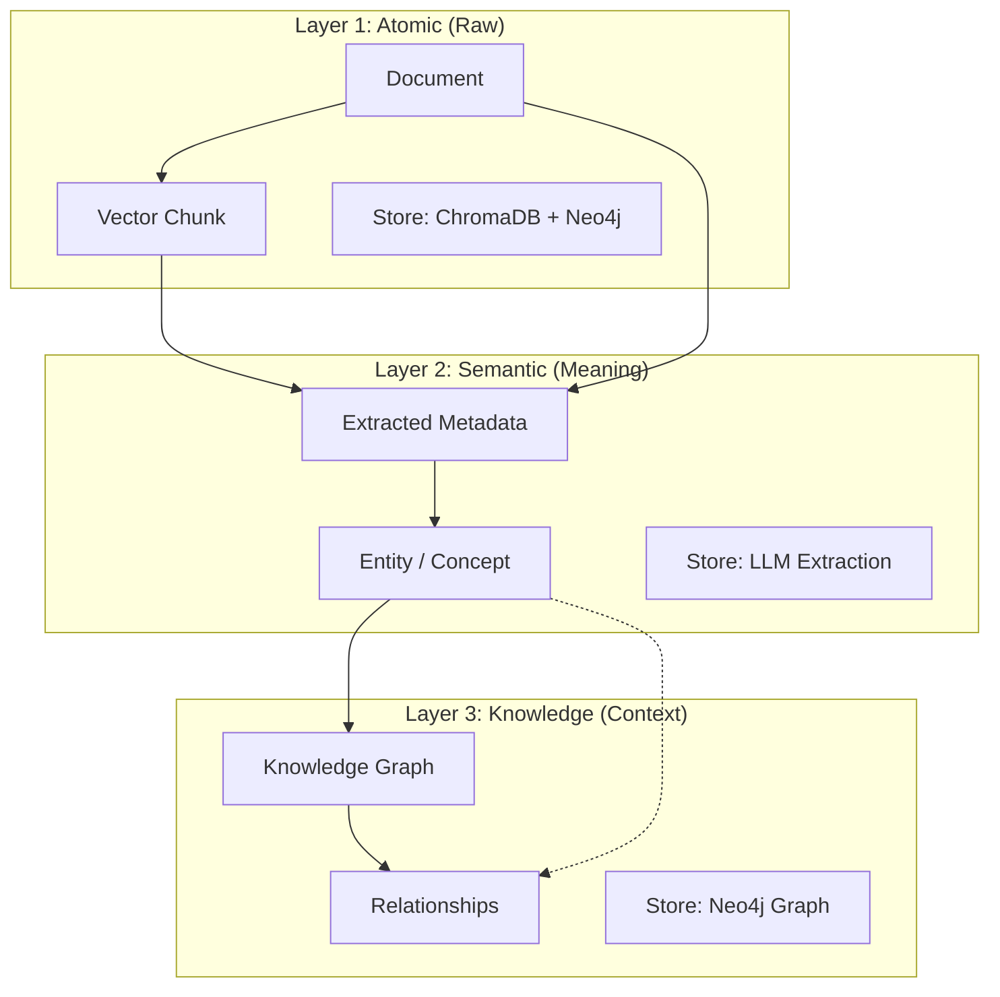

# 🏭 Knowledge Factory: The Intelligent RAG Engine

> **"From Raw Data to Structured Wisdom"**
>
> 단순한 데이터 수집을 넘어, 흩어진 정보를 **연결(Connection)** 하고 **구조화(Structuring)** 하여 실행 가능한 **지식(Wisdom)** 으로 변환하는 지능형 엔진입니다.

[](https://www.python.org/)
[](https://fastapi.tiangolo.com/)
[](https://neo4j.com/)
[](https://www.langchain.com/)

---

## 💡 Vision: Knowledge Factory

사용자가 **"이 주제에 대해 알고 싶어"** 라고 요청하면, 시스템은 원석(Raw Data)을 채굴하고 가공하여 보석(Insight)을 만들어냅니다.

1.  **Mining (Ingestion)**: 유튜브, 웹페이지, 문서 등 파편화된 리소스를 수집합니다.
2.  **Refining (Deep Structuring)**: LLM이 텍스트 이면의 의미(Entity)와 관계(Relationship)를 심층 추출합니다.
3.  **Assembling (Knowledge Graph)**: 추출된 정보들을 논리적으로 연결하여 거대한 지식 그래프를 형성합니다.

---

## 🏗️ 3-Layer Storage Strategy

본 프로젝트는 데이터의 깊이와 목적에 따라 3단계로 저장하는 **Clean Architecture** 기반의 전략을 사용합니다.



| Layer | Type | Philosophy | Technologies |
| :--- | :--- | :--- | :--- |
| **1. Atomic** | **Facts** | "원본은 훼손되지 않아야 한다." | `Document`, `Chunk`, `ChromaDB` |
| **2. Semantic** | **Information** | "텍스트에는 숨겨진 의미가 있다." | `Gemini 2.0`, `Entity Extraction` |
| **3. Knowledge** | **Wisdom** | "맥락 없는 정보는 죽은 지식이다." | `Neo4j`, `Knowledge Graph`, `Reasoning` |

---

## ✨ Key Features

### 1. Ingestion & Deep Structuring
*   **Smart Scraper**: 웹페이지, 유튜브 자막 등 다양한 소스를 정규화하여 수집합니다.
*   **Semantic Extraction**: 텍스트에서 인물, 기술, 사건 등을 자동으로 식별하고 분류합니다.

### 2. Contextual RAG
*   **Graph RAG**: 단순 키워드 매칭을 넘어, 그래프상의 관계를 추론하여 답변합니다.
*   **Hybrid Search**: Vector(의미) + Keyword(단어) + Graph(관계) 검색을 결합하여 정확도를 극대화합니다.

### 3. Agentic Workflow
*   **Admin Dashboard**: 수집 현황을 모니터링하고 데이터 파이프라인을 제어합니다.
*   **HITL (Human-in-the-Loop)**: AI의 판단이 불확실할 때 인간의 피드백을 받아 학습하고 보정합니다.

---

## � Getting Started

설치, 실행, 배포에 대한 자세한 내용은 가이드를 참고하세요.

� [**Getting Started Guide**](docs/guides/getting_started.md)

```bash
# Quick Run (Docker)
make up
```

---

## 📚 Documentation

*   [**Clean Architecture**](docs/architecture/architecture.md): 시스템 설계 원칙
*   [**Ontology Guide**](docs/architecture/ontology.md): 지식 그래프 모형
*   [**Testing Strategy**](docs/guides/testing_strategy.md): 품질 보증 전략

---

## 🗺 Roadmap

| Phase | Goal | Status |
| :--- | :--- | :--- |
| **Phase 1-4** | Foundation & Graph Construction | ✅ Completed |
| **Phase 5** | Knowledge Reasoning (Logic) | ✅ Completed |
| **Phase 6-7** | Performance & Scalability | ✅ Completed |
| **Phase 8** | Architecture & Quality Foundation | ✅ Completed |
| **Phase 9** | **Advanced RAG Operations** | � **In Progress** |

> 상세 로드맵은 [Backlog](backlog/queue.md)에서 확인할 수 있습니다.
