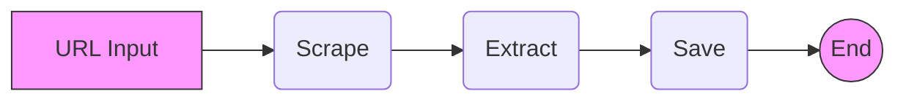
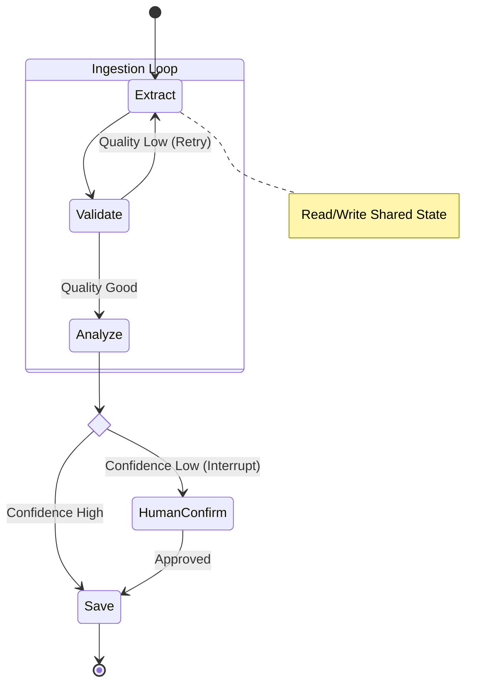

# Architecture Decisions

이 문서는 프로젝트의 주요 아키텍처 결정 사항(ADR)을 기록합니다.

---

## ADR 020: Transition from Linear DAG to LangGraph

- **Date**: 2026-01-20
- **Status**: Accepted
- **Context**: Spec 020 (Ingestion Pipeline Refactoring), Phase 4 Preparation

### 1. 배경 및 문제 정의 (Context)

#### 1.1 현재 아키텍처의 한계 (The Limits of Linear DAG)
초기 Ingestion Pipeline은 LangChain의 `RunnableSequence`를 사용한 **DAG(Directed Acyclic Graph)** 구조였습니다. 이는 "입력 -> A -> B -> C -> 출력"의 단방향 흐름에는 매우 효율적이었으나, 프로젝트가 **Phase 4 (Workflow & Ecosystem)**로 진입하면서 근본적인 한계에 부딪혔습니다.

**기존 구조 (DAG)**:


**문제점**:
1.  **No Cycles (순환 불가)**: LLM의 결과가 모호할 때 "다시 실행"하거나, 부족한 정보를 "추가 검색"하는 **재귀적 루프(Loop)**를 구현하기가 매우 어렵습니다. LangChain Chain 내부에서 while 문을 돌리는 것은 디버깅을 지옥으로 만듭니다.
2.  **Stateless (상태 관리 부재)**: 각 단계는 이전 단계의 출력값만 입력으로 받습니다. 전체 파이프라인에서 공유해야 할 "Global Context" (예: 원본 URL, 에러 카운트, 단계별 로그)를 유지하려면 모든 함수가 이를 `input_schema`로 받아서 `output_schema`로 넘겨줘야 하는 "Prop Drilling" 문제가 발생합니다.
3.  **No Human-in-the-loop**: 실행 중간에 멈춰서(Breakpoint) 사용자의 입력을 기다리거나(Interrupt), 사람이 수정한 데이터로 다시 진행(Resume)하는 기능은 단순 Chain 구조에서는 불가능에 가깝습니다.

---

### 2. 결정 사항 (Decision): LangGraph 도입

우리는 파이프라인의 핵심 엔진을 **LangGraph**로 교체하기로 결정했습니다. 이는 단순한 라이브러리 교체가 아니라, 사고방식을 **함수형 파이프라인**에서 **상태 머신(State Machine)**으로 전환하는 것입니다.

#### 2.1 State Graph Architecture
LangGraph는 Node(작업)와 Edge(전이)로 구성된 그래프 위에서 `State` 객체 하나가 계속 업데이트되며 돌아다니는 구조입니다.



#### 2.2 도입 효과 (Benefits)
1.  **Cycles as First-class Citizens**: 그래프 상에서 화살표만 뒤로 연결하면 루프가 됩니다. "Extract 결과가 나쁘면 -> 다시 Extract" 로직이 직관적으로 구현됩니다.
2.  **Shared State (`IngestionState`)**: `IngestionState`라는 TypedDict 하나에 모든 데이터를 담습니다.
    ```python
    class IngestionState(TypedDict):
        raw_content: str
        metadata: dict
        retry_count: int  # 몇 번 재시도했는지 추적 가능
        error: str | None
    ```
    각 노드는 자신이 필요한 필드만 읽고, 변경된 필드만 업데이트하면 됩니다.
3.  **Persistence & Time Travel**: LangGraph는 각 단계마다 상태를 자동 저장(Checkpointing)합니다. 에러가 나면 해당 지점부터 다시 시작하거나, 과거 상태를 수정해서 재실행할 수 있습니다.

---

### 3. 마이그레이션 전략 (Migration Strategy)

한 번에 모든 것을 바꾸는 것은 위험하므로, **단계적(Incremental)**으로 전환합니다.

- **Phase 1 (Spec 020 - Current)**: 구조 전환.
    - 선형 로직(`Extract` -> `Validate` -> `Save`)을 그대로 그래프로 옮깁니다.
    - `LangGraphAdapter`를 만들어 기존 `IngestionService`가 코드 변경 없이 그래프를 사용할 수 있게 합니다 (Adapter Pattern).
- **Phase 2 (Spec 021)**: Logic Resolver.
    - 조건부 분기(Conditional Edges)를 추가합니다.
- **Phase 3 (Spec 022)**: Human-in-the-loop.
    - Checkpointer를 도입하여 사람의 개입 프로세스를 구축합니다.

이 결정은 향후 프로젝트가 단순한 정보 수집을 넘어 **"지능형 에이전트 워크플로우"**로 나아가기 위한 필수적인 토대입니다.
