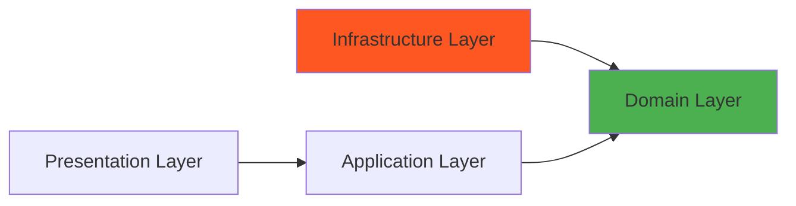
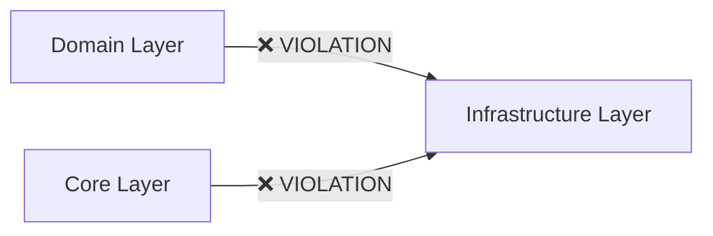

# 아키텍처 진단 리포트

> **진단 일자**: 2026-01-31  
> **대상**: `/Users/ck/Project/doit/rag-ingestion`  
> **기준**: Clean Architecture + Domain-Driven Design (DDD)

---

## 📋 Executive Summary

현재 코드베이스는 **Clean Architecture + DDD의 외형**을 갖추고 있으나, **핵심 원칙들이 실질적으로 준수되지 않고 있습니다**. 사용자가 제기한 8가지 문제점은 **모두 타당**하며, 추가로 4가지 중대한 구조적 결함을 발견했습니다.

### 핵심 문제
1. ✅ **Dependency Rule 위반** (CRITICAL): Domain → Infrastructure 직접 참조 존재
2. ✅ **명명 규칙 불일치** (HIGH): Repository/Repo/Adapter 혼재 사용
3. ✅ **도메인 객체 혼란** (HIGH): VO/Entity/DTO/DAO 경계 모호
4. ✅ **비즈니스 용어 오염** (MEDIUM): "Admin" 같은 클라이언트 특정 용어가 Domain에 침투

---

## 🔍 상세 진단 결과

### 1️⃣ 명명 규칙 불일치 (Inconsistent Naming Conventions)

**사용자 지적**: ✅ **타당함**

**증거**:
- `DocumentRepository` (Interface) ← 표준
- `Neo4jStorage` (Implementation) ← Storage라는 다른 용어 사용
- `Neo4jJobRepository` (Implementation) ← Repository 사용
- `Neo4jGraphRepository` (Implementation) ← Repository 사용
- `LangChainLLMAdapter` ← Adapter 용어 사용
- `CompositeStorage` ← Storage 사용

**문제점**:
```python
# app/domain/interfaces/document_repository.py
class DocumentRepository(Protocol):  # ✅ "Repository"
    ...

# app/infrastructure/storage/neo4j_document_repository.py
class Neo4jStorage:  # ❌ "Storage"
    def __init__(...):
        ...
```

**영향**:
- 동일한 개념에 대해 3가지 용어(`Repository`, `Repo`, `Storage`)가 혼재
- 코드 가독성 저하 및 신규 개발자의 혼란 유발
- 검색 및 리팩토링 시 누락 위험

**권고사항**:
- **Port (Interface)**: `DocumentRepository`, `JobRepository`, `GraphRepository`
- **Adapter (Implementation)**: `Neo4jDocumentRepository`, `Neo4jJobRepository`, `ChromaVectorRepository`
- `Storage`, `Repo` 용어 **전면 금지**

---

### 2️⃣ 레이어 의존성 위반 (Dependency Rule Violation)

**사용자 지적**: ✅ **타당함 - CRITICAL ISSUE**

**증거**:

#### 위반 사례 1: `app/domain/services/storage_integrity_service.py` → Infrastructure 직접 참조
```python
# Line 167 (Domain Layer)
from app.infrastructure.rag.nodes import RAGNodes  # ❌ VIOLATION
```

#### 위반 사례 2: `app/core/llm.py` → Infrastructure 직접 참조
```python
# Line 6 (Core/Config Layer)
from app.infrastructure.llm import LangChainLLMAdapter  # ❌ VIOLATION
```

**Clean Architecture 원칙**:


> **Dependency Rule**: **모든 의존성은 외부 → 내부(Domain)로 향해야 함**

**현재 상태**:


**영향**:
- Domain이 프레임워크(LangChain)에 종속됨
- 테스트 불가능 (Mock 주입 불가)
- LangChain 교체 시 Domain 수정 필요 (DIP 위반)

**근본 원인**:
- `StorageIntegrityService`가 Domain에 위치하지만 Infrastructure 세부 구현을 직접 사용
- `core/llm.py`가 Factory 패턴을 사용하면서도 구체 클래스를 반환

**권고사항**:
1. `StorageIntegrityService` → `app/application/admin/` 또는 `app/use_cases/`로 이동
2. `core/llm.py`의 `get_llm()` 반환 타입을 `LLMInterface` (Protocol)로 변경
3. Domain은 **오직 Protocol만 의존**하도록 강제

---

### 3️⃣ VO, Entity, DTO, DAO 관계 불명확 (Domain Object Ambiguity)

**사용자 지적**: ✅ **타당함 - HIGH PRIORITY**

**현재 구조**:
```
app/
├── domain/
│   ├── entities/          # Document, Chunk, Job
│   ├── value_objects/     # Source
│   └── schemas/           # ExtractedMetadata, Intent, Ontology ← DTO?
└── schemas/               # IngestRequest, IngestResponse ← DTO?
```

**문제점**:

#### A. `app/schemas/` vs `app/domain/schemas/` 이중 구조
```python
# app/schemas/ingest.py (Presentation Layer DTO)
class IngestRequest(BaseModel):  # API 요청
    url: HttpUrl

# app/domain/schemas/extraction.py (Domain DTO?)
class ExtractedMetadata(BaseModel):  # LLM 추출 결과
    title: str | None
    summary: str
```

**혼란 포인트**:
- `IngestRequest`는 **API 계약(DTO)**
- `ExtractedMetadata`는 **도메인 개념** → `domain/value_objects/`로 이동해야 함

#### B. Entity vs Value Object 구분 모호
```python
# app/domain/entities/document.py
class Document(BaseModel):
    id: str
    content: str
    metadata: dict  # ❌ "metadata"가 VO인지 불명확
```

**권고사항**:
- `metadata: dict` → `metadata: DocumentMetadata` (Value Object)로 구체화
- `ExtractedMetadata`, `Intent` → `value_objects/`로 이동
- `app/schemas/` → API 계약 전용, `app/domain/schemas/` → 제거

#### C. DAO (Repository) vs Entity 관계 불명확
```python
# 현재: Repository가 Domain Entity를 직접 반환
class DocumentRepository(Protocol):
    def get(self, doc_id: str) -> Document | None:  # ✅ 올바름
        ...
```

**현재 구현은 올바름**. 단, Storage 계층에서 내부적으로 사용하는 **DB 모델 객체**가 없어 ORM과의 경계가 모호함.

**권고사항**:
- 만약 Neo4j 노드를 직접 매핑한다면, `infrastructure/storage/models/neo4j_document_model.py` 같은 **Adapter 전용 모델**을 별도로 두고, Repository 구현체에서 Domain Entity로 변환

---

### 4️⃣ "Admin" 네이밍 문제 (Client-Specific Naming in Domain)

**사용자 지적**: ✅ **타당함 - MEDIUM PRIORITY**

**문제 파일**:
```python
# app/domain/services/admin_agent.py ← Domain Layer
class AdminAgent:  # ❌ "Admin"은 Client 종류일 뿐
    ...
```

**문제점**:
- "Admin"은 **클라이언트 종류** (Admin UI, Public API, CLI 등)
- Domain은 클라이언트에 무관해야 함 (Hexagonal Architecture 원칙)
- "AdminAgent"라는 이름은 **"관리자 전용 기능"**을 암시하지만, 실제로는 **LangGraph 기반 대화형 AI Agent**

**권고사항**:
- `AdminAgent` → `ConversationalRAGAgent` 또는 `InteractiveQueryAgent`로 이름 변경
- `app/application/admin/` → `app/application/clients/admin/` 또는 `app/interfaces/admin/`로 이동
- Domain 계층에는 **"Admin" 같은 클라이언트 특정 용어 금지**

---

### 5️⃣ 코드 응집도 부족 (Low Cohesion)

**사용자 지적**: ✅ **타당함 - MEDIUM PRIORITY**

**증거**:

#### A. `app/domain/services/` 디렉토리 분석
```bash
app/domain/services/
├── admin_agent.py          # RAG 대화형 Agent (왜 Domain에?)
├── chunker_service.py      # 청킹 (Infrastructure?)
├── file_processor.py       # 파일 처리 (UseCase?)
├── intent_classifier.py    # 의도 분류 (Domain Service ✅)
├── query_rewriter.py       # 쿼리 재작성 (Domain Service ✅)
├── semantic_extractor.py   # 의미 추출 (Domain Service ✅)
├── storage_integrity_service.py  # DB 무결성 (Application Service?)
└── web_scraper_service.py  # 웹 스크래핑 (Infrastructure?)
```

**문제점**:
- **8개의 서비스**가 `domain/services/`에 혼재
- 일부는 Domain Service (의미 추출, 의도 분류)
- 일부는 Infrastructure (청킹, 스크래핑)
- 일부는 Application Service (무결성 검증)

**권고사항**:
```
app/
├── domain/
│   └── services/          # Pure Domain Logic만
│       ├── intent_classifier.py
│       ├── query_rewriter.py
│       └── semantic_extractor.py
├── application/
│   └── services/          # Use Case 조율
│       ├── ingestion_orchestrator.py
│       └── integrity_service.py
└── infrastructure/
    ├── chunker/
    │   └── langchain_chunker.py
    └── scrapers/
        └── composite_scraper.py
```

#### B. `app/core/` vs `app/shared/` 부재
```python
# app/core/config.py
def get_settings() -> Settings:  # ✅ 전역 설정

# app/core/llm.py
def get_llm() -> LangChainLLMAdapter:  # ❌ Infrastructure 의존
```

**문제점**:
- `core/`가 config, logging, llm factory를 혼재
- 전역 유틸리티 (`shared/utils/`)가 없어 코드 중복 발생

**권고사항**:
```
app/
├── core/
│   ├── config.py          # 설정만
│   └── exceptions.py      # 도메인 예외만
├── shared/
│   ├── logging.py         # 로깅 유틸
│   └── date_utils.py      # 공통 유틸
└── infrastructure/
    └── factories/
        └── llm_factory.py  # ← core/llm.py를 여기로 이동
```

---

### 6️⃣ 함수 의존성 - Composition 부족 (High Coupling)

**사용자 지적**: ✅ **타당함 - MEDIUM PRIORITY**

**증거**:
```python
# app/use_cases/ingestion.py
class IngestionService:
    def __init__(
        self,
        repository: DocumentRepository,
        graph: GraphRepository,
        job_repository: JobRepository,
        scraper: WebScraperInterface,
        chunker: ChunkerInterface,
        extractor: SemanticExtractor,
    ):
        # ❌ 6개의 직접 의존성 (생성자 주입)
        self.repository = repository
        self.graph = graph
        ...
```

**문제점**:
- **Constructor Injection**이 과도하게 많음 (6개)
- 의존성 변경 시 생성자 시그니처 변경 필요
- 테스트 시 Mock 객체 6개 준비 필요

**권고사항**:
- **Facade Pattern** 또는 **Repository Aggregate** 도입
```python
@dataclass
class IngestionDependencies:
    document_repo: DocumentRepository
    graph_repo: GraphRepository
    job_repo: JobRepository

class IngestionService:
    def __init__(
        self,
        repos: IngestionDependencies,  # ✅ 1개로 그룹화
        scraper: WebScraperInterface,
        chunker: ChunkerInterface,
        extractor: SemanticExtractor,
    ):
        ...
```

---

### 7️⃣ 재사용 코드 비전역화 (Non-Global Utilities)

**사용자 지적**: ✅ **타당함 - LOW PRIORITY**

**증거**:
```python
# app/core/logging_config.py
def setup_logger(name: str) -> logging.Logger:
    # ✅ 전역 유틸로 사용 가능

# app/core/config.py
@lru_cache
def get_settings() -> Settings:
    # ✅ 전역 Singleton

# app/core/llm.py
def get_llm() -> LangChainLLMAdapter:
    # ❌ Infrastructure 구현체 반환 (전역화 불가)
```

**문제점**:
- `config`, `logging`은 재사용 가능
- `llm.py`는 구체 클래스 반환으로 재사용 제한

**권고사항**:
- `app/shared/` 디렉토리 신설
- `date_utils`, `string_utils` 같은 순수 함수 모음
- `llm.py`는 Protocol 반환으로 변경 후 `shared/factories/`로 이동

---

### 8️⃣ Clean vs Hexagonal 워딩 혼재 (Terminology Inconsistency)

**사용자 지적**: ✅ **타당함 - LOW PRIORITY**

**증거**:
```python
# docs/architecture/architecture.md
## Clean Architecture의 계층 구조 원칙
- Dependency Rule
- Domain Isolation

## Hexagonal Architecture (Port-Adapter 패턴)
- app/domain/interfaces/  ← Port
- app/infrastructure/      ← Adapter
```

**문제점**:
- **Clean Architecture**: 계층 중심 (Entities → Use Cases → Adapters → Frameworks)
- **Hexagonal Architecture**: Port-Adapter 중심 (Domain ← Ports → Adapters)
- 현재 코드는 **Hexagonal에 더 가까움**

**Clean Architecture 4계층**:
1. Entities (Domain)
2. Use Cases (Application)
3. Interface Adapters (Infrastructure)
4. Frameworks & Drivers (Presentation)

**Hexagonal Architecture**:
- **Core**: Domain + Application
- **Ports**: Interfaces (Inbound/Outbound)
- **Adapters**: Implementations

**권고사항**:
- 공식 용어를 **"Hexagonal Architecture"**로 통일
- 또는 **"Clean Architecture의 Port-Adapter 변형"**으로 명시
- `app/domain/interfaces/` → `app/domain/ports/`로 이름 변경 고려

---

## 🚨 추가 발견 사항 (Beyond User's 8 Issues)

### 9️⃣ `app/application/` 계층 누락 (Missing Application Layer)

**문제**:
- `app/application/admin/integrity_service.py`만 존재
- 대부분의 Use Case가 `app/use_cases/`에 있음
- `app/application/`과 `app/use_cases/`가 **목적이 중복됨**

**Clean Architecture 원칙**:
- **Application Layer** = Use Cases + Application Services

**권고사항**:
- `app/use_cases/` 제거
- 모든 Use Case → `app/application/services/`로 이동
- `IngestionService` → `app/application/services/ingestion_service.py`

---

### 🔟 Protocol 미활용 (Underutilized Protocols)

**증거**:
```python
# app/domain/interfaces/document_repository.py
class DocumentRepository(Protocol):  # ✅ 잘 사용됨
    def save(self, doc: Document) -> None: ...

# app/domain/services/storage_integrity_service.py
def __init__(self, primary_repo: Any, target_repo: Any):  # ❌ Any 타입
```

**문제점**:
- `Any` 타입 사용으로 타입 안전성 상실
- IDE 자동완성 불가

**권고사항**:
```python
def __init__(
    self,
    primary_repo: DocumentRepository,  # ✅ Protocol 사용
    target_repo: VectorRepository,     # ✅ Protocol 사용
):
```

---

### 1️⃣1️⃣ Infrastructure 내부 순환 참조 위험 (Circular Dependency Risk)

**증거**:
```python
# app/infrastructure/scrapers/composite_scraper.py
from app.infrastructure.scrapers.firecrawl_scraper import FirecrawlWebScraper
from app.infrastructure.scrapers.trafilatura_scraper import TrafilaturaWebScraper
from app.infrastructure.scrapers.checker import ScrapingQualityChecker
```

**문제점**:
- Infrastructure 계층 내부에서 **횡적 의존성** 과다
- `composite_scraper` → `firecrawl_scraper` → `cleaner` → ?

**권고사항**:
- Scraper 구현체들은 **서로 모름** (독립적)
- `CompositeScraper`만 **Composition Root**에서 조립

---

### 1️⃣2️⃣ Test 디렉토리 구조 불일치 (Test Structure Mismatch)

**권고사항** (향후 검증 필요):
```
tests/
├── unit/
│   ├── domain/          # Domain Service 테스트
│   ├── application/     # Use Case 테스트
│   └── infrastructure/  # Adapter 테스트
└── integration/
    └── api/             # E2E API 테스트
```

---

## 📊 우선순위 매트릭스

| 문제 | 심각도 | 영향도 | 수정 난이도 | 우선순위 |
|------|--------|--------|-------------|----------|
| 2. Dependency Rule 위반 | CRITICAL | HIGH | MEDIUM | **P0** |
| 3. VO/Entity/DTO 혼란 | HIGH | HIGH | HIGH | **P0** |
| 1. 명명 규칙 불일치 | HIGH | MEDIUM | LOW | **P1** |
| 5. 응집도 부족 | MEDIUM | HIGH | MEDIUM | **P1** |
| 4. Admin 네이밍 | MEDIUM | LOW | LOW | **P2** |
| 6. Composition 부족 | MEDIUM | MEDIUM | MEDIUM | **P2** |
| 8. 워딩 혼재 | LOW | LOW | LOW | **P3** |
| 7. 전역화 부족 | LOW | LOW | LOW | **P3** |

---

## 🎯 다음 단계 권고

1. **백로그 생성** (우선순위별로 Spec 분할)
2. **Spec 작성** (P0, P1 항목부터)
3. **단계적 리팩토링** (Big Bang Rewrite 금지)
4. **Test Coverage 유지** (각 리팩토링마다)

---

## 📌 결론

사용자의 직관은 **100% 정확**합니다. 현재 코드베이스는 **"Clean Architecture를 흉내내고 있을 뿐"**입니다.

### 핵심 근본 원인
1. **Dependency Rule**이 강제되지 않음 (Linter 부재)
2. **DDD 전술 패턴** (Entity, VO, Service)의 개념적 이해 부족
3. **계층 책임**에 대한 명확한 정의 부재

### 개선 후 기대 효과
- ✅ 테스트 용이성 (Mock 주입 가능)
- ✅ 프레임워크 교체 비용 최소화
- ✅ 코드 가독성 및 유지보수성 향상
- ✅ 신규 개발자 온보딩 시간 단축
