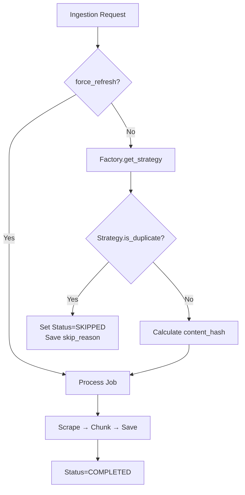

# Deduplication Architecture

## 개요

RAG Ingestion 시스템의 **Deduplication Framework**는 Content 중복을 방지하여 저장소 효율성을 높이고 사용자 경험을 개선합니다.

## 핵심 개념

### 1. Deduplication Strategy 패턴

4가지 Strategy를 제공하여 다양한 Source에 대응:

#### 1.1. `IDCheckingStrategy`
- **목적**: URL 기반 중복 체크 (가장 빠름)
- **동작**: `find_last_job_by_source()` 호출, 동일 URL의 COMPLETED/RUNNING Job 존재 시 Skip
- **적용 대상**: 모든 Source (Default Fallback)

#### 1.2. `MetadataCheckStrategy`
- **목적**: 고유 Metadata 기반 중복 체크 (YouTube 등)
- **동작**: `custom_metadata`의 `video_id` 등으로 중복 판단
- **적용 대상**: YouTube Videos, Podcast Episodes

#### 1.3. `TTLStrategy`
- **목적**: 시간 기반 재수집 허용
- **동작**: 마지막 수집 시간이 TTL (기본 7일) 이내이면 Skip
- **적용 대상**: News Sites, Blogs

#### 1.4. `ContentsStrategy`
- **목적**: Content Hash 기반 중복 체크
- **동작**: `content_hash (SHA256)`를 비교하여 내용 변경 감지
- **적용 대상**: Static Pages, Documentation

### 2. DeduplicationFactory

Source URL 패턴에 따라 적절한 Strategy를 선택:

```python
def get_strategy(self, source_url: str) -> DeduplicationStrategy:
    if "youtube.com" in source_url or "youtu.be" in source_url:
        return MetadataCheckStrategy(self.job_repository)
    elif any(domain in source_url for domain in NEWS_DOMAINS):
        return TTLStrategy(self.job_repository, ttl_days=1)
    else:
        return IDCheckingStrategy(self.job_repository)  # Default
```

## Spec 072 추가 기능

### 3. Force Refresh

- **목적**: Admin이 중복 체크를 우회하고 강제로 재수집
- **구현**: `process_job(job_id, force_refresh=True)` 파라미터 추가
- **사용 사례**:
  - Content가 업데이트되었지만 중복으로 판단된 경우
  - Manual Re-ingestion 필요 시
  - Deduplication Strategy 버그 수정 후 재수집

**Admin API Endpoint:**
```http
POST /admin/jobs/{job_id}/force-refresh
```

### 4. JobStatus.SKIPPED

- **목적**: 중복으로 Skip된 Job을 명시적으로 표시
- **필드**: `skip_reason: str | None` - Skip 사유 저장
- **예시**:
  - `"Duplicate of job abc-123 (Status: COMPLETED)"`
  - `"Duplicate detected by ContentsStrategy"`

### 5. Content Hash

- **계산 시점**: Scrape 직후
- **알고리즘**: `hashlib.sha256(content.encode()).hexdigest()`
- **저장**: `IngestionJob.content_hash` 필드
- **활용**: `ContentsStrategy`에서 내용 변경 감지

## Admin UI

### Job Queue 페이지

**필터**:
- Status: ALL / PENDING / RUNNING / COMPLETED / FAILED / **SKIPPED**

**테이블 컬럼**:
- Job ID
- Status
- URL
- **Skip Reason** ← Spec 072
- Created At / Updated At

**Force Refresh**:
- Job ID 입력 → "Force Refresh" 버튼 클릭
- Confirmation 없이 즉시 재수집 (Admin 전용)

## 아키텍처 다이어그램



## 사용 예시

### 1. 일반 중복 체크

```python
# 첫 번째 수집
job1 = ingestion.create_job(url="https://example.com/article")
await ingestion.process_job(job1.job_id)
# → Status: COMPLETED

# 두 번째 수집 (동일 URL)
job2 = ingestion.create_job(url="https://example.com/article")
await ingestion.process_job(job2.job_id)
# → Status: SKIPPED, skip_reason: "Duplicate of job {job1.job_id}"
```

### 2. Force Refresh

```python
# Admin이 강제 재수집
await ingestion.process_job(job2.job_id, force_refresh=True)
# → Status: COMPLETED (중복 체크 우회)
```

## 설정

### TTL 커스터마이징

```python
# News는 1일 TTL
if "news.com" in source_url:
    return TTLStrategy(job_repository, ttl_days=1)

# Documentation은 30일 TTL
if "docs.example.com" in source_url:
    return TTLStrategy(job_repository, ttl_days=30)
```

## 모니터링

### Neo4j Query: Skipped Jobs 조회

```cypher
MATCH (j:IngestionJob {status: "SKIPPED"})
RETURN j.job_id, j.source_url, j.skip_reason, j.created_at
ORDER BY j.created_at DESC
LIMIT 50
```

### Admin UI Metrics

- **Total Jobs**: 전체 Job 수
- **Skipped (Dedup)**: 중복으로 Skip된 Job 수
- **Skip Rate**: `Skipped / Total * 100%`

## 참고 문서

- [Spec 065: 기본 Deduplication 전략](../065-deduplication-strategies/spec.md)
- [Spec 072: Robust Deduplication Framework](../072-robust-deduplication-framework/spec.md)
- [JobRepository Interface](../../app/domain/interfaces/job_repository.py)
