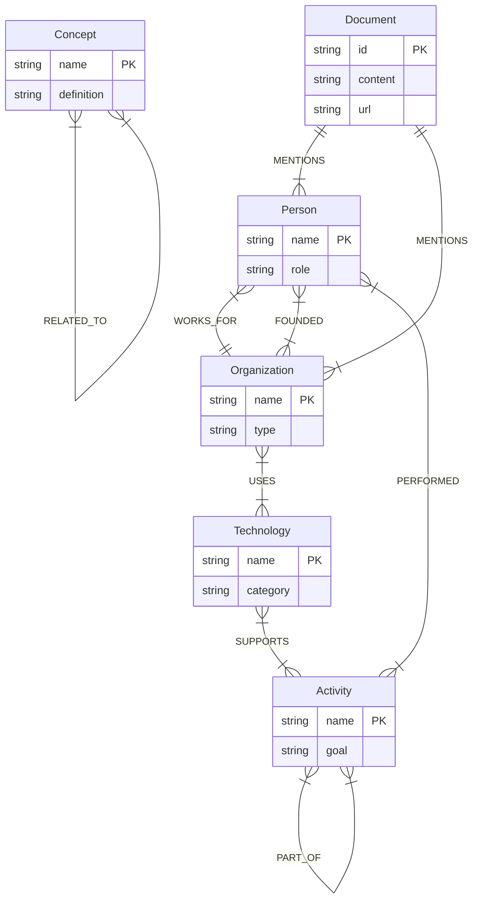

# Ontology Design

## 📌 배경 (Background)

### 왜 Ontology인가?

"지식"은 단순히 정보를 모아놓은 것이 아니라, **의미 있는 연결(Connection)**에서 탄생합니다. 
본 프로젝트는 웹에서 수집한 텍스트를 단순 저장하는 것을 넘어, **Knowledge Graph**로 발전시키기 위한 여정의 일부입니다.

Ontology는 그 여정의 핵심 청사진입니다:
- **Entity를 분류**하여 "Elon Musk"가 사람인지 회사인지 명확히 구분
- **Relationship을 정의**하여 "Elon Musk가 Tesla를 설립했다"는 사실을 구조화
- **확장 가능한 구조**로 향후 새로운 타입과 관계를 쉽게 추가

---

## 🏗️ Entity 타입 정의

### 1. PERSON (인물)
**정의**: 실존 인물 또는 가상의 캐릭터

**예시**:
- "Elon Musk", "Geoffrey Hinton", "Steve Jobs"
- "Harry Potter" (가상 인물도 포함)

**활용**:
- 인물 간 관계망 구축 (예: "누가 누구와 함께 일했는가?")
- 저작권 및 기여도 추적

---

### 2. ORGANIZATION (조직)
**정의**: 회사, 기관, 단체, 커뮤니티

**예시**:
- "Tesla", "MIT", "Y Combinator"
- "World Health Organization", "Python Software Foundation"

**활용**:
- 기업 간 관계 분석 (인수/합병, 파트너십)
- 기술 스택 추적 (예: "어떤 회사가 Neo4j를 사용하는가?")

---

### 3. TECHNOLOGY (기술)
**정의**: 구체적인 도구, 프레임워크, 프로그래밍 언어, 기술 제품

**예시**:
- "Python", "Docker", "GPT-4", "Neo4j"
- "React", "PostgreSQL", "Kubernetes"

**활용**:
- 기술 생태계 매핑 (예: "Python이 어떤 활동을 지원하는가?")
- 기술 스택 추천

---

### 4. CONCEPT (개념)
**정의**: 추상적 아이디어, 이론, 방법론, 학문적 개념

**예시**:
- "Machine Learning", "Clean Architecture"
- "Lean Startup", "Quantum Computing"

**활용**:
- 개념 간 연관성 탐색 (예: "Clean Architecture와 관련된 개념")
- 학습 경로 생성

---

### 5. LOCATION (장소)
**정의**: 지리적 위치, 도시, 지역, 국가

**예시**:
- "Seoul", "Silicon Valley", "San Francisco"
- "United States", "Hawthorne, California"

**활용**:
- 지역별 기술 트렌드 분석
- 이벤트-장소 매핑

---

### 6. EVENT (사건)
**정의**: 특정 사건, 컨퍼런스, 역사적 순간

**예시**:
- "OpenAI DevDay 2024", "NeurIPS 2024"
- "World War II", "TechCrunch Disrupt"

**활용**:
- 시간선 기반 지식 정리
- 사건-인물-장소 관계 구축

---

### 7. ACTIVITY (활동)
**정의**: 행위, 작업, 프로세스, 업무 활동

**예시**:
- **한글**: "책 쓰기", "벤치마킹", "코드 리뷰", "회고"
- **영문**: "Prototyping", "A/B Testing", "Data Analysis"

**활용**:
- 프로세스 최적화 (예: "어떤 기술이 코드 리뷰를 지원하는가?")
- 업무 패턴 분석

**설계 결정**:
- ACTIVITY 타입은 사용자 요청으로 추가됨 (Spec 007 기획 단계)
- "책 쓰기", "벤치마킹" 같은 한글 활동명을 명시적으로 지원하기 위함

---

## 🔗 Relationship 타입 정의




### Document-Entity 관계

#### MENTIONS
`(:Document) -[:MENTIONS]-> (:Entity)`

**의미**: "이 문서는 X를 언급한다"

**활용**:
- "Elon Musk를 언급한 모든 문서 찾기"
- Entity 등장 빈도 분석

---

### Entity-Entity 관계

#### WORKS_FOR
`(:Person) -[:WORKS_FOR]-> (:Organization)`

**예시**: "Geoffrey Hinton이 Google에서 일했다"

---

#### FOUNDED
`(:Person) -[:FOUNDED]-> (:Organization)`

**예시**: "Elon Musk가 Tesla를 설립했다"

---

#### USES
`(:Organization) -[:USES]-> (:Technology)`

**예시**: "Netflix가 Python을 사용한다"

---

#### RELATED_TO
`(:Concept) -[:RELATED_TO]-> (:Concept)`

**예시**: "Clean Architecture와 Domain-Driven Design이 관련되어 있다"

---

#### PERFORMED (🆕 Spec 007에서 추가)
`(:Person) -[:PERFORMED]-> (:Activity)`

**예시**: "팀이 벤치마킹을 수행했다"

**활용**:
- 누가 어떤 활동을 했는지 추적
- 업무 할당 최적화

---

#### SUPPORTS (🆕 Spec 007에서 추가)
`(:Technology) -[:SUPPORTS]-> (:Activity)`

**예시**: "Python이 데이터 분석을 지원한다"

**활용**:
- 활동에 필요한 기술 스택 파악
- 도구 추천 시스템

---

#### PART_OF (🆕 Spec 007에서 추가)
`(:Activity) -[:PART_OF]-> (:Activity)`

**예시**: "코드 리뷰는 개발 프로세스의 일부다"

**활용**:
- 활동 간 계층 구조 표현
- 프로세스 분해 및 시각화

---

## 🎯 설계 결정 기록 (ADR)

### 왜 7개 타입인가?

**Too Few (2-3개)**:
- Person, Organization만 있으면 "AI" 같은 개념이나 "책 쓰기" 같은 활동을 분류 불가

**Too Many (15-20개)**:
- LLM도 혼란스러워하고 분류 정확도 하락
- 유지보수 부담 증가

**Just Right (7개)**:
- 대부분의 지식 도메인을 커버 (인물, 조직, 기술, 개념, 장소, 사건, 활동)
- LLM이 일관되게 분류 가능한 수준
- 필요 시 확장 가능 (예: PRODUCT, DOCUMENT 등)

---

### 왜 Python Enum인가?

**대안 1: 자유 형식 문자열 (str)**
- ❌ LLM이 "Person", "PERSON", "사람" 등 불일치 값 생성 가능
- ❌ 타입 안전성 없음

**대안 2: Neo4j Cypher Schema**
- ❌ Infrastructure에 종속
- ❌ Domain 레이어 순수성 위반

**✅ 채택: Pydantic Enum (str 기반)**
- 타입 안전성 확보
- JSON 직렬화 용이
- IDE 자동 완성 지원
- 프레임워크 독립적

---

### 확장성 고려

#### 하위 타입 계층 (향후)
현재는 Flat 구조지만, 필요 시 계층화 가능:
```
TECHNOLOGY
├── PROGRAMMING_LANGUAGE (Python, JavaScript)
├── FRAMEWORK (React, Django)
└── TOOL (Docker, Git)
```

#### 새로운 타입 추가
`EntityType` Enum에 값만 추가하면 됨:
```python
class EntityType(str, Enum):
    # ... 기존 타입
    PRODUCT = "PRODUCT"  # 🆕 제품 타입 추가
```

---

## 🔮 향후 계획

### Spec 010: Knowledge Graph Construction (✅ 완료)
Spec 007의 설계를 기반으로 실제 구현이 완료되었습니다:

1. **✅ Entity Graph 자동 구축**
   - Document 수집 시 Entity를 Neo4j 노드로 자동 생성
   - MENTIONS 관계 자동 연결

2. **✅ Neo4j Repository 구현**
   - `Neo4jGraphRepository`로 Entity 저장 및 조회
   - Cypher Query Templates를 사용한 효율적 쿼리

3. **✅ Entity API 개발**
   - `GET /entities` - 전체 Entity 목록
   - `GET /entities/{name}/documents` - Entity별 Document 조회
   
### 향후 확장 (Future Specs)
4. **LLM Entity-Entity 관계 추출**
   - Prompt에 관계 추출 지시 추가
   - 예: "Elon Musk founded Tesla" → `(:Person)-[:FOUNDED]->(:Organization)`

5. **고급 Graph 탐색 API**
   - Graph 기반 복잡한 탐색 쿼리
   - Knowledge Path 분석

---

## 📚 참고 자료

### External Resources
- [Pydantic Enums](https://docs.pydantic.dev/latest/concepts/fields/#enums)
- [Neo4j Graph Data Modeling](https://neo4j.com/docs/getting-started/data-modeling/)
- [Ontology Design 101](https://protege.stanford.edu/publications/ontology_development/ontology101.pdf)

### Relationship Types

관계 타입은 두 Entity 간의 의미적 관계를 나타냅니다:

- **FOUNDED**: 창립 관계 (예: "Elon Musk founded Tesla")
- **WORKS_FOR**: 고용 관계 (예: "Alice works for Google")
- **USES**: 기술/도구 사용 관계 (예: "Tesla uses Python")
- **RELATED_TO**: 일반적 연관 관계 (예: "AI is related to Machine Learning")
- **SUPPORTS**: 지원 관계 (예: "Framework supports async operations")
- **PERFORMED**: 수행 관계 (예: "Company performed IPO")
- **PART_OF**: 부분 관계 (예: "PyTorch is part of Meta's AI ecosystem")

**Implementation (Spec 016):**

Entity 간 관계는 Neo4j 그래프에 명시적 관계로 저장됩니다:

```cypher
// Entity-Entity Relationship 생성
MATCH (source:Entity {name: $source_name})
MATCH (target:Entity {name: $target_name})
MERGE (source)-[r:RELATIONSHIP {type: $relationship_type}]->(target)
SET r.confidence = $confidence
RETURN r

// Relationship 조회
MATCH (e:Entity {name: $entity_name})-[r:RELATIONSHIP]->(target:Entity)
WHERE r.type = $relationship_type OR $relationship_type IS NULL
RETURN target.name as target_name, 
       target.type as target_type,
       r.type as relationship_type,
       r.confidence as confidence
```

**API Endpoint:**
- `GET /entities/{name}/relationships` - Entity의 모든 관계 조회
- Query Parameter: `relationship_type` (optional) - 특정 타입으로 필터링

**관련 Spec:**
- [Spec 007: Ontology Design](../specs/007-ontology-design/spec.md)
- [Spec 016: Entity Relationship Extraction](../specs/016-entity-relationship-extraction/spec.md)

### Related Documentation
- [Graph Schema Guide](./graph_schema.md) - Neo4j graph schema implementation details (Spec 010)
- [Neo4j Query Guide](./neo4j_query_guide.md) - Practical Cypher queries for knowledge graph exploration
- [Architecture Guide](./architecture.md) - Clean Architecture principles

---

**문서 작성일**: 2026-01-16  
**최종 업데이트**: 2026-01-19 (Spec 015: Documentation Update)  
**관련 Spec**: 
- [Spec 007: Ontology Design](file:///Users/ck/Project/doit/rag-ingestion/specs/007-ontology-design/spec.md)  
- [Spec 010: Knowledge Graph Construction](file:///Users/ck/Project/doit/rag-ingestion/specs/010-knowledge-graph-construction/spec.md)  
**구현 코드**: [`ontology.py`](file:///Users/ck/Project/doit/rag-ingestion/app/domain/schemas/ontology.py)
