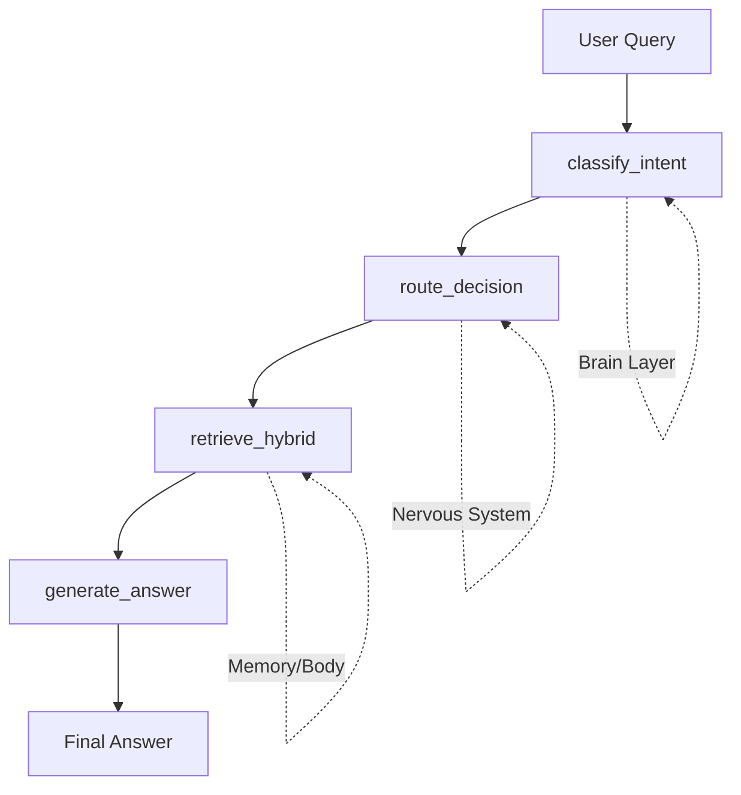

# RAG Pipeline Architecture

## 개요
RAG (Retrieval-Augmented Generation) 파이프라인은 **LangGraph 기반**으로 구현되어 있으며, 사용자 질문에 대해 관련 지식을 검색하고 답변을 생성합니다.

**Spec 033: LangGraph State Management**에서 기존 함수 기반 로직을 Graph 기반으로 전환하여 의사결정 과정을 State로 명시적으로 관리합니다.

## 아키텍처 (Design Guide 005: 3-Layer Pattern)



### 레이어 구조

| Layer | Component | Responsibility |
|:---:|:---:|:---|
| **Brain** | Intent Classifier, Query Rewriter | LLM을 사용한 의사결정 (Intent Classification, Query Rewriting) |
| **Nervous System** | LangGraph (RAGGraphState) | State 기반 흐름 제어 및 데이터 전달 |
| **Memory/Body** | Document Repository, Graph Repository | 물리적 검색 및 필터 강제 실행 |

## RAGGraphState 스키마

모든 중간 상태를 명시적으로 관리하는 TypedDict:

```python
class RAGGraphState(TypedDict):
    # Input
    query: str
    history: list[dict]
    manual_filters: dict | None
    
    # Brain (LLM Decisions)
    user_intent: UserIntent | None
    rewritten_query: str | None
    
    # Nervous System (Routing)
    auto_filters: dict | None
    final_filters: dict | None
    
    # Body (Results)
    vector_chunks: list[Chunk]
    keyword_chunks: list[Chunk]
    graph_data: list[dict]
    
    # Output
    full_context: str
    final_answer: str
```

## Graph 플로우

### Node 1: classify_intent
- **역할**: Intent Classification + Query Rewriting
- **Input**: `query`, `history`
- **Output**: `user_intent`, `rewritten_query`

### Node 2: route_decision
- **역할**: Intent → Filters 변환
- **Input**: `user_intent`, `manual_filters`
- **Output**: `auto_filters`, `final_filters`
- **로직**: `COMPARE`/`SUMMARIZE` 등에서 타겟을 `source` 필터로 변환. Manual Filters 우선.

### Node 3: retrieve_hybrid
- **역할**: Parallel Hybrid Search (Vector + Keyword + Graph)
- **주요 특징**: `asyncio.to_thread`를 사용하여 동기 DB 리포지토리를 병렬로 실행.

### Node 4: generate_answer
- **역할**: Context Formatting + LLM Generation
- **로직**: 검색된 청크들에 Citations(출처)를 부여하여 컨텍스트 생성 후 LLM 호출.

---

## ⚠️ Troubleshooting & Lessons Learned (Spec 033 Review)

테스트 및 리뷰 과정에서 발견된 주요 이슈와 이에 대한 상세 원인 분석 기록입니다.

### 1. 필터링 강도와 데이터 불일치 이슈 (Scenario 2: Strict Filtering)

**현상 및 제보 내용**:
- "Claude와 GPT-4 비교", "일론 머스크와 스티브 잡스의 공통점" 등 특정 대상을 지목한 질문 시 검색 결과가 0건(`Document Context: [EMPTY]`)으로 나타남.

**상세 원인 분석**:
- **Intent Classifier의 동작**: `Intent: COMPARE`, `Targets: ["일론 머스크", "스티브 잡스"]`로 의도를 아주 정확하게 파악함.
- **Strict Filtering의 함정**: 파이프라인은 추출된 타겟을 바탕으로 `source` 필드 필터링을 강제함. 
  - 검색 명령: `source가 ["일론 머스크", "스티브 잡스"]인 문서를 찾아라.`
  - 실제 DB 상태: 문서는 `Elon Musk Bio`라는 영어 타이틀/소스로 저장되어 있거나, `tech_wiki`와 같은 다른 소스 명칭을 가짐.
- **결과**: 한글 대상명과 실제 DB의 소스 명칭이 **정확히 일치(Exact Match)**하지 않아 필터링 단계에서 모든 검색 결과가 차단됨.

---

### 2. Context 부재 시 LLM의 자의적 답변 (Hallucination 위험)

**현상 및 제보 내용**:
- "일론 머스크와 스티브 잡스의 공통점" 질문 시, 분명히 `Document Context`는 비어있음에도 불구하고 LLM이 "혁신적인 비전, 강력한 리더십..." 등 매우 훌륭한 답변을 내놓음.

**상세 원인 분석**:
- **RAG의 기본 전제**: RAG는 주어진 Context 내에서만 답을 찾아야 함.
- **프롬프트 제어 부족**: 현재 `nodes.py`의 `generate_answer` 노드에 설정된 프롬프트가 충분히 엄격하지 않음. 
  - "컨텍스트 기반으로 답해라"라는 지시는 있으나, **"컨텍스트에 정보가 아예 없으면 절대 지어내지 말고 모른다고 답해라"**라는 강력한 제약(Guardrail)이 부족함.
- **결과**: LLM이 자신의 내부 지식(Internal Knowledge)을 동원하여 답변함으로써, 사용자는 시스템이 DB 정보를 사용한 것으로 오해할 수 있는 상황이 발생함.

---

### 3. Manual Filter와 의도 사이의 충돌 (Scenario 3: Manual Override)

**현상 및 제보 내용**:
- 사용자가 UI에서 특정 문서(예: "일론 머스크")를 고정(Manual Filter)한 후 무거운 비교 질문을 던졌으나, 필터에 의해 다른 정보(스티브 잡스)가 차단되어 답변 품질이 저하됨.
- 제보 요지: "Search Documents 부분이 1개만 선택되는 것(혹은 하나만 고정하는 것)이 의도적인 비교 시나리오를 방해할 수 있다."

**상세 원인 분석**:
- **필터 배타성**: 현재 로직은 사용자 수동 필터를 최우선 시함. 사용자가 "머스크"만 고정하면 시스템은 "잡스" 정보가 DB에 있어도 절대 보지 않음.
- **데이터 파편화**: 특정 문서 내의 정보가 가십성(트윗 등)인 경우, '비교'라는 복합적인 Intent를 처리하기에 부적절한 Context가 되어 답변이 어색해짐.

**설계 고민 및 개선 방향 (Spec 034+)**:
- **UI/UX 조율**: 수동 필터가 걸려 있더라도 Intent 달성을 위해 추가 정보가 필요한 경우, 사용자에게 필터 해제를 제안하거나 동적으로 범위를 확장하는 지능형 검색 전환 필요.

---

## 🔬 Advanced Topic: Hybrid Knowledge Strategy (RAG vs LLM Balance)

PR 리뷰 과정에서 도출된 RAG 설계 철학에 대한 중요한 논의 기록입니다.

**사용자 제보 및 제안**:
- "RAG에 정보가 부족하거나 한쪽 정보만 있을 경우, 시스템이 유연하게 LLM의 배경 지식을 섞어서 답변해야 한다. (예: 일론은 DB 정보로, 잡스는 LLM 정보로 비교)"
- "의존도가 너무 RAG에만 쏠리는 것보다 사용성을 위해 하이브리드로 가야 하지 않을까?"

**기술적 합의 및 설계 원칙**:
- **Transparent Hybrid 패턴 채택**: LLM의 지식을 융합하되, **출처의 투명성**을 유지하는 방향으로 발전시킨다.
- **구분 답변**: 
  - DB 근거 정보: `[1] (Source)` 처럼 인덱스를 붙여 팩트 강조. 
  - LLM 보충 정보: "지식 베이스 외 일반 상식(General Knowledge)"임을 명시하여 신뢰도를 관리함.
- **Adaptive Augmentation**: 검색된 Context의 질이 검색어(Query)에 비해 현저히 낮을 경우, LLM에게 "문맥을 보강하라"는 지시를 동적으로 추가함.

---

## Checkpointer 통합 및 상태 관리
`SqliteSaver`를 사용하여 State Snapshot을 저장하며, 이를 통해 Admin Dashboard에서 과거의 의사결정 과정을 추적할 수 있습니다.

### Troubleshooting: `checkpoints.sqlite` 손상 및 Playground 미연동 이슈 (2026-01-24)
- **현상**: `sqlite3.DatabaseError: file is not a database` 발생.
- **원인**: `checkpoints.sqlite` 파일이 알 수 없는 바이너리 데이터(UUID 등 포함)로 채워져 SQLite 형식이 파괴됨. 또한 `4_RAG_Playground.py`에서 `graph_builder.build()` 호출 시 `checkpointer` 인자가 누락되어 Playground 대화 내역이 저장되지 않는 문제 발견.
- **해결 및 후속 조치**:
  1. 손상된 파일을 백업하고 정상적인 SQLite DB로 교체 완료.
  2. `rag-backend` 컨테이너에는 `sqlite3` CLI가 없으므로 Python 스크립트(`check_states.py`)를 통해 관리하도록 프로세스 정립.
  3. Spec 034 작업 시 Playground 코드에 `checkpointer`를 명시적으로 주입하도록 수정 예정.
