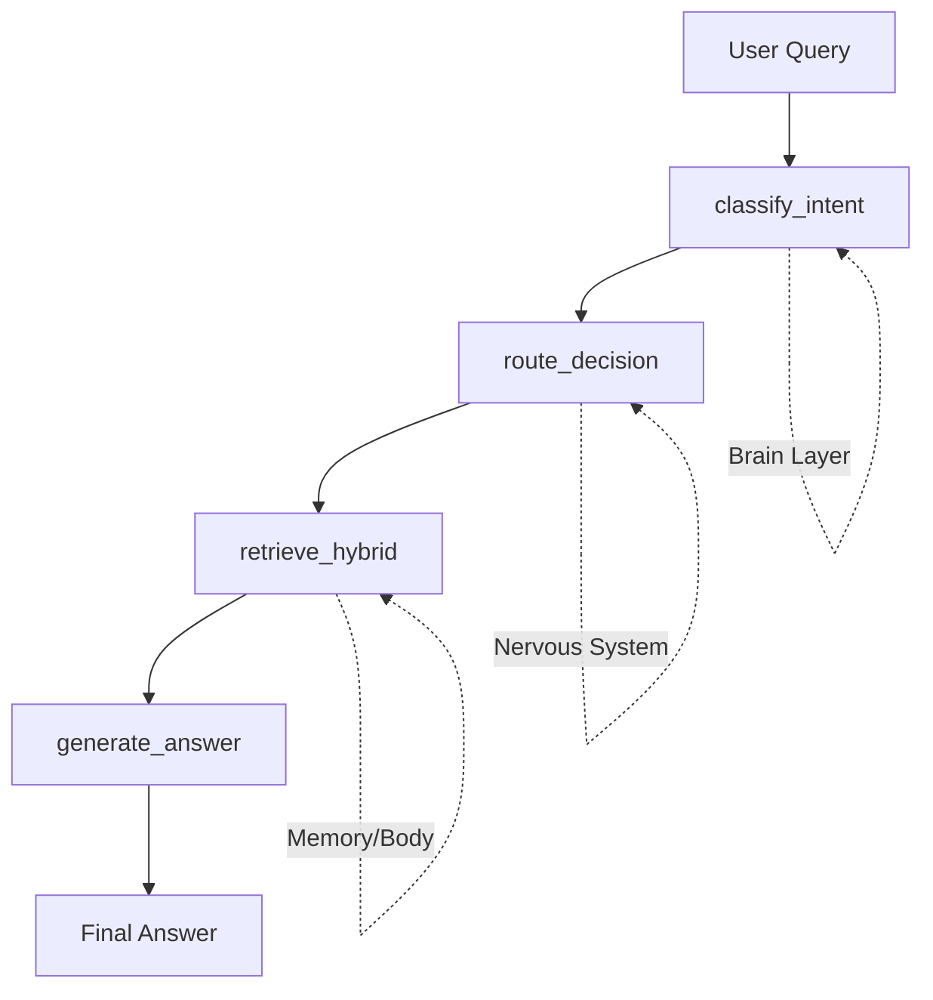

# RAG Pipeline Architecture

## 개요

RAG (Retrieval-Augmented Generation) 파이프라인은 **LangGraph 기반**으로 구현되어 있으며, 사용자 질문에 대해 관련 지식을 검색하고 답변을 생성합니다.

**Spec 033: LangGraph State Management**에서 기존 함수 기반 로직을 Graph 기반으로 전환하여 의사결정 과정을 State로 명시적으로 관리합니다.

## 아키텍처 (Design Guide 005: 3-Layer Pattern)



### 레이어 구조

| Layer | Component | Responsibility |
|:---:|:---:|:---|
| **Brain** | Intent Classifier, Query Rewriter | LLM을 사용한 의사결정 (Intent Classification, Query Rewriting) |
| **Nervous System** | LangGraph (RAGGraphState) | State 기반 흐름 제어 및 데이터 전달 |
| **Memory/Body** | Document Repository, Graph Repository | 물리적 검색 및 필터 강제 실행 |

## RAGGraphState 스키마

모든 중간 상태를 명시적으로 관리하는 TypedDict:

```python
class RAGGraphState(TypedDict):
    # Input
    query: str
    history: list[dict]
    manual_filters: dict | None
    
    # Brain (LLM Decisions)
    user_intent: UserIntent | None
    rewritten_query: str | None
    
    # Nervous System (Routing)
    auto_filters: dict | None
    final_filters: dict | None
    
    # Body (Results)
    vector_chunks: list[Chunk]
    keyword_chunks: list[Chunk]
    graph_data: list[dict]
    
    # Output
    full_context: str
    final_answer: str
```

## Graph 플로우

### Node 1: classify_intent
- **역할**: Intent Classification + Query Rewriting
- **Input**: `query`, `history`
- **Output**: `user_intent`, `rewritten_query`
- **구현**: `IntentClassifier` + `QueryRewriter`

### Node 2: route_decision
- **역할**: Intent → Filters 변환
- **Input**: `user_intent`, `manual_filters`
- **Output**: `auto_filters`, `final_filters`
- **로직**:
  - `COMPARE` / `SUMMARIZE` → `{source: targets}`
  - `FILTER_BY_TOPIC` → `{topic: targets}`
  - Manual Filters 우선 적용

### Node 3: retrieve_hybrid
- **역할**: Parallel Hybrid Search
- **Input**: `rewritten_query`, `final_filters`
- **Output**: `vector_chunks`, `keyword_chunks`, `graph_data`
- **구현**: Async Parallel 검색 (Vector + Keyword + Graph)

### Node 4: generate_answer
- **역할**: Context Formatting + LLM Generation
- **Input**: `query`, `vector_chunks`, `keyword_chunks`, `graph_data`
- **Output**: `full_context`, `final_answer`
- **로직**: Citations 포함 Context 생성 → LLM 호출

## 주요 컴포넌트

### RAGNodes (`app/infrastructure/rag/nodes.py`)
Graph의 각 노드 비즈니스 로직을 캡슐화한 클래스.

### RAGGraphBuilder (`app/infrastructure/rag/graph.py`)
StateGraph를 구성하고 Checkpointer와 통합하여 CompiledGraph를 생성.

### RAGService (`app/domain/services/rag_service.py`)
Graph를 실행하고 결과를 RAGResult로 변환하는 Orchestrator.

---

## 💡 Lessons Learned & Troubleshooting (Spec 033)

### 1. 자동 필터링의 견고성 문제 (Scenario 2 & 3 이슈)

**문제 현상**:  
`COMPARE` 의도 시 추출된 `targets`가 `source` 필터로 강제 적용되는데, 다음 사유로 검색 결과가 0건이 되는 현상 발생.
1.  **데이터 부재**: DB에 해당 주제의 문서 자체가 없음.
2.  **언어/명칭 불일치**: Intent는 "일론 머스크"(한국어)를 추출했으나, DB에는 "Elon Musk Bio"(영어)로 저장되어 매칭 실패.
3.  **엄격한 매칭**: 필터가 `source` 전체 일치를 요구하여 조금만 달라도 차단됨.

**LLM Fallback 현상**:
RAG 컨텍스트가 비어있을 때 LLM이 자신의 사전 지식(Internal Knowledge)으로 답변을 생성함. 이는 사용자가 RAG 기반 답변인지 식별하기 어렵게 만듦.

**설계 결정 및 개선 방향 (Spec 034 예정)**:  
- **Soft Filter / Fallback 로직**: 필터 결과가 0건일 경우 자동으로 필터를 해제(Global Search)하여 의미적으로 유사한 문서를 재검색.
- **검색 쿼리 강화**: 추출된 `targets`를 필터뿐만 아니라 검색 쿼리에 포함시켜 검색 확률을 높임.

---

## Checkpointer 통합

`SqliteSaver`를 사용하여 State Snapshot을 저장하며, 향후 HITL(Human-in-the-Loop) 확장이 가능합니다.

## 테스트 전략

- **Unit Tests**: Mock LLM을 사용하여 각 Node를 독립적으로 테스트
- **Integration Tests**: 실제 LLM을 사용하여 End-to-End 흐름 검증
- **Contract Tests**: RAGService API 호환성 유지 검증
