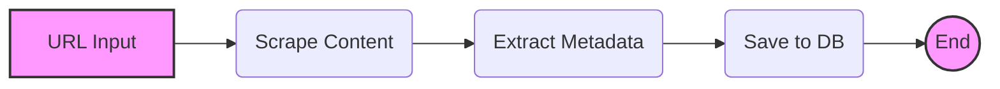
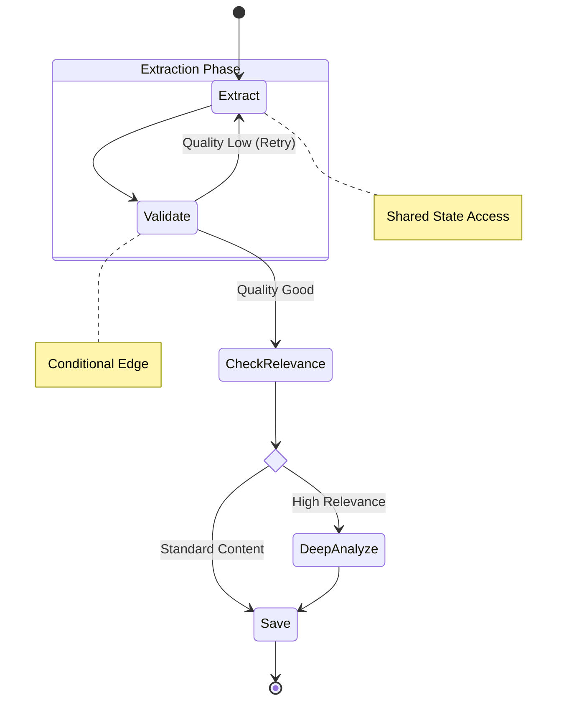

# Architecture Decision: From Linear DAG to Stateful Graph

**Date**: 2026-01-20
**Status**: Accepted
**Context**: Spec 020 (Transition to LangGraph)

---

## 1. Context & Problem Definition

### 1.1 The Current State (Linear DAG)
초기 MVP 단계에서 우리의 Ingestion Pipeline은 LangChain의 `RunnableSequence`를 사용한 **선형적인 DAG(Directed Acyclic Graph)** 구조였습니다.

이 구조는 단순하고 명확하지만, **"데이터가 한 방향으로만 흐른다"**는 강력한 제약사항이 있습니다. Phase 4로 진입하면서 다음과 같은 복잡한 요구사항이 등장했습니다.

### 1.2 The Limits of DAG
1.  **No Cycles (순환 불가능)**: 
    *   품질이 낮으면 다시 추출하거나, 정보가 부족하면 추가 검색을 하는 식의 **Retry Loop**를 구현하기 어렵습니다.
    *   LangChain에서 LCEL로 루프를 만드려면 복잡한 재귀 호출이 필요하며 디버깅이 난해해집니다.
2.  **Stateless Hardship (상태 관리의 어려움)**:
    *   각 단계(Step)는 이전 단계의 출력만 받을 수 있습니다.
    *   파이프라인 전체에서 공유해야 하는 "Context(원본 메타데이터, 로그, 에러 상태 등)"를 관리하려면 모든 단계의 입/출력 스키마를 맞춰야 합니다.
3.  **No Human-in-the-loop (중간 개입 불가)**:
    *   실행 도중 특정 단계에서 멈추고, 사람의 승인을 기다렸다가 재개(Resume)하는 기능을 구현하기 위해선 외부 데이터베이스에 상태를 저장하고 불러오는 로직을 직접 구현해야 합니다.

---

## 2. Solution: Stateful Graph (LangGraph)

우리는 파이프라인의 패러다임을 **Function Composition (DAG)** 에서 **State Machine (Graph)** 으로 전환합니다.

### 2.1 The New Architecture (State Graph)

### 2.2 Key Improvements
1.  **Loop & Cycles**:
    *   잘못된 결과가 나오면 `Validate` 노드에서 `Extract` 노드로 화살표를 다시 그리면 끝입니다. 그래프 엔진이 이를 순환 처리합니다.
2.  **Single Source of Truth (IngestionState)**:
    *   `IngestionState`라는 TypedDict 하나를 정의하고, 모든 노드가 이를 공유합니다.
    *   노드는 필요한 데이터만 읽고(`Read`), 변경된 데이터만 갱신(`Update`)하면 됩니다. 입출력 파이프라인을 맞출 필요가 없습니다.
3.  **Persistence & Time Travel**:
    *   LangGraph는 각 단계마자 `Checkpoint`를 저장합니다.
    *   에러가 발생하면 해당 시점의 상태를 수정하여 **그 지점부터 다시 실행(Replay)** 할 수 있습니다.

---

## 3. Comparison Summary

| Feature | LangChain (LCEL) | LangGraph |
| :--- | :--- | :--- |
| **Topology** | DAG (단방향, 비순환) | Cyclic Graph (순환 가능) |
| **Data Flow** | Input -> Output (River) | Shared State (Blackboard) |
| **Control Flow** | Implicit (체인 연결) | Explicit (Conditional Edges) |
| **Human Interaction** | Hard (외부 DB 의존) | Native (Checkpoint & Interrupt) |
| **Use Case** | Simple Transformations | Complex Agents, Long-running logic |

---

## 4. Migration Strategy

우리는 **점진적 전환(Incremental Adoption)** 전략을 취합니다.

1.  **Phase 1 (Spec 020)**: 기존의 선형 로직을 그대로 Graph로 옮깁니다. (`Extract` -> `Save`)
2.  **Phase 2 (Spec 021)**: Conditional Logic 추가 (Logic Resolver).
3.  **Phase 3 (Spec 022)**: Human-in-the-loop 및 외부 n8n 트리거 연동.

이로써 시스템은 복잡성을 수용할 수 있는 유연한 아키텍처로 진화합니다.
