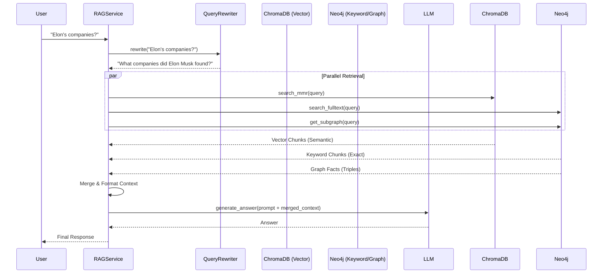

# Design Guide 004: Graph-Enhanced RAG Strategy

## 1. Overview
This document outlines the **Graph-Enhanced RAG** strategy implemented in Spec 026. The goal is to overcome the limitations of simple vector similarity search by integrating:
1.  **Keyword Search (Neo4j Fulltext)**: For exact term matching.
2.  **Graph Traversal (Neo4j)**: For retrieving structured factual context (triples).
3.  **Vector Diversity (MMR)**: For reducing redundancy in retrieved chunks.

## 2. Architecture

The `RAGService` orchestrates the retrieval pipeline as follows:



## 3. Key Components

### 3.1. Hybrid Search (Spec 026)
We combine three retrieval signals:
- **Vector**: Understanding intent (e.g., "electric car boss").
- **Keyword**: Exact entity matching (e.g., "Elon Musk", "Tesla").
- **Graph**: Structural relationships (e.g., `(Elon Musk)-[:FOUNDED]->(SpaceX)`).

### 3.2. Vector Diversity: kNN vs MMR
Standard kNN search often retrieves nearly identical chunks. We use **Maximal Marginal Relevance (MMR)** to penalize redundancy.

| Algorithm | Pros | Cons |
| :--- | :--- | :--- |
| **kNN (Euclidean/Cosine)** | Simple, Fast | "Clumping" (redundant results) |
| **MMR** | Diverse, Comprehensive coverage | Slightly slower (re-ranking) |

**Formula**:
`MMR = argmax [ lambda * Sim(D, Q) - (1-lambda) * max(Sim(D, Di)) ]`
- High `lambda`: Focus on relevance (like kNN).
- Low `lambda`: Focus on diversity.
- *Default Config*: `lambda=0.7` for balanced results.

### 3.3. Graph Context Injection
We inject structured facts (triples) at the top of the LLM context.
**Format**:
```
Graph Facts:
- (Elon Musk) -[FOUNDED]-> (SpaceX)
- (SpaceX) -[LOCATED_IN]-> (USA)

Document Context:
[1] Source: Wiki...
```
This forces the LLM to ground its reasoning in verified structural data, reducing hallucinations about relationships.
