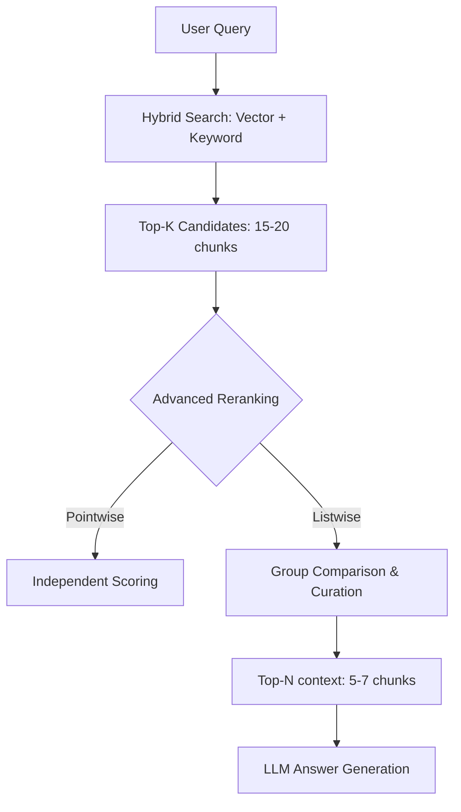

# 고급 리랭킹 가이드: Listwise Reranking & Context Expansion

이 문서는 **Spec-067**을 통해 도입된 고급 리랭킹 기법의 개념, 작동 방식 및 실무 적용 가이드를 제공합니다.

---

## 1️⃣ Listwise Reranking 이란?

> **"후보 문서 각각의 점수를 따로 계산하는 것이 아니라, '이 질문에 대해 이 문서들이 어떤 상대적 순서를 가져야 하는지'를 한 번에 판단하는 랭킹 방식"**

기존의 Pointwise 방식이 개별 문서의 '절대 점수'에 집착했다면, Listwise 방식은 문서들 간의 **상대적 순서(Order)**와 **상호 보완성**에 집중합니다.

---

## 2️⃣ RAG 파이프라인 내 위치

우리 프로젝트의 RAG 워크플로우에서 리랭킹은 다음과 같은 위치에 배치됩니다:

👉 **Listwise Reranking은 "검색 결과 후보 도출 이후, 최종 답변 생성 직전"**의 정밀 여과 단계입니다.

---

## 3️⃣ 기존 방식 vs Listwise의 결정적 차이

### 🔹 Pointwise (기존 방식)
*   **작동**: Query + Doc1 → 점수, Query + Doc2 → 점수...
*   **문제**: 문서끼리 서로 비교하지 않으므로, 내용이 거의 중복되는 문서들이 동시에 상위에 노출되어 컨텍스트 윈도우를 낭비할 수 있습니다.

### 🔹 Listwise (도입된 방식)
*   **작동**: Query + [Doc1, Doc2, Doc3... Doc10] → "이 질문에 가장 적합한 순서로 정렬"
*   **장점**: LLM이 문서 전체를 조망하며 **"개념 설명 → 예제 → 심화 내용"** 순으로 논리적인 흐름을 설계할 수 있습니다. 또한 중복된 정보는 자연스럽게 순위가 밀립니다.

---

## 4️⃣ Sliding Window (Context Expansion)의 역할

리랭킹 성능을 극대화하기 위해 우리 시스템은 **인접 청크 보강(Sliding Window)** 기법을 병행합니다.

*   **배경**: 정보가 여러 청크에 걸쳐 나뉘어 있을 경우(Context Fragmentation), 각 청크는 단독으로는 낮은 점수를 받고 탈락할 위험이 있습니다.
*   **해결**: 리랭킹 평가 시 해당 청크의 **전후 맥락(인접 청크)**을 함께 LLM에게 전달하여, 파편화된 정보를 복원하고 정확한 가치 판단을 돕습니다.

---

## 5️⃣ 실무 적용 가이드

### ✅ 언제 Listwise를 쓰는 것이 좋을까?
*   **"왜 / 어떻게 / 비교해줘"**와 같은 추론 중심 질문.
*   기술 문서 QA, 법률/의료 등 정밀한 맥락 파악이 중요한 도메인.
*   답변의 **근거(Citation) 품질**을 높이고 싶을 때.

### ❌ 언제 Pointwise(기본값)가 유리할까?
*   매우 빠른 응답 속도(Latency)가 최우선인 경우.
*   단순 FAQ 검색이나 키워드 위주의 단답형 질문.
*   API 비용 최적화가 극도로 중요한 상황.

---

## 6️⃣ 요약 및 결론

> **Listwise Reranking은 단순한 "검색 정확도" 개선을 넘어, "LLM이 답변을 가장 잘 만들 수 있도록 문서를 큐레이션하는 기술"입니다.**

이 기법의 도입을 통해 우리 RAG 시스템은 더 높은 답변 신뢰도(Faithfulness)와 정교한 출처 인용 능력을 갖추게 되었습니다.

---
**관련 문서**:
* [Spec-067: Advanced Reranking Logic Research](file:///Users/ck/Project/doit/rag-ingestion/specs/067-advanced-reranking/spec.md)
* [Implementation Plan](file:///Users/ck/Project/doit/rag-ingestion/specs/067-advanced-reranking/plan.md)
