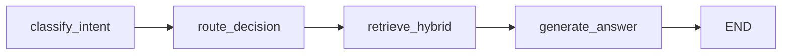

# Implementation Plan: Spec 033 - LangGraph State Management

## 📋 Branch Strategy
- `feature/033-langgraph-state-management`

## 🛑 User Review Required

> [!WARNING]
> **아키텍처 변경**: RAG 파이프라인을 기존 함수 기반에서 LangGraph 기반으로 전환하므로, 구조적 변경이 발생합니다.

> [!IMPORTANT]
> **API 호환성**: 기존 `RAGService.retrieve_and_generate()` 인터페이스는 유지하지만, 내부 구현이 완전히 변경됩니다.

**검토 필요 사항:**
- [x] RAG 파이프라인의 LangGraph 전환 승인 여부
- [x] State 스키마 설계 검토 (필드 구성 및 타입)
- [x] 기존 테스트가 모두 통과하는지 확인 후 머지

---

## 🎯 Core Strategy

### 1. 아키텍처 설계: Ingestion Graph 패턴 재사용

기존 **Ingestion Pipeline**에서 검증된 LangGraph 패턴을 RAG 파이프라인에 적용합니다:

| 구성 요소 | Ingestion (참고) | RAG (신규) |
|:---:|:---|:---|
| **State** | `IngestionState` (TypedDict) | `RAGGraphState` (TypedDict) |
| **Nodes** | `IngestionNodes` (비즈니스 로직) | `RAGNodes` (신규 클래스) |
| **Graph Builder** | `IngestionGraphBuilder` | `RAGGraphBuilder` (신규 클래스) |
| **Adapter** | `LangGraphAdapter` (Ingestion 전용) | `RAGService` 내부에서 직접 사용 |
| **Checkpointer** | `SqliteSaver` | `SqliteSaver` (공유) |

### 2. RAGGraphState 스키마 설계

```python
# app/domain/rag/state.py (신규)
from typing import TypedDict
from app.domain.entities.chunk import Chunk
from app.domain.schemas.intent import UserIntent

class RAGGraphState(TypedDict):
    \"\"\"RAG Pipeline의 전체 상태를 관리하는 TypedDict.\"\"\"
    
    # Input
    query: str  # 원본 사용자 질문
    history: list[dict]  # 대화 이력
    manual_filters: dict | None  # 사용자 지정 필터 (우선순위 높음)
    
    # Brain Layer (LLM Decisions)
    user_intent: UserIntent | None  # Intent Classifier 결과
    rewritten_query: str | None  # Query Rewriter 결과
    
    # Nervous System (Routing Decisions)
    auto_filters: dict | None  # Intent → Filters 변환 결과
    final_filters: dict | None  # Manual + Auto 병합 결과
    
    # Memory/Body (Retrieval Results)
    vector_chunks: list[Chunk]
    keyword_chunks: list[Chunk]
    graph_data: list[dict]
    
    # Output
    full_context: str  # Formatted context for LLM
    final_answer: str  # Generated answer
```

### 3. Graph 구조: 4-Node Pipeline



**노드별 책임:**
1. **classify_intent**: Intent Classification + Query Rewriting (Brain)
2. **route_decision**: Intent → Filters 변환 (Deterministic Logic)
3. **retrieve_hybrid**: Parallel Hybrid Search (Async)
4. **generate_answer**: LLM Answer Generation

### 4. RAGService 전환 전략

**기존 구조** (함수 기반):
```python
class RAGService:
    async def retrieve_and_generate(self, query, history, filters=None):
        user_intent = self._classify_intent_with_fallback(query, history)
        auto_filters = self._intent_to_filters(user_intent)
        # ... (이하 검색 및 생성 로직)
```

**변경 후** (LangGraph 기반):
```python
class RAGService:
    def __init__(self, ..., graph_builder: RAGGraphBuilder):
        self.graph = graph_builder.build(checkpointer=checkpointer)
    
    async def retrieve_and_generate(self, query, history, filters=None):
        initial_state = RAGGraphState(
            query=query,
            history=history,
            manual_filters=filters
        )
        result = await self.graph.ainvoke(initial_state)
        return self._state_to_result(result)  # Convert to RAGResult
```

---

## 📂 Proposed Changes

### Domain Layer

#### [NEW] `app/domain/rag/__init__.py`
RAG 도메인 패키지 생성 (Ingestion과 분리).

---

#### [NEW] `app/domain/rag/state.py`
RAGGraphState TypedDict 정의.

```python
from typing import TypedDict
from app.domain.entities.chunk import Chunk
from app.domain.schemas.intent import UserIntent

class RAGGraphState(TypedDict):
    # Input
    query: str
    history: list[dict]
    manual_filters: dict | None
    
    # Brain (Decisions)
    user_intent: UserIntent | None
    rewritten_query: str | None
    
    # Nervous System (Routing)
    auto_filters: dict | None
    final_filters: dict | None
    
    # Body (Results)
    vector_chunks: list[Chunk]
    keyword_chunks: list[Chunk]
    graph_data: list[dict]
    
    # Output
    full_context: str
    final_answer: str
```

---

### Infrastructure Layer

#### [NEW] `app/infrastructure/rag/__init__.py`
RAG Infrastructure 패키지 생성.

---

#### [NEW] `app/infrastructure/rag/nodes.py`
RAG Graph의 각 노드 비즈니스 로직 구현.

**핵심 메서드:**
- `classify_intent(state: RAGGraphState) -> RAGGraphState`
  - `IntentClassifier` + `QueryRewriter` 호출
  - `user_intent`, `rewritten_query` 업데이트
  
- `route_decision(state: RAGGraphState) -> RAGGraphState`
  - Intent → Auto Filters 변환
  - Manual Filters와 병합하여 `final_filters` 업데이트
  
- `retrieve_hybrid(state: RAGGraphState) -> RAGGraphState`
  - Parallel 검색 (Vector + Keyword + Graph)
  - `vector_chunks`, `keyword_chunks`, `graph_data` 업데이트
  
- `generate_answer(state: RAGGraphState) -> RAGGraphState`
  - Context Formatting + LLM Generation
  - `full_context`, `final_answer` 업데이트

**참고**: 기존 `RAGService`의 로직을 각 노드로 분리합니다.

---

#### [NEW] `app/infrastructure/rag/graph.py`
RAG Graph Builder 구현.

```python
from langgraph.graph import END, StateGraph
from app.domain.rag.state import RAGGraphState
from app.infrastructure.rag.nodes import RAGNodes

class RAGGraphBuilder:
    def __init__(self, nodes: RAGNodes):
        self.nodes = nodes
    
    def build(self, checkpointer=None):
        workflow = StateGraph(RAGGraphState)
        
        # Add Nodes
        workflow.add_node("classify_intent", self.nodes.classify_intent)
        workflow.add_node("route_decision", self.nodes.route_decision)
        workflow.add_node("retrieve_hybrid", self.nodes.retrieve_hybrid)
        workflow.add_node("generate_answer", self.nodes.generate_answer)
        
        # Add Edges (Linear Pipeline)
        workflow.set_entry_point("classify_intent")
        workflow.add_edge("classify_intent", "route_decision")
        workflow.add_edge("route_decision", "retrieve_hybrid")
        workflow.add_edge("retrieve_hybrid", "generate_answer")
        workflow.add_edge("generate_answer", END)
        
        # Compile
        if checkpointer:
            return workflow.compile(checkpointer=checkpointer)
        return workflow.compile()
```

---

#### [MODIFY] `app/domain/services/rag_service.py`
기존 함수 기반 로직을 LangGraph 호출로 전환.

**변경 사항:**
1. Constructor에 `RAGGraphBuilder` 주입
2. `retrieve_and_generate()` 메서드를 Graph Invocation으로 대체
3. 기존 헬퍼 메서드(`_classify_intent_with_fallback`, `_intent_to_filters` 등)는 `RAGNodes`로 이동
4. `_state_to_result()` 메서드 추가 (State → RAGResult 변환)

**Before:**
```python
async def retrieve_and_generate(self, query, history, filters=None):
    user_intent = self._classify_intent_with_fallback(query, history)
    auto_filters = self._intent_to_filters(user_intent)
    # ... (직접 검색 및 생성)
```

**After:**
```python
async def retrieve_and_generate(self, query, history, filters=None, thread_id=None):
    initial_state = {
        "query": query,
        "history": history,
        "manual_filters": filters,
        # Initialize empty fields
        "user_intent": None,
        "rewritten_query": None,
        "auto_filters": None,
        "final_filters": None,
        "vector_chunks": [],
        "keyword_chunks": [],
        "graph_data": [],
        "full_context": "",
        "final_answer": ""
    }
    
    config = {"configurable": {"thread_id": thread_id}} if thread_id else {}
    result_state = await self.graph.ainvoke(initial_state, config=config)
    
    return self._state_to_result(result_state)
```

---

#### [MODIFY] `app/interfaces/api/dependencies.py`
`RAGService` DI 설정에 Graph Builder 추가.

```python
def get_rag_nodes(
    neo4j_doc_repo=Depends(...),
    neo4j_graph_repo=Depends(...),
    chroma_repo=Depends(...),
    query_rewriter=Depends(get_query_rewriter),
    intent_classifier=Depends(get_intent_classifier),
    llm=Depends(get_llm)
) -> RAGNodes:
    return RAGNodes(
        neo4j_doc_repo=neo4j_doc_repo,
        neo4j_graph_repo=neo4j_graph_repo,
        chroma_repo=chroma_repo,
        query_rewriter=query_rewriter,
        intent_classifier=intent_classifier,
        llm=llm
    )

def get_rag_graph_builder(nodes: RAGNodes = Depends(get_rag_nodes)) -> RAGGraphBuilder:
    return RAGGraphBuilder(nodes)

def get_rag_service(
    graph_builder: RAGGraphBuilder = Depends(get_rag_graph_builder),
    checkpointer: SqliteSaver = Depends(get_checkpointer)
) -> RAGService:
    return RAGService(graph_builder, checkpointer)
```

---

### Test Layer

#### [NEW] `tests/unit/infrastructure/rag/test_rag_nodes.py`
각 노드의 비즈니스 로직 단위 테스트.

**테스트 시나리오:**
1. `test_classify_intent_node_updates_state`: Intent + Rewrite 결과가 State에 저장됨
2. `test_route_decision_converts_intent_to_filters`: Intent → Filters 변환 정확성
3. `test_route_decision_prioritizes_manual_filters`: Manual Filters가 Auto보다 우선
4. `test_retrieve_hybrid_node_parallel_search`: 3개 검색 결과가 모두 State에 저장됨
5. `test_generate_answer_node_formats_context`: Context Formatting 및 LLM 호출 확인

---

#### [NEW] `tests/integration/bdd/test_rag_graph_flow.py`
End-to-End RAG Graph 실행 테스트 (Real LLM).

**Given-When-Then 시나리오:**

**Scenario 1: 일반 질문 흐름**
- Given: "인공지능이 뭐야?" 질문
- When: RAG Graph 실행
- Then: GENERAL_QUERY Intent, 전체 검색 수행, 답변 생성

**Scenario 2: 비교 의도 자동 필터링**
- Given: "Claude와 GPT-4를 비교해줘" 질문 + 두 문서 존재
- When: RAG Graph 실행
- Then: COMPARE Intent, Filters={source: [claude, gpt-4]}, 두 문서만 검색

**Scenario 3: State Checkpoint 저장**
- Given: Thread ID 지정
- When: RAG Graph 실행
- Then: Checkpointer에 State Snapshot 저장 확인

---

#### [MODIFY] `tests/integration/bdd/test_rag_service.py`
기존 RAG Service 통합 테스트 수정 (Graph 기반 동작 확인).

**변경 사항:**
- Graph 기반으로 변경되었지만 API Signature는 동일하므로 테스트 코드는 최소 변경
- State 기반 동작 확인을 위한 Assertion 추가 (예: `result.user_intent is not None`)

---

## 🧪 Verification Plan

### Automated Tests

#### Unit Tests
```bash
# RAG Nodes Logic (각 노드 독립 테스트)
uv run pytest tests/unit/infrastructure/rag/test_rag_nodes.py -v
```

**검증 항목:**
- ✅ 각 노드가 State를 올바르게 업데이트하는지 확인
- ✅ Intent → Filters 변환 로직 정확성
- ✅ Manual Filters 우선순위 보장

---

#### Integration Tests
```bash
# End-to-End RAG Graph Flow (Real LLM)
uv run pytest tests/integration/bdd/test_rag_graph_flow.py -v

# RAGService Compatibility (기존 테스트)
uv run pytest tests/integration/bdd/test_rag_service.py -v
```

**검증 항목:**
- ✅ 전체 Pipeline이 정상 동작하는지 확인
- ✅ Checkpointer에 State가 정상 저장되는지 확인
- ✅ 기존 RAGService API 호환성 유지

---

#### Full Test Suite
```bash
# 전체 테스트 통과 확인 (회귀 방지)
uv run pytest -v
```

---

### Manual Verification

#### 1. Admin Dashboard에서 State 조회
1. Streamlit Admin 실행: `uv run streamlit run app/admin/app.py`
2. "RAG Playground" 페이지 이동
3. "Claude와 GPT-4를 비교해줘" 질문 입력
4. "🔍 Debug View" Expander 확인:
   - **Intent**: `COMPARE`
   - **Filters**: `{source: [claude, gpt-4]}`
   - **Rewritten Query**: "Claude AI와 GPT-4의 특징 비교"
   - **State Snapshot**: JSON 형태로 표시

#### 2. Checkpointer를 통한 State 복원
```python
# 스크립트로 State 조회 테스트
from langgraph.checkpoint.sqlite import SqliteSaver

checkpointer = SqliteSaver.from_conn_string("checkpoints.sqlite")
snapshot = checkpointer.get({"configurable": {"thread_id": "test-123"}})
print(snapshot.values)  # RAGGraphState 전체 출력
```

---

## 📊 Expected Impact

### Observability
- **State 가시성**: 모든 의사결정 과정이 State에 명시적으로 저장되어 디버깅 가능
- **HITL 준비**: Checkpointer 적용으로 향후 Interrupt/Resume 지원 가능

### Maintainability
- **노드 독립성**: 각 노드를 독립적으로 테스트 및 수정 가능
- **패턴 일관성**: Ingestion/RAG 모두 LangGraph 기반으로 통일

### Performance
- **예상 Overhead**: Graph Orchestration으로 +30~50ms 증가 (State 직렬화 비용)
- **장점**: Parallel 검색은 기존과 동일하게 유지

### Extensibility
- **조건부 분기 추가 용이**: 향후 "검색 필요 없는 질문"은 바로 LLM에게 보내는 등의 라우팅 로직 추가 가능
- **Spec 034 연계**: Advanced Scraper 결과를 Graph State에 통합 가능
