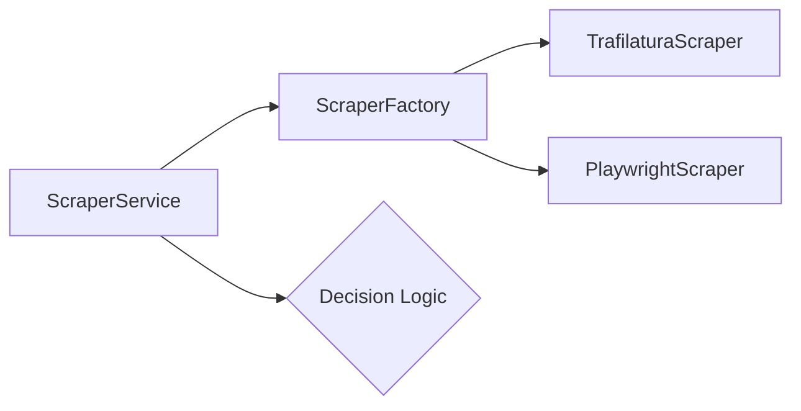

# Implementation Plan: Spec 046 - Advanced Scraper

## 📋 Branch Strategy
- `feature/046-advanced-scraper`

## 🛑 User Review Required

> [!IMPORTANT]
> **의존성 추가**: `playwright` 라이브러리와 브라우저 바이너리 설치가 필요합니다. 이는 도커 이미지 크기를 약 200MB 이상 증가시킬 수 있습니다.

> [!CAUTION]
> **리소스 관리**: Headless Browser는 메모리 소모가 큽니다. 동시 인제스션 요청이 많을 경우 서버 자원 부족 현상이 발생할 수 있으므로, 초기에는 순차적 실행을 권장합니다.

## 🎯 Core Strategy

### 1. 계층적 스택 전략 (Tiered Strategy)
리소스와 비용 최적화를 위해 다음과 같은 3단계 전략을 사용합니다.

| Tier | 상황 | 도구 | 장점 | 비용 |
|:---:|:---|:---|:---|:---|
| **Tier 1** | 일반 뉴스/블로그 | `Trafilatura` | 속도 최우선 | 무료 (로컬) |
| **Tier 2** | 동적/복잡한 페이지 | `Playwright` | JS 렌더링 지원 | 무료 (로컬) |
| **Tier 3** | 강력한 봇 탐지 사이트 | `Firecrawl` | 차단 우회 전문 | **유료 (API)** |

### 2. 품질 가드 로직 (Quality Guard Logic)
단순 수치를 넘어 **의미적/형태소적 정합성**을 판별합니다. 한영 혼용 문서 등 다양한 언어 환경에서도 대응 가능하도록 설계합니다.

| 검사 항목 | 판별 기준 (Fallback Trigger) | 이유 |
|:---:|:---|:---|
| **의미적 정합성** | **LLM Semantic Judge (Language Agnostic)** | **[최우선]** 한/영 혼용 여부와 상관없이 문맥의 연결성을 판독 (Namuwiki 파편 감지) |
| **형태소 분포** | **명사 비중 > 80% (KO/EN 개별 분석)** | 한국어(조사/어미), 영어(품사 패턴)를 각각 탐지하여 메뉴성 텍스트 판별 |
| **문장 완결성** | **종결 기호(. ? !) 부재** | 정상적인 문장 단위가 아닌 텍스트 조각들임 |
| **분량 부족** | `len(content) < 300` | 절대적인 정보량 부족 |

> [!IMPORTANT]
> **Multi-language Support**: 혼용 문서의 경우 형태소 분석기보다는 **LLM Quality Judge**가 주된 역할을 수행합니다. LLM은 다국어 문맥 이해에 능하므로, 언어가 섞여 있어도 "정보로서 가치가 있는지"를 정확히 판단할 수 있습니다.

### 2. 아키텍처: Scraper Factory 패턴
기존 `ScraperService`가 상황에 맞는 스크래퍼를 동적으로 선택하도록 수정합니다.



## 📂 Proposed Changes

### [Infrastructure Layer]

#### [NEW] `app/infrastructure/scrapers/playwright_scraper.py`
- Playwright `async_playwright`를 사용한 스크래핑 로직.
- `wait_until="networkidle"` 옵션으로 동적 로딩 대기.
- `Selector` 기반 본문 추출 또는 `Trafilatura.extract()`와 연동한 정제.

#### [MODIFY] `app/infrastructure/scrapers/scraper_service.py`
- Tiered 로직 구현.
- `fetch_url_with_fallback` 메서드 추가.

### [Dependency Management]

#### [MODIFY] `pyproject.toml`
- `playwright` 의존성 추가.

## 🧪 Verification Plan

### Automated Tests
```bash
# Unit Tests: 스크래퍼 개별 검증
uv run pytest tests/unit/infrastructure/scrapers/test_playwright_scraper.py

# Integration Tests: Fallback 전략 검증
uv run pytest tests/integration/test_scraper_fallback.py
```

### Manual Verification
1. **나무위키 테스트**: 정적 스크래퍼가 실패하는 복잡한 페이지 수집 시도.
2. **동적 페이지 테스트**: JS 렌더링 이후에만 나타나는 텍스트 수집 확인.
