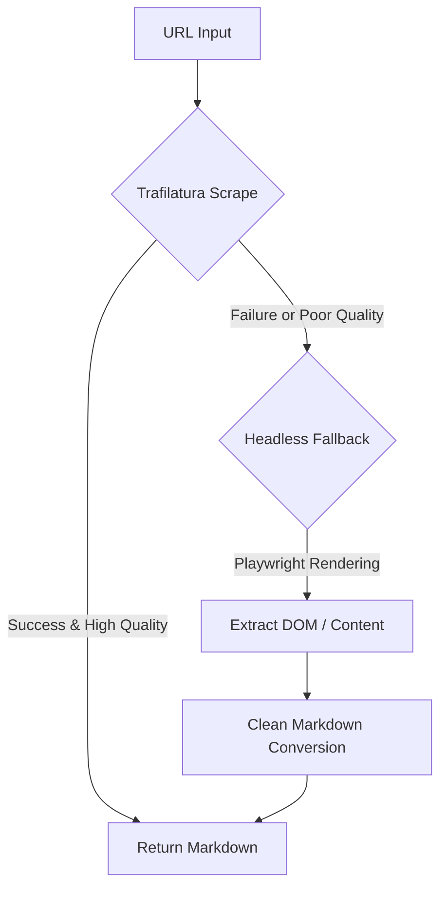

# Spec 046: Advanced Scraper (Headless Browser)

## 📋 배경 및 문제 정의 (Background & Problem)

### 현재 상황
현재 시스템은 `Trafilatura`를 기반으로 한 정적 HTML 파싱 방식을 사용하고 있습니다. 이는 정적인 뉴스나 블로그 기사를 수립하는 데는 매우 효율적이고 빠릅니다.

### 문제점
1. **동적 콘텐츠 누락**: 자바스크립트(JS) 실행이 필수적인 SPA(Single Page Application)나 동적으로 데이터를 로드하는 사이트(예: 네이버 뉴스 댓글, 일부 기업 대시보드)의 데이터를 수집하지 못합니다.
2. **복잡한 레이아웃 대응 한계**: 나무위키나 특정 커뮤니티처럼 복잡한 DOM 구조를 가진 사이트의 경우, 정적 분석만으로는 본문과 노이즈(광고, 네비게이션)를 완벽히 분리하지 못해 RAG 검색 품질이 저하됩니다.
3. **차단 취약성**: 단순 HTTP 요청 방식은 봇 탐지 솔루션에 의해 쉽게 차단되는 경향이 있습니다.

### 해결 방안
`Playwright` 기반의 Headless Browser 스크래퍼를 도입하여 실제 브라우저 환경에서 페이지를 렌더링한 후 데이터를 추출합니다. 또한 속도와 정확도의 균형을 맞추기 위해 **계층적 스택 전략(Tiered Strategy)**을 적용합니다.

## 📊 개념도 (Conceptual Architecture)

## 🎯 요구사항 (Requirements)

### Functional Requirements
1. **Playwright Integration**: Playwright를 사용하여 JS가 렌더링된 최종 DOM을 수집하는 스크래퍼 구현.
2. **Tiered Strategy**: `Trafilatura`로 먼저 시도하고, 실패하거나 본문 내용이 특정 임계치 미만일 경우 `Playwright`로 자동 전환하는 로직 구현.
3. **Metadata Enrichment**: 페이지 제목(Title), 작성일, 저자 등 메타데이터 추출 강화.
4. **Noise Filtering**: 스크래핑 단계에서 불필요한 태그(nav, footer, script, style)를 선제적으로 제거.

### Non-Functional Requirements
1. **Resource Efficiency**: 모든 요청에 브라우저를 띄우지 않고 필요한 경우에만 띄워 리소스 소모 최소화.
2. **Stability**: 브라우저 인스턴스 관리(Resource Leak 방지) 및 타임아웃 처리 철저.

## ✅ Definition of Done
1. `PlaywrightScraper` 클래스 구현 및 인터페이스 통합 완료.
2. 동적 로딩이 필요한 샘플 사이트(예: 나무위키 특정 페이지) 수집 성공 확인.
3. 전체 테스트 스위트 통과 및 `walkthrough.md` 작성 완료.
