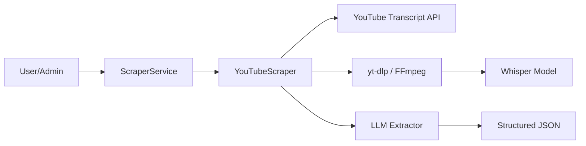

# Implementation Plan: Spec 047 - YouTube Knowledge Scraper

## 📋 Branch Strategy
- `feature/047-youtube-knowledge-scraper` (이미 생성됨)

## 🛑 User Review Required

> [!IMPORTANT]
> - **로컬 Whisper 엔진 선택**: 사용 중인 기기가 **Intel Core i9**로 확인되었습니다. Apple Silicon 전용인 `mlx-whisper`는 사용이 불가능하며, Intel CPU의 **AVX/AVX2** 명령어를 활용하는 `faster-whisper`가 최상의 선택입니다.
> - **최적화 설정**: `compute_type="int8"` (Quantization) 설정을 통해 i9 CPU 점유율을 효율적으로 관리하면서 속도를 확보하겠습니다.
> - **의존성 추가**: `yt-dlp` (영상/오디오 수집), `youtube-transcript-api` (자막 수집), `ffmpeg` (시스템 라이브러리) 설치가 필요합니다.

## 🎯 Core Strategy

### Architecture Context


| Component | Strategy | Reasoning |
|:---:|:---|:---|
| **Transcription** | Transcript API -> Whisper Fallback | 비용 및 속도 최적화 (API 연동 먼저 시도) |
| **Audio Extract** | `yt-dlp` + `ffmpeg` | 업계 표준 라이브러리로 안정적인 스트림 처리 |
| **STT Model** | `faster-whisper` (medium) | **Intel i9 CPU** 환경에서 최적화된 AVX 가속을 통해 안정적인 STT 제공 |
| **Structuring** | LLM Refinement Prompt | 불연속 자막을 고품질 지식으로 변환하는 핵심 레이어 |

## 📂 Proposed Changes

### Infrastructure Layer (Scrapers)

#### [NEW] `app/infrastructure/scrapers/youtube_scraper.py`
- `Scraper` 인터페이스 구현
- 자막 수집 로직 (`youtube-transcript-api`)
- 오디오 추출 및 Whisper 연동 로직
- LLM 기반 지식 추출 프롬프트 포함

#### [MODIFY] `app/infrastructure/scrapers/composite_scraper.py`
- YouTube URL(youtube.com, youtu.be) 감지 시 `YouTubeScraper`로 라우팅하는 로직 추가

### Core Domain

#### [NEW] `docs/design_guides/011-youtube-strategy.md`
- 로컬(Mac) 하드웨어 가속 설정 가이드
- 배포 환경(Cloud GPU)에서의 운영 전략 (Docker, CUDA 등)

## 🧪 Verification Plan

### Automated Tests
```bash
# Unit Tests (Mocking API & Whisper)
uv run pytest tests/unit/infrastructure/scrapers/test_youtube_scraper.py

# Integration Tests (실제 URL 테스트 - optional/slow)
uv run pytest tests/integration/infrastructure/scrapers/test_youtube_integration.py
```

### Manual Verification
1. **자막 있는 영상**: `https://www.youtube.com/watch?v=...` 입력 -> 자막 기반 지식 추출 확인
2. **자막 없는 영상**: 고의로 자막 없는 영상 입력 -> 오디오 추출 및 Whisper STT 구동 확인
3. **최종 결과**: Admin Dashboard의 JSON 결과창에서 `summary`, `sections`, `claims` 데이터 구조 확인
