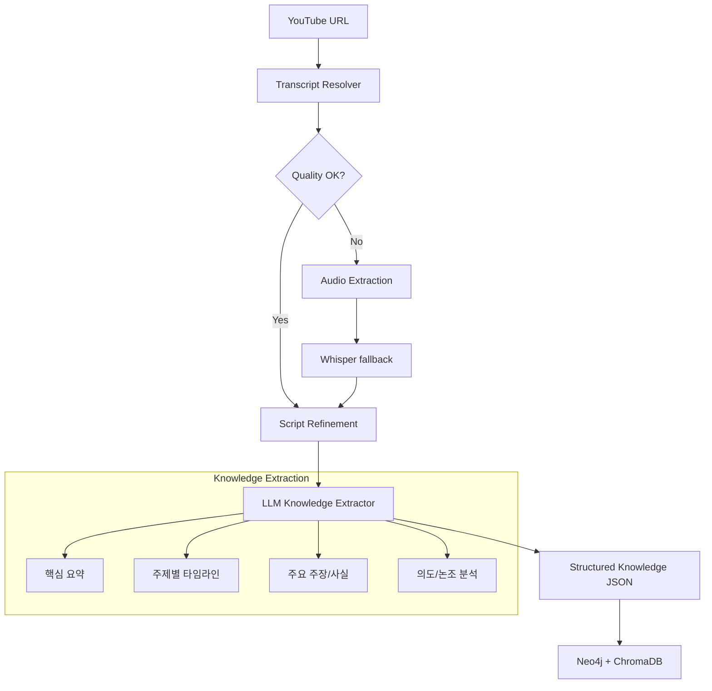

# Spec 047: YouTube Knowledge Scraper (Video-to-Knowledge)

## 📋 배경 및 문제 정의 (Background & Problem)

### 현재 상황
현재 시스템은 `trafilatura`와 `playwright`를 활용하여 텍스트 중심의 웹 페이지 스크래핑을 수행하고 있습니다. 하지만 점차 중요해지는 **YouTube 영상 콘텐츠**에 대해서는 대응하지 못하고 있어, 영상 형태의 지식을 RAG 시스템에 통합하는 데 한계가 있습니다.

### 문제점
1. **자막 가변성**: YouTube 영상은 자막이 아예 없거나, 자동 생성 자막(품질 낮음), 수동 작성 자막(품질 높음) 등 상태가 제각각입니다.
2. **단순 텍스트의 한계**: 자막 텍스트만으로는 영상의 맥락(주제 전환, 핵심 주장 등)을 파악하기 어렵고, 검색 시 노이즈가 많이 발생합니다.
3. **인프라 종속성**: 고품질 추출을 위해 Whisper 같은 AI 모델이 필요하지만, 현재 Docker 기반 환경과 로컬(Mac M1/M2/M3) 환경 간의 하드웨어 가속 방식 차이에 대한 고려가 부족합니다.

### 해결 방안
사용자가 제안한 **"현업 수준의 영상 내용 추출 전략"**을 기반으로 고품질 YouTube 스크래퍼를 구축합니다.

1. **Transcript Resolver**: 사람 자막 > 자동 자막 순으로 최대한 수집하고, 품질이 낮거나 없을 경우 Whisper로 보컬을 텍스트로 전환합니다.
2. **하드웨어 최적화**: 사용자의 Intel Core i9 Mac 환경(2019/2021 Intel)에서 최선의 성능을 내도록 `faster-whisper`의 CPU 최적화(AVX/AVX2) 또는 `OpenVINO` 활용 전략을 문서를 통해 제시합니다.
3. **Knowledge Structuring**: 단순 스크립트를 넘어 LLM을 활용해 주제별 분할, 핵심 주장(Claims) 추출, 의도 분석을 수행하여 **"영상 지식 문서"**를 생성합니다.

## 📊 개념도 (Conceptual Architecture)

## 🎯 요구사항 (Requirements)

### Functional Requirements
1. **Multi-Source Transcript Retrieval**: `youtube-transcript-api` 등을 활용하여 가용한 모든 자막 소스 확보.
2. **Whisper Fallback**: 자막 부재/저품질 시 로컬 리소스를 활용해 STT 실행.
3. **Audio Processing**: 영상에서 오디오를 추출(`yt-dlp` 등 활용)하고 Whisper 입력 규격에 맞게 변환.
4. **LLM-based Structuring**:
    - 불연속적인 자막 문장을 자연스러운 문장으로 복원.
    - 의미 단위(Topic)로 구간을 나누고 타임스탬프 부여.
    - 영상의 핵심 주장(Claims) 및 메타 정보(의도, 논조) 추출.
5. **Tiered Strategy Documentation**: 개발/로컬 환경과 배포(Production/GPU) 환경 간의 Whisper 운영 차이점 문서화.

### Non-Functional Requirements
1. **Intel CPU 최적화**: Intel Core i9의 멀티코어 성능을 활용하도록 `faster-whisper`의 `compute_type="int8"` 및 `cpu_threads` 설정 최적화.
2. **안정성**: `yt-dlp` 등의 라이브러리 업데이트에 따른 깨짐 대응(Error handling).
3. **확장성**: 추후 외부 API(OpenAI Whisper)로의 전환이 용이한 인터페이스 설계.

## ✅ Definition of Done
1. YouTube URL을 입력으로 받아 구조화된 지식 JSON을 반환하는 스크래퍼 구현 완료.
2. 자막이 없는 영상에 대해 Whisper Fallback이 정상 작동함을 확인.
3. 추출된 지식이 RAG 시스템(Neo4j, Chroma)에 적절히 저장되는지 확인.
4. 로컬 vs 배포 환경 운영 전략 문서(`docs/design_guides/011-youtube-strategy.md`) 작성 완료.
5. 모든 단위 테스트 및 통합 테스트 통과.
