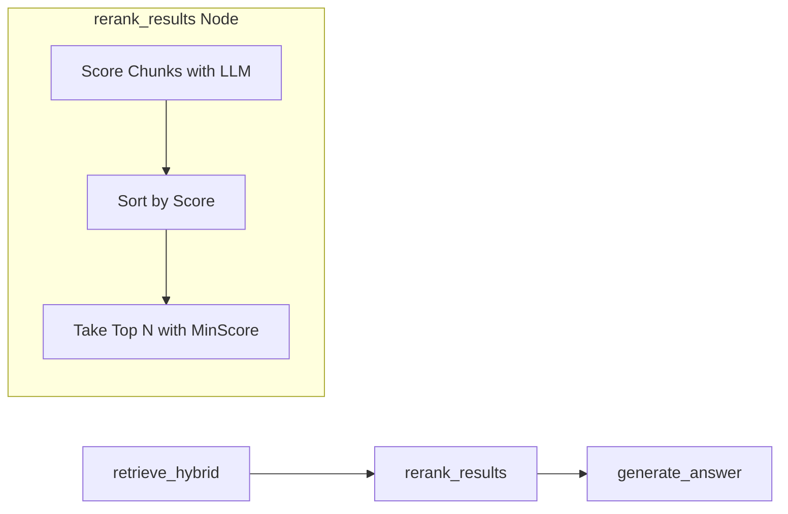

# Implementation Plan: Spec 048

## 📋 Branch Strategy
- `feature/048-rag-precision`

## 🛑 User Review Required
> [!IMPORTANT]
> - **Similarity Threshold 값**: 현재 0.7 정도로 예상하고 있으나, 실제 데이터 분포에 따라 조정이 필요할 수 있습니다.
> - **Reranker 모델**: 비용과 속도를 고려하여 `Gemini 2.0 Flash`를 기본으로 사용하고자 합니다.

## 🎯 Core Strategy

### Architecture Context


| Component | Strategy | Reasoning |
|:---:|:---|:---|
| **Similarity Filter** | Linear Thresholding | 1차적으로 확실한 노이즈를 빠르게 제거합니다. |
| **LLM Reranker** | Pointwise Scoring | 각 청크별 관련성을 정량화하여 정밀한 필터링 기준을 제공합니다. |
| **Logic Adjustment** | State-driven Context | `RAGGraphState`에 정제된 결과를 담아 `generate_answer`에 전달합니다. |

## 📂 Proposed Changes

### [Domain & State]

#### [MODIFY] `app/domain/models/rag.py`
- `RAGGraphState`에 리랭킹 과정을 추적할 수 있는 필드(`rerank_log`) 추가 고려.

### [Nervous System (LangGraph)]

#### [MODIFY] `app/services/rag_service.py`
- `_create_graph()` 메소드에 `rerank_results` 노드 추가 및 엣지 설정.
- `rerank_results` 함수 구현: LLM 호출을 통해 청크 점수 매기기.

### [Brain (LLM Prompting)]

#### [NEW] `app/services/prompts/reranker.py`
- 청크 관련성 평가를 위한 전용 프롬프트 정의.

## 🧪 Verification Plan

### Automated Tests
```bash
# Reranker Node 단위 테스트
uv run pytest tests/unit/test_rag_reranker.py

# 노이즈 유입 차단 통합 테스트
uv run pytest tests/integration/test_rag_precision.py
```

### Manual Verification
1. **Scenario: Irrelevant Question**
    - 질문: "릭롤이 뭐야?"
    - 타겟: 기술 문서 DB
    - 기대 결과: "검색 결과에 관련 정보가 없습니다" 혹은 DB 인용 없이 LLM 지식으로만 답변 (또는 거부). 인용 목록(`[1]`)이 없어야 함.
2. **Scenario: Precision Retrieval**
    - 질문: "일론 머스크의 엑스 인수가 왜 논란이야?"
    - 기대 결과: 가장 관련성이 높은 청크 상위 3개만 깔끔하게 인용되어 답변이 생성됨.
