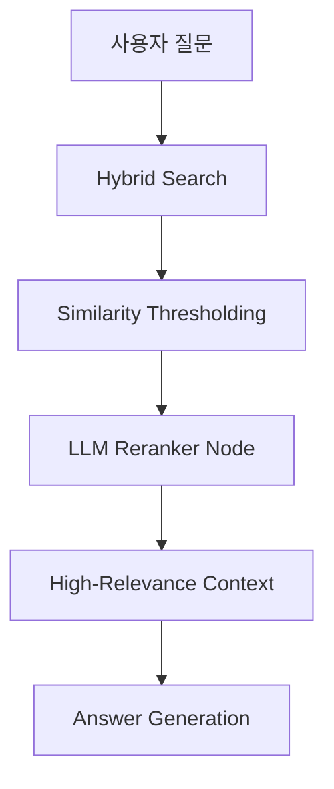

# Spec 048: RAG Precision Refinement (Reranking & Dynamic Filtering)

## 📋 배경 및 문제 정의 (Background & Problem)

### 현재 상황
현재 RAG 시스템은 `HybridSearch`를 통해 Vector(Chroma)와 Graph(Neo4j) 데이터를 결합하여 답변을 생성합니다. 하지만, 사용자 질문과 직접적인 관련성이 낮은 정보가 '유사도' 점수만으로 상위에 노출되어 답변에 포함되는 "과응답(Over-response)" 혹은 "노이즈 유입" 현상이 발생하고 있습니다.

### 문제점
1. **Low-Quality Context**: 유사도 점수가 낮음에도 불구하고 Top-K 개수에 맞춰 가져온 청크들이 답변의 정확도를 떨어뜨림. (예: 릭롤 노래 질문에 일론 머스크 문서가 인용됨)
2. **Context Dilution**: 관련 없는 정보가 컨텍스트 윈도우를 차지하여, LLM이 핵심 근거를 파악하는 데 방해가 됨.
3. **Hallucination Risk**: LLM이 주어진 컨텍스트가 정답이라고 가정하고 답변을 생성하려다 보니, 관련 없는 내용을 억지로 엮어내는 환각 발생.

### 해결 방안
검색 정밀도를 극대화하기 위해 **3단계 정제 전략**을 도입합니다:
1. **Similarity Thresholding**: 벡터 검색 결과 중 유사도 점수가 특정 기준 이하인 청크를 즉시 배제합니다.
2. **LLM Reranker**: 검색된 Top-K 청크들을 LLM이 질문과의 실제 의미론적 관련성(Relevance)을 기준으로 다시 정렬하고 점수를 부여합니다.
3. **Citation Restriction**: 리랭킹 결과 상위 N개 중 고득점 청크만을 최종 컨텍스트로 사용하도록 제한합니다.

## 📊 개념도 (Conceptual Architecture)

## 🎯 요구사항 (Requirements)

### Functional Requirements
1. **Similarity Guard**: `ChromaRepository.search` 결과에 `score` 필터를 적용할 수 있는 기능을 추가하거나, RAG 파이프라인에서 정제 로직을 구현합니다.
2. **Rerank Node 구현**: LangGraph에 `rerank_results` 노드를 추가합니다. 이 노드는 LLM을 사용하여 각 청크가 질문에 대해 얼마나 답변에 도움이 되는지 1~10점 사이의 점수를 부여합니다.
3. **Dynamic Context Window**: 리랭커 점수가 높은 청크들로만 윈도우를 재구성하여 LLM에 전달합니다.
4. **Citataion Guidance**: 생성 노드 프롬프트를 강화하여, 리랭킹을 통과한 확실한 정보만을 인용하도록 지시합니다.

### Non-Functional Requirements
1. **Latency**: 리랭킹 노드 추가로 인한 지연 시간을 최소화하기 위해 'Fast' 모델(Gemini 2.0 Flash)을 사용하거나 병렬 처리를 고려합니다.
2. **Cost Efficiency**: 모든 청크를 리랭킹하기보다는 상위 M개(M > N)로 제한하여 토큰 사용량을 조절합니다.

## ✅ Definition of Done
1. **Reranker Node**가 LangGraph RAG 파이프라인에 통합됨.
2. "무관한 질문" 세트(예: 릭롤 질문 vs 기술 문서) 테스트 시, 무관한 문서가 인용되지 않음을 확인.
3. 모든 통합 테스트(`pytest`) 통과.
4. `docs/architecture/rag_pipeline.md`에 정밀도 개선 로직 내용 업데이트.
5. `walkthrough.md`에 비포/애프터 비교 증거 포함.
