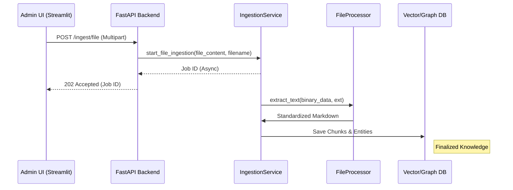

# Implementation Plan: Spec-049 Local File Ingestion

## 📋 Branch Strategy
- `feature/049-local-file-ingestion`

## 🛑 User Review Required
> [!IMPORTANT]
> - **Divide and Conquer (Chunked Processing)**: 대용량 파일 처리를 위해 파일을 한 번에 메모리에 로드하지 않고, 페이지 단위(PDF) 또는 일정 크기(TXT/MD) 단위로 분할하여 처리하도록 변경합니다.
> - **세그먼트 메타데이터**: 각 분할된 데이터에는 `page_number` 또는 `segment_index`가 포함되어 검색 시 정확한 위치를 식별할 수 있게 합니다.

## 🎯 Core Strategy

### Architecture Context


| Component | Strategy | Reasoning |
|:---:|:---|:---|
| **File Parsing** | `PyMuPDF` Iterative | 대용량 PDF를 페이지별로 처리하여 메모리 절약 |
| **Ingestion** | Segment-based Loop | 각 세그먼트별로 Semantic Extraction 및 Indexing 수행 (계단식 처리) |
| **API Interface** | `FastAPI UploadFile` | 메모리 효율적인 스트리밍 업로드 지원 |

## 📂 Proposed Changes

### [Backend/Core]

#### [MODIFY] `app/domain/services/file_processor.py`
- `extract_segments(content, filename)` 제너레이터 추가. (텍스트와 메타데이터 쌍 반환)

#### [MODIFY] `app/use_cases/ingestion.py`
- `process_job` 내부에서 파일인 경우 루프를 돌며 세그먼트별로 처리하도록 로직 변경.

### [Frontend/Admin]

#### [MODIFY] `admin/pages/1_Ingestion_Management.py`
- 파일 업로드 위젯 및 처리 로직 추가.

#### [MODIFY] `admin/pages/4_RAG_Playground.py`
- 대화창 하단 혹은 사이드바에 즉석 파일 업로드 기능 추가.

## 🧪 Verification Plan

### Automated Tests
```bash
# Unit Tests: 파일 파싱 로직 검증
uv run pytest tests/unit/test_file_processor.py

# Integration Tests: 업로드 -> 인제스션 -> 검색 흐름 검증
uv run pytest tests/integration/test_file_ingestion_flow.py
```

### Manual Verification
1. **Admin UI**: 샘플 PDF 파일을 업로드하고 Job 상태가 `SUCCESS`로 변하는지 확인.
2. **Playground**: 업로드한 파일 내용에 대해 질문하고 정확한 출처와 함께 답변이 생성되는지 확인.
3. **API**: `curl` 명령어로 멀티파트 업로드 시 정상적으로 `Job ID`가 반환되는지 확인.
