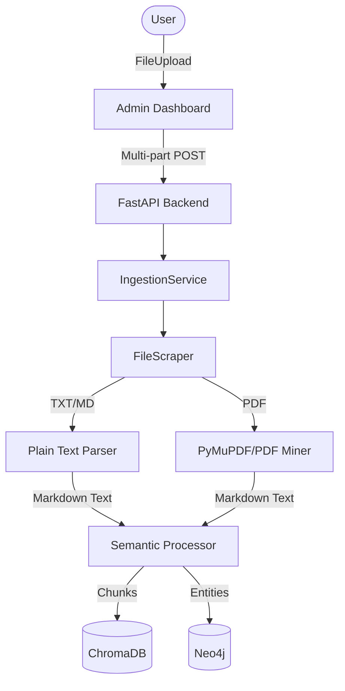

# Spec-049: Local File Ingestion (PDF, TXT, MD)

## 📋 배경 및 문제 정의 (Background & Problem)

### 현재 상황
현재 시스템은 웹 URL을 통한 크롤링 기반의 데이터 수집(`BasicWebScraper`, `AdvancedScraper`)에 전적으로 의존하고 있습니다. 사용자가 가지고 있는 로컬 문서 데이터를 지식 베이스에 추가하기 위해서는 해당 내용을 어딘가에 게시하거나 수동으로 텍스트를 복사-붙여넣기해야 하는 번거로움이 있습니다.

### 문제점
1. **데이터 소스 제한**: PDF나 마크다운 문서 등 로컬에 존재하는 방대한 지식 자산을 시스템에 직접 주입할 방법이 없습니다.
2. **사용성 저하**: 챗지피티(ChatGPT)나 제미나이(Gemini)와 같이 파일을 직접 업로드하여 대화하는 현대적인 RAG UX를 제공하지 못하고 있습니다.
3. **업무 효율**: 보고서, 논문, 가이드라인 등 파일 형태의 자료를 분석하기 위해 별도의 외부 도구를 사용해야 합니다.

### 해결 방안
1. **Backend**: 다양한 파일 포맷(PDF, TXT, MD)을 텍스트로 변환하고 분석할 수 있는 `FileScraper`(또는 `FileProcessor`) 도메인 서비스 및 API 엔드포인트(`POST /ingest/file`)를 구축합니다.
2. **Infrastructure**: `PyMuPDF`(또는 `pdfminer.six`) 등 검증된 파싱 라이브러리를 도입하여 PDF 구조를 정확히 추출합니다.
3. **Frontend (Admin UI)**: Streamlit 플레이그라운드와 전체 수집 화면에 파일 업로드 위젯을 추가하여 로컬 파일을 지식 베이스로 즉시 통합할 수 있도록 개선합니다.

## 📊 개념도 (Conceptual Architecture)

## 🎯 요구사항 (Requirements)

### Functional Requirements
1. **파일 포맷 지원**: PDF, TXT, MD 파일 형식을 지원해야 합니다.
2. **API 개발**: 멀티파트 업로드를 수용하는 `POST /ingest/file` 엔드포인트를 구현합니다.
3. **비동기 처리**: 파일 크기에 관계없이 `BackgroundTasks`를 통해 비동기로 인제스션을 수행하고 상태를 반환합니다.
4. **Admin UI 통합**: 
    - 인제스션 관리 화면에 파일 업로드 기능 추가.
    - RAG 플레이그라운드 하단에 "파일 업로드" 버튼 추가하여 대화 세션에 지식 즉시 주입 유도.
5. **메타데이터 보존**: 파일명, 생성 시간 등을 메타데이터로 저장하여 검색 시 출처(Citation)로 활용합니다.

### Non-Functional Requirements
1. **대용량 파일 처리**: 파일 크기 제한(예: 10MB) 및 스트리밍 처리로 메모리 부족 현상을 방지합니다.
2. **보안**: 업로드 파일의 확장자 및 매직 넘버(Magic Number) 검증을 통해 악성 파일 유입을 차단합니다.
3. **성능**: PDF 파싱 시 텍스트 추출 속도를 최적화합니다.

## ✅ Definition of Done
1. PDF/TXT/MD 파일이 성공적으로 파싱되어 Neo4j와 ChromaDB에 저장됨.
2. Admin UI에서 파일을 업로드하고 인제스션 상태를 확인할 수 있음.
3. 플레이그라운드에서 업로드한 파일의 내용에 대해 RAG 답변 및 Citation(출처 표시)이 정상 동작함.
4. 모든 단위 테스트 및 통합 테스트 통과.
