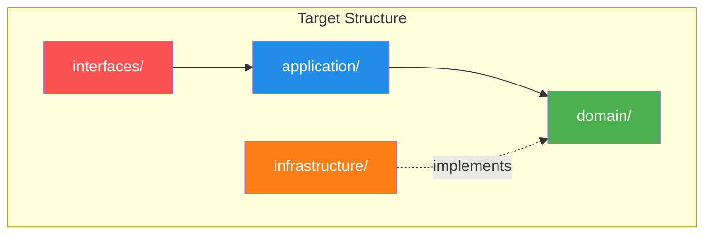

# Implementation Plan: Spec-050 (Clean Architecture Refactoring)

## 📋 Branch Strategy
- `feature/050-clean-architecture-refactoring`

---

## 🛑 User Review Required

> [!IMPORTANT]
> **대규모 구조 변경**: 이 작업은 전체 코드베이스의 디렉토리 구조를 재편합니다. 다음 디렉토리가 삭제/이동됩니다:
> - `app/use_cases/` → `app/application/services/`로 통합
> - `app/domain/schemas/` → `app/domain/value_objects/`로 이동
> - `app/schemas/` → `app/interfaces/api/schemas/`로 이동
> - `app/core/llm.py` → `app/infrastructure/factories/`로 이동

> [!WARNING]
> **Import 경로 전면 변경**: 모든 레이어에서 Import 경로가 변경됩니다. 하지만 각 Phase마다 전체 테스트를 실행하여 안정성을 보장합니다.

> [!IMPORTANT]
> **단계적 실행**: Phase A → B → C 순서로 진행하며, 각 Phase는 독립적인 커밋으로 관리합니다. 중간에 멈추고 싶으시면 언제든 요청하세요.

---

## 🎯 Core Strategy

### Clean Architecture 4계층 재정립



| Layer | 책임 | 의존 방향 |
|:---:|:---|:---|
| **Domain** | 순수 비즈니스 로직 (Entities, VO, Domain Services) | **아무것도 의존하지 않음** |
| **Application** | Use Case 조율 (Repository + Service 조합) | Domain만 의존 |
| **Infrastructure** | 구현 세부사항 (DB, LLM, Scraper) | Domain Interface 구현 |
| **Interfaces** | 외부 진입점 (API, CLI, UI) | Application + Infrastructure 조합 |

---

## 📂 Proposed Changes

### ═══════════════════════════════════════
### Phase A: 기반 수정 (Critical Path)
### ═══════════════════════════════════════

#### A-1. Dependency Rule Enforcement

##### [MODIFY] Domain → Application 이동

**파일 이동**:
- `app/domain/services/storage_integrity_service.py` → `app/application/services/integrity_service.py`

**클래스명 변경**:
```python
# Before
class StorageIntegrityService:  # Domain에 잘못 위치
    def __init__(self, primary_repo: Any, target_repo: Any):
        from app.infrastructure.rag.nodes import RAGNodes  # ❌ 위반

# After
class IntegrityService:  # Application으로 이동
    def __init__(self, primary_repo: DocumentRepository, target_repo: VectorRepository):
        from app.infrastructure.rag.nodes import RAGNodes  # ✅ Application은 허용
```

##### [NEW] Infrastructure Factories

**디렉토리 생성**:
```bash
mkdir -p app/infrastructure/factories
```

**파일 이동**:
- `app/core/llm.py` → `app/infrastructure/factories/llm_factory.py`

**반환 타입 변경**:
```python
# Before (core/llm.py)
def get_llm() -> LangChainLLMAdapter:  # ❌ 구체 클래스
    return LangChainLLMAdapter(...)

# After (infrastructure/factories/llm_factory.py)
class LLMFactory:
    @staticmethod
    def create() -> LLMInterface:  # ✅ Protocol
        return LangChainLLMAdapter(...)
```

---

#### A-2. Domain Object Reorganization

##### [MODIFY] Domain Schemas → Value Objects

**디렉토리 이동**:
```bash
# ExtractedMetadata, Intent, Ontology를 VO로 재분류
mv app/domain/schemas/extraction.py app/domain/value_objects/extracted_metadata.py
mv app/domain/schemas/intent.py app/domain/value_objects/intent.py
mv app/domain/schemas/ontology.py app/domain/value_objects/ontology.py

# schemas 디렉토리 삭제
rm -rf app/domain/schemas/
```

**이유**: 이들은 "데이터 전송"이 아니라 **불변 값 객체(Value Object)**입니다.

##### [MODIFY] API Schemas 이동

**디렉토리 이동**:
```bash
mv app/schemas/ app/interfaces/api/schemas/
```

**이유**: `IngestRequest`, `IngestResponse`는 API 계약(DTO)이므로 Presentation Layer에 속합니다.

##### [NEW] DocumentMetadata Value Object

**새 파일 생성**: `app/domain/value_objects/document_metadata.py`

```python
from pydantic import BaseModel, Field

class DocumentMetadata(BaseModel):
    """문서 메타데이터 Value Object"""
    title: str = Field(default="Untitled")
    source_url: str | None = None
    author: str | None = None
    created_at: str | None = None
    semantic_data: dict | None = None  # 향후 ExtractedMetadata로 타입화
    
    class Config:
        frozen = True  # 불변성
```

**Document Entity 수정**:
```python
# Before
class Document(BaseModel):
    metadata: dict  # ❌ 타입 안전성 없음

# After
from app.domain.value_objects.document_metadata import DocumentMetadata

class Document(BaseModel):
    metadata: DocumentMetadata  # ✅ 타입 안전
```

---

#### A-3. Application Layer Consolidation

##### [MODIFY] Use Cases → Application Services

**디렉토리 통합**:
```bash
# IngestionService를 Application으로 이동
mv app/use_cases/ingestion.py app/application/services/ingestion_service.py

# use_cases 디렉토리 삭제
rm -rf app/use_cases/
```

**이유**: `use_cases/`와 `application/`은 중복 개념입니다. Clean Architecture에서 "Use Case Layer"는 곧 "Application Layer"입니다.

---

### ═══════════════════════════════════════
### Phase B: 품질 개선
### ═══════════════════════════════════════

#### B-1. Naming Convention Standardization

##### [MODIFY] Repository 구현체 이름 통일

**파일명 및 클래스명 변경**:
```bash
# Neo4jStorage → Neo4jDocumentRepository (파일명은 이미 올바름)
# 클래스명만 변경
```

```python
# Before
class Neo4jStorage:  # ❌ Storage 용어
    ...

class CompositeStorage:  # ❌
    ...

class ChromaStorage:  # ❌
    ...

# After
class Neo4jDocumentRepository:  # ✅ Repository 통일
    ...

class CompositeDocumentRepository:
    ...

class ChromaVectorRepository:
    ...
```

**영향받는 파일**:
- `app/infrastructure/storage/neo4j_document_repository.py`
- `app/infrastructure/storage/composite.py`
- `app/infrastructure/storage/chroma.py`
- 모든 Import 경로 업데이트

---

#### B-2. Service Layer Cohesion

##### [MODIFY] Infrastructure Service 재배치

**파일 이동**:
```bash
# Domain Service가 아닌 것들을 Infrastructure로 이동
mv app/domain/services/chunker_service.py app/infrastructure/chunker/chunker_service.py
mv app/domain/services/file_processor.py app/infrastructure/processors/file_processor.py

# web_scraper_service.py는 이미 infrastructure에 있으므로 domain에서만 삭제
rm app/domain/services/web_scraper_service.py  # 중복 제거
```

**Domain Services 최종 정리** (`app/domain/services/`에만 남는 것):
- `intent_classifier.py` ✅ (순수 비즈니스 로직)
- `query_rewriter.py` ✅ (순수 비즈니스 로직)
- `semantic_extractor.py` ✅ (순수 비즈니스 로직)

**나머지는 모두 Application 또는 Infrastructure로 이동 완료**

---

#### B-3. Protocol Enforcement

##### [MODIFY] Any 타입 → Protocol 교체

**대상 파일**: `app/application/services/integrity_service.py`

```python
# Before
def __init__(self, primary_repo: Any, target_repo: Any):  # ❌

# After
from app.domain.interfaces.document_repository import DocumentRepository
from app.domain.interfaces.vector_repository import VectorRepository  # 신규 Protocol

def __init__(
    self,
    primary_repo: DocumentRepository,
    target_repo: VectorRepository,
):  # ✅
```

**신규 Protocol 필요**: `app/domain/interfaces/vector_repository.py`

```python
from typing import Protocol

class VectorRepository(Protocol):
    """Vector DB에 대한 추상 인터페이스"""
    def save_chunks(self, chunks: list) -> None: ...
    def get_all_chunk_ids(self) -> set[str]: ...
```

---

### ═══════════════════════════════════════
### Phase C: 마무리
### ═══════════════════════════════════════

#### C-1. Client-Agnostic Naming

##### [MODIFY] AdminAgent → ConversationalRAGAgent

**파일 이동**:
```bash
mv app/domain/services/admin_agent.py app/application/clients/admin/rag_agent.py
```

**클래스명 변경**:
```python
# Before
class AdminAgent:  # ❌ 클라이언트 특정

# After  
class ConversationalRAGAgent:  # ✅ 도메인 중심
```

---

#### C-2. Shared Utilities Layer

##### [NEW] app/shared/ 디렉토리

**디렉토리 생성 및 파일 이동**:
```bash
mkdir -p app/shared

# Logging 유틸리티 이동
mv app/core/logging_config.py app/shared/logging.py
```

**Core 디렉토리 최종 정리** (`app/core/`에 남는 것):
- `config.py` ✅ (설정)
- `exceptions.py` ✅ (도메인 예외)

---

#### C-3. Documentation Update

##### [MODIFY] Architecture 문서 전면 재작성

**대상**: `docs/architecture/architecture.md`

**주요 변경 사항**:
1. Clean Architecture 4계층 명확히 정의
2. Hexagonal 용어 제거 (Port/Adapter → Interface/Implementation)
3. 디렉토리 구조 다이어그램 업데이트
4. Dependency Rule 준수 상태 명시

##### [NEW] ADR 작성

**새 파일**: `docs/architecture_decisions/adr-001-clean-architecture-refactoring.md`

---

## 🧪 Verification Plan

### Automated Tests (각 Phase 완료 후)

```bash
# Phase A 완료 후
uv run pytest tests/ -v
# Expected: 87+ passed

# Phase B 완료 후
uv run pytest tests/ -v
ruff check app/ tests/

# Phase C 완료 후
uv run pytest tests/ -v
ruff check app/ tests/
lint-imports  # import-linter 설치 시
```

### Manual Verification (Phase C 완료 후)

1. **Admin UI**:
   ```bash
   uv run streamlit run app/admin/1_File_Ingestion.py
   ```
   - 모든 페이지 정상 로드 확인
   - RAG Playground 정상 작동

2. **API**:
   ```bash
   uv run uvicorn app.interfaces.api.main:app --reload
   ```
   - Swagger UI: `http://localhost:8000/docs`
   - 모든 엔드포인트 200 OK 응답

3. **Import 레이어  검증**:
   ```bash
   # Domain이 Infrastructure를 참조하는지 확인 (0건)
   grep -r "from app.infrastructure" app/domain/
   
   # use_cases 디렉토리 존재 확인 (삭제되어야 함)
   ls app/use_cases/  # "No such file or directory" 기대
   ```

---

## 📝 Commit Strategy

각 Phase는 여러 커밋으로 나뉩니다:

### Phase A (6 commits)
1. `refactor(spec-050): move IntegrityService to application layer`
2. `refactor(spec-050): move LLMFactory to infrastructure`
3. `refactor(spec-050): reorganize domain schemas to value objects`
4. `refactor(spec-050): move API schemas to interfaces layer`
5. `refactor(spec-050): create DocumentMetadata value object`
6. `refactor(spec-050): consolidate use_cases into application layer`

### Phase B (3 commits)
7. `refactor(spec-050): standardize repository naming (Storage → Repository)`
8. `refactor(spec-050): relocate infrastructure services`
9. `refactor(spec-050): replace Any types with Protocols`

### Phase C (3 commits)
10. `refactor(spec-050): rename AdminAgent to ConversationalRAGAgent`
11. `refactor(spec-050): create shared utilities layer`
12. `docs(spec-050): update architecture documentation`

### Final (1 commit)
13. `docs(spec-050): archive walkthrough and pr description`

**총 13개 커밋**

---

## ⏱️ 예상 소요 시간

| Phase | 작업 내용 | 예상 시간 |
|-------|---------|----------|
| **Phase A** | 기반 수정 | 6시간 |
| **Phase B** | 품질 개선 | 5시간 |
| **Phase C** | 마무리 | 3시간 |
| **총계** | | **14시간** |

---

## 🎯 Success Criteria

✅ **구조적 목표**:
- [ ] `app/domain/` → `app/infrastructure/` 참조 0건
- [ ] `app/use_cases/` 디렉토리 삭제
- [ ] `app/domain/schemas/` 디렉토리 삭제
- [ ] Storage 용어 사용 0건

✅ **품질 목표**:
- [ ] 전체 테스트 통과 (87+ passed)
- [ ] Linter 통과 (ruff)
- [ ] Type hints 커버리지 90%+

✅ **문서화 목표**:
- [ ] Architecture.md 업데이트
- [ ] ADR 작성
- [ ] Walkthrough.md 작성
