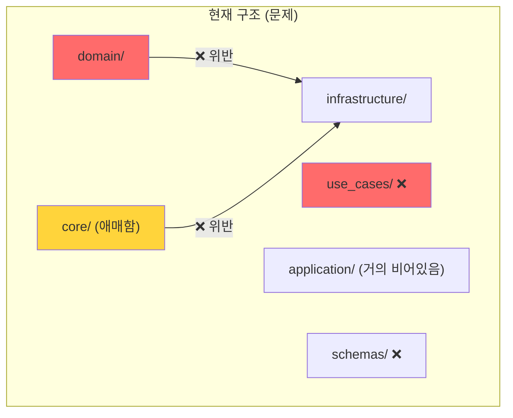
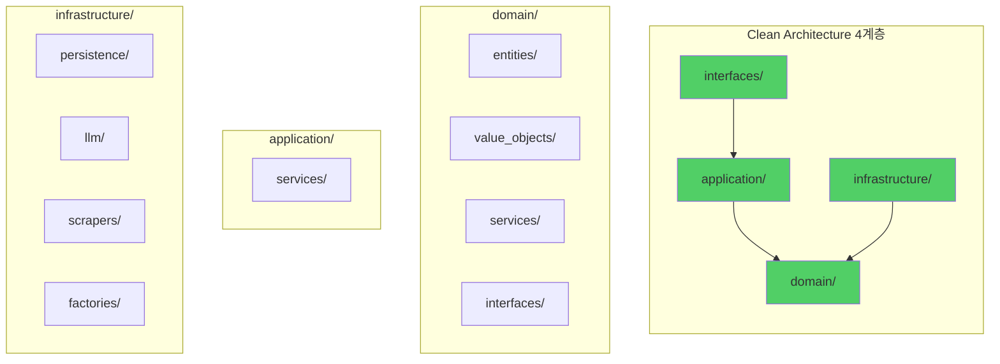

# Spec-050: Clean Architecture Refactoring (클린 아키텍처 전면 리팩토링)

## 📋 배경 및 문제 정의 (Background & Problem)

### 현재 상황
2026-01-31 아키텍처 진단 결과, 현재 코드베이스는 **Clean Architecture의 외형**을 갖추고 있으나 **핵심 원칙들이 실질적으로 준수되지 않고 있습니다**.

**전체 진단 보고서**: [`docs/architecture/architecture_diagnosis_2026-01-31.md`](../../docs/architecture/architecture_diagnosis_2026-01-31.md)

### 발견된 12개 문제점

#### 🚨 P0 (CRITICAL - 최우선)
1. **Dependency Rule 위반**: Domain → Infrastructure 직접 참조 (2건)
2. **VO/Entity/DTO 경계 모호**: `app/schemas/` vs `app/domain/schemas/` 이중 구조
3. **Application Layer 누락**: `app/use_cases/`와 `app/application/` 중복

#### ⚠️ P1 (HIGH - 높음)
4. **명명 규칙 불일치**: Repository/Storage/Adapter 혼재 사용
5. **Service Layer 응집도 부족**: Domain/Application/Infrastructure Service 혼재
6. **Protocol 미활용**: `Any` 타입 남발

#### 📌 P2 (MEDIUM - 중간)
7. **Admin 네이밍 문제**: 클라이언트 특정 용어가 Domain 침투
8. **Composition 패턴 부족**: 생성자 의존성 과다 (6개)

#### 💡 P3 (LOW - 낮음)
9. **재사용 코드 비전역화**: `core/` 디렉토리 정리 필요
10. **Infrastructure 순환 참조 위험**: 횡적 의존성 과다
11. **Clean vs Hexagonal 워딩 혼재**: 용어 통일 필요
12. **Test 구조 불일치**: 프로덕션 코드와 미러링 필요

### 문제점 요약
- **Dependency Rule** 위반으로 테스트 불가능 및 프레임워크 종속
- **계층 책임**이 불명확하여 코드 배치의 일관성 부족
- **명명 규칙** 혼재로 인한 가독성 저하
- **도메인 오염**: 클라이언트 용어, 기술 구현 세부사항이 Domain에 침투

### 해결 방안
**Clean Architecture 4계층 구조**를 명확히 정립하고, 모든 코드를 올바른 위치로 재배치합니다:

```
app/
├── domain/          # Entities, Value Objects, Domain Services (순수 비즈니스)
├── application/     # Use Cases (비즈니스 흐름 조율)
├── infrastructure/  # Adapters (DB, LLM, 외부 API 구현)
└── interfaces/      # Presentation (API, CLI, UI)
```

---

## 📊 개념도 (Conceptual Architecture)

### Before (현재 - 혼란 상태)


### After (목표 - Clean Architecture)


---

## 🎯 요구사항 (Requirements)

### Functional Requirements

#### Phase A: 계층 구조 수정 (P0)
1. **Dependency Rule 강제**:
   - [ ] `app/domain/services/storage_integrity_service.py` → `app/application/services/`로 이동
   - [ ] `app/core/llm.py` → `app/infrastructure/factories/llm_factory.py`로 이동
   - [ ] Domain에서 Infrastructure 참조 **완전 제거**

2. **Domain Objects 재구성**:
   - [ ] `app/domain/schemas/` → `app/domain/value_objects/`로 이동 (`ExtractedMetadata`, `Intent`, `Ontology`)
   - [ ] `app/schemas/` → `app/interfaces/api/schemas/`로 이동 (API DTO 전용)
   - [ ] `Document.metadata: dict` → `Document.metadata: DocumentMetadata` (VO화)

3. **Application Layer 통합**:
   - [ ] `app/use_cases/ingestion.py` → `app/application/services/ingestion_service.py`로 이동
   - [ ] `app/use_cases/` 디렉토리 삭제
   - [ ] Application Service가 Use Case를 명확히 표현하도록 재구성

#### Phase B: 명명 및 응집도 개선 (P1)
4. **Naming Convention 표준화**:
   - [ ] `Neo4jStorage` → `Neo4jDocumentRepository`
   - [ ] `CompositeStorage` → `CompositeDocumentRepository`
   - [ ] `ChromaStorage` → `ChromaVectorRepository`
   - [ ] Storage/Repo 용어 전면 금지

5. **Service Layer 재배치**:
   - [ ] `app/domain/services/chunker_service.py` → `app/infrastructure/chunker/`
   - [ ] `app/domain/services/file_processor.py` → `app/infrastructure/processors/`
   - [ ] `app/domain/services/web_scraper_service.py` 제거 (이미 infrastructure에 있음)
   - [ ] Domain Services는 순수 비즈니스 로직만 유지

6. **Protocol 활용 강화**:
   - [ ] `Any` 타입을 모두 Protocol로 교체
   - [ ] Type hints 100% 커버리지 달성

#### Phase C: 네이밍 및 정리 (P2-P3)
7. **Client-Agnostic Naming**:
   - [ ] `AdminAgent` → `ConversationalRAGAgent`
   - [ ] `app/application/admin/` → `app/application/clients/admin/`

8. **Shared Utilities Layer**:
   - [ ] `app/shared/` 디렉토리 신설
   - [ ] `app/core/logging_config.py` → `app/shared/logging.py`
   - [ ] 공통 유틸리티 정리

9. **Architecture 문서 정비**:
   - [ ] `docs/architecture/architecture.md` 전면 재작성
   - [ ] Clean Architecture 용어로 통일
   - [ ] Hexagonal 용어 제거

### Non-Functional Requirements
1. **테스트 안정성**: 모든 기존 테스트 통과 (87+ passed)
2. **성능**: 구조 변경이므로 성능 영향 없음
3. **하위 호환성**: API 엔드포인트는 변경 없음 (내부 구조만 변경)
4. **문서화**: 모든 변경 사항을 ADR(Architecture Decision Record)로 기록

---

## 🔄 단계별 실행 계획

### Phase A: 기반 수정 (Critical Path) - 예상 6시간
| Sub-Task | 내용 | 우선순위 |
|---------|------|---------|
| **A-1** | Dependency Rule Enforcement | P0 |
| **A-2** | Domain Object Reorganization | P0 |
| **A-3** | Application Layer Consolidation | P0 |

### Phase B: 품질 개선 - 예상 5시간
| Sub-Task | 내용 | 우선순위 |
|---------|------|---------|
| **B-1** | Naming Convention Standardization | P1 |
| **B-2** | Service Layer Cohesion | P1 |
| **B-3** | Protocol Enforcement | P1 |

### Phase C: 마무리 - 예상 3시간
| Sub-Task | 내용 | 우선순위 |
|---------|------|---------|
| **C-1** | Client-Agnostic Naming | P2 |
| **C-2** | Shared Utilities Layer | P3 |
| **C-3** | Documentation Update | ALL |

**총 예상 시간**: 14시간 (약 2일)

---

## ✅ Definition of Done

### 기술적 목표
- [ ] Domain Layer에서 Infrastructure 참조 **0건**
- [ ] `app/use_cases/` 디렉토리 삭제 완료
- [ ] `app/domain/schemas/` 디렉토리 삭제 완료
- [ ] Storage/Repo 혼재 용어 **0건**
- [ ] `Any` 타입 사용 **최소화** (Protocol로 교체)

### 품질 목표
- [ ] 전체 테스트 통과: `pytest tests/ -v` (87+ passed)
- [ ] Linter 통과: `ruff check app/ tests/`
- [ ] Type Coverage: `mypy app/` (Optional)
- [ ] Import 레이어 위반 **0건** (`lint-imports`)

### 문서화 목표
- [ ] `docs/architecture/architecture.md` 업데이트
- [ ] `docs/architecture/architecture_diagnosis_2026-01-31.md` 보존
- [ ] ADR 작성: `docs/architecture_decisions/adr-xxx-clean-architecture-refactoring.md`

### 검증 목표
- [ ] Admin UI 정상 작동 (Streamlit)
- [ ] API 엔드포인트 정상 응답 (Swagger UI)
- [ ] RAG Playground 기능 정상 작동

---

## 📝 참고 자료

- **진단 보고서**: [`docs/architecture/architecture_diagnosis_2026-01-31.md`](../../docs/architecture/architecture_diagnosis_2026-01-31.md)
- **Clean Architecture**: Robert C. Martin - "Clean Architecture: A Craftsman's Guide"
- **DDD**: Eric Evans - "Domain-Driven Design"
- **현재 아키텍처 문서**: [`docs/architecture/architecture.md`](../../docs/architecture/architecture.md)
