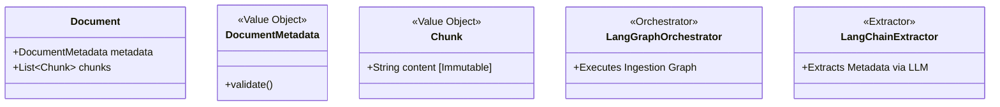

# Spec 051: Architecture Refinement (Consistency & Cleanliness)

## 📋 배경 및 문제 정의 (Background & Problem)

### 현재 상황
현재 `infrastructure` 계층 내에 `llm`, `brain`, `rag` 등 유사한 역할을 하는 AI/Logic 관련 폴더들이 산재해 있습니다. User Feedback에 따라 이러한 파편화된 구조를 **Hierarchical AI Structure**로 통합하여 관리 효율성을 높여야 합니다.

### 문제점
1.  **Fragmentation**: `llm`(Adapter), `brain`(Ingestion Logic), `rag`(Retrieval Logic)이 분산되어 있어 "AI 구현체"를 찾기 어렵습니다.
2.  **Naming Confusion**: `IntegrityService` vs `Integrity`, `Storage` vs `Repository`.
3.  **Taxonomy Issues**: `Chunk`(Entity vs VO), `FileProcessor`(Domain vs Utils).
4.  **Legacy Debt**: `api/schemas` 용어, `v1` 미사용.

### 해결 방안
`infrastructure/ai`를 중심으로 계층적 구조를 도입하여 흩어진 AI 모듈을 통합합니다.

## 📊 개념도 (Conceptual Architecture)

## 🎯 요구사항 (Requirements)

### Functional Requirements

#### P1: High Priority (Core Domain & Semantic Naming)
1.  **Strict Service Naming**:
    *   `IntegrityService` -> `Integrity`
    *   `FeedbackService` -> `Feedback`
    *   `IngestionService` -> `IngestionUseCase`
2.  **Domain Objects**:
    *   `Chunk`: **VO (Value Object)** 로 정의.
    *   `DocumentMetadata`: **VO** (Pydantic Model).
    *   `app/domain/entities/chunk.py` 삭제.
3.  **Interface Segregation**:
    *   `Chunker` Protocol 도입.

#### P2: Medium Priority (Structural Cleanup & Consolidation)
1.  **Hierarchical AI Structure (Consolidation)**:
    *   기존 `llm`, `brain` 폴더를 제거하고 `app/infrastructure/ai/`로 통합.
    *   `app/infrastructure/ai/extractors/`: `LangChainExtractor` (ex-`llm/langchain_adapter.py`)
    *   `app/infrastructure/ai/orchestrators/`: `IngestionOrchestrator` (ex-`brain/adapter.py`)
    *   `app/infrastructure/ai/nodes/`: `IngestionNodes` (ex-`brain/nodes.py`)
    *   `app/infrastructure/ai/graphs/`: `IngestionGraphBuilder` (ex-`brain/graph.py`)
2.  **Utility Relocation**:
    *   `FileProcessor` -> `app/core/utils/file_processor.py`.

#### P3: Low Priority (Standardization)
1.  **Repositories**: `infrastructure/storage` -> `infrastructure/repositories`.
2.  **Naming**:
    *   `IngestionState` -> `IngestionGraphState`
    *   `AdminAgent` -> `ConversationalRAGAgent`
3.  **API**:
    *   `api/schemas` -> `api/dto`
    *   `api/v1` 라우터 정리.

## ✅ Definition of Done
1.  모든 단위/통합 테스트 Pass.
2.  `llm`, `brain` 폴더가 삭제되고 `ai` 폴더로 깔끔하게 이전됨.
3.  `repository`, `dto` 등 표준 용어 적용 완료.
