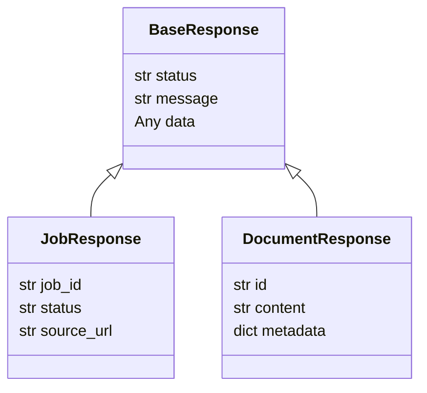

# Implementation Plan: Spec-053

## 📋 Branch Strategy
- `feature/spec-053-api-standardization`

## 🛑 User Review Required
> [!WARNING]
> - [ ] **Breaking Change**: `jobs.py`, `entities.py`, `rag.py` 등 API 응답이 `dict`에서 `Pydantic Model` (JSON 구조 변경 가능성)로 바뀝니다. 클라이언트(프론트엔드)가 있다면 영향도를 확인해야 합니다.
> - [ ] **Exception Handling**: 기존에는 모든 에러가 500으로 잡혔으나, 이제는 `400 Bad Request`, `404 Not Found` 등으로 세분화됩니다.

## 🎯 Core Strategy

### Architecture Context


| Component | Strategy | Reasoning |
|:---:|:---|:---|
| **DTO (`app/interfaces/api/dto`)** | Single Source of Truth | 모든 API 응답 스키마를 한곳에서 관리하여 재사용성 및 문서화 보장 |
| **Mapping (`app/interfaces/api/v1/endpoints`)** | Explicit Translation | Domain Entity -> Response DTO 변환을 엔드포인트에서 명시적으로 수행 |
| **Error Handling (`app/interfaces/api/main.py`)** | Global Exception Handler | 개별 함수의 try-except 제거 및 일관된 에러 포맷 ({error: code, message: msg}) 제공 |

## 📂 Proposed Changes

### [DTO Definition]
#### [NEW] `app/interfaces/api/dto/common.py`
- `BaseResponse`, `ErrorResponse`, `PaginationResponse` 정의

#### [NEW] `app/interfaces/api/dto/jobs.py`
- `JobResponse`, `JobStatusResponse` 정의

#### [NEW] `app/interfaces/api/dto/rag.py`
- `RAGResponse`, `RetrievalResponse` 정의

### [API Endpoints Refactoring]
#### [MODIFY] `app/interfaces/api/v1/endpoints/jobs.py`
- `dict` 반환 제거 -> `JobResponse` 사용
- `response_model` 명시

#### [MODIFY] `app/interfaces/api/v1/endpoints/rag.py`
- `dict` 반환 제거 -> `RAGResponse` 사용

#### [MODIFY] `app/interfaces/api/v1/endpoints/entities.py`
- `Document` 엔티티 직접 반환 지양 -> `DocumentDTO` 사용

### [Error Handling]
#### [MODIFY] `app/interfaces/api/main.py`
- `add_exception_handler` 추가

## 🧪 Verification Plan

### Automated Tests
```bash
# Unit Tests (DTO Validation check)
# endpoint Refactoring 후 기존 integration test가 깨질 수 있으므로 이를 수정하거나 unit test를 추가
uv run pytest tests/integration/tdd/test_api_ingest.py
uv run pytest tests/integration/test_integrity_api.py

# New Test: Response Structure Check
# 엔드포인트가 올바른 DTO를 리턴하는지 검증
```

### Manual Verification
1. `uv run uvicorn app.interfaces.api.main:app --reload`
2. `http://localhost:8000/docs` 접속
3. `Jobs`, `Ingest`, `RAG` 관련 API 스키마가 정상 출현하는지 확인
4. 강제로 예외 발생 시켜 에러 JSON 포맷 확인
