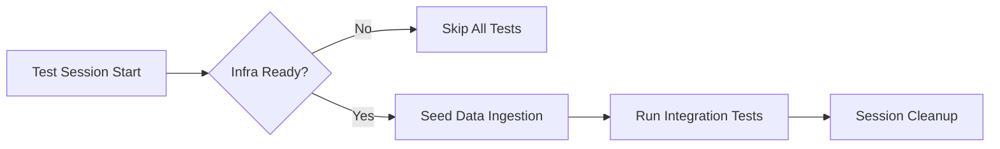

# Implementation Plan: Spec-054 Integration Test Infrastructure Improvement

## 📋 Branch Strategy
- `feature/054-integration-test-infra`

## 🛑 User Review Required
> [!IMPORTANT]
> - **시드 데이터 생성 전략**: 현재 계획은 통합 테스트 세션 시작 시 **실제 로컬 인제스션(Ingestion)** 과정을 거쳐 시드 데이터를 생성합니다. 이는 테스트 속도보다는 **실제 환경과 동일한 데이터 정합성**을 우선한 결정입니다. Mock 데이터 사용을 선호하신다면 알려주세요.

## 🎯 Core Strategy

### Architecture Context
통합 테스트의 신뢰성을 보장하기 위해 `pytest`의 `session` 스코프 픽스처를 활용하여 **"인프라 체크 -> 시드 데이터 적재 -> 테스트 수행 -> 격리"** 파이프라인을 구축합니다.



| Component | Strategy | Reasoning |
|:---:|:---|:---|
| **Infra Check** | Socket Port Check | 별도 라이브러리 없이 `socket` 모듈로 빠르고 가볍게 Neo4j/Chroma 포트 확인 |
| **Seeding** | Session-scoped Real Ingestion | Mock 대신 실제 파이프라인을 태워 DB 스키마 변경 시 테스트도 함께 검증되도록 함 |
| **Isolation** | Unique Job ID | DB 전체 초기화 비용을 줄이기 위해, 테스트마다 고유 ID를 사용하여 데이터 충돌 방지 |

## 📂 Proposed Changes

### [Testing Infrastructure]

#### [NEW] `tests/integration/conftest.py`
통합 테스트 전용 픽스처를 정의합니다.
- `check_infrastructure`: Neo4j(7687), Chroma(8000) 포트 점검. 연결 불가 시 전체 통합 테스트 Skip.
- `seed_test_data`: `Wikipedia`, `GitHub`, `PDF` 등 대표 타입 문서를 실제 인제스션 API로 주입하고 완료 대기.

#### [NEW] `tests/integration/README.md`
통합 테스트 실행 가이드라인을 작성합니다.
- Docker Compose 실행 필수 명시.
- `pytest` 실행 시 주의사항 및 옵션 설명.

### [Existing Tests]

#### [MODIFY] `tests/integration/test_api.py` 및 기타 테스트
- `conftest.py`의 시드 데이터를 활용하도록 수정.
- 하드코딩된 ID 의존성 제거.
- 인프라가 준비되지 않았을 때의 우아한 종료 처리.

## 🧪 Verification Plan

### Automated Tests
```bash
# 1. 인프라 정상 상태 테스트
docker compose up -d
uv run pytest tests/integration

# 2. 인프라 비정상 상태 테스트 (Skip 확인)
docker compose stop
uv run pytest tests/integration
```

### Manual Verification
1. `make reset-db` 명령어로 DB 초기화 후 `pytest tests/integration` 실행 시 16개 테스트 모두 통과 확인.
