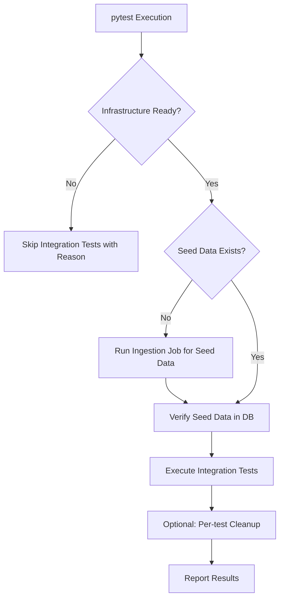

# Spec-054: Integration Test Infrastructure Improvement

## 📋 배경 및 문제 정의 (Background & Problem)

### 현재 상황
현재 프로젝트의 통합 테스트(Integration Tests)는 특정 로컬 환경이나 DB 상태를 수동으로 설정해야만 성공할 수 있는 구조입니다. 이로 인해 개발 환경마다 테스트 결과가 불일치하며, CI/CD 파이프라인 도입에 걸림돌이 되고 있습니다.

### 문제점
1.  **환경 의존성**: Neo4j, ChromaDB 등 필수 인프라가 실행 중인지 확인하지 않고 테스트를 실행하여 불명확한 에러가 발생합니다.
2.  **데이터 격리 부재**: 테스트 간 데이터가 공유되거나 이전 테스트의 잔재가 남아있어 실행 순서에 따라 테스트가 실패합니다.
3.  **시드 데이터 부족**: 특정 데이터가 존재함을 가정하고 작성된 테스트가 많아, 빈 DB에서는 대다수의 테스트가 실패합니다.
4.  **낮은 가독성**: 통합 테스트 실행 방법과 환경 설정에 대한 문서가 부족합니다.

### 해결 방안
1.  **Infrastructure Orchestration**: `pytest` 픽스처를 통해 테스트 시작 전 필수 서비스(Neo4j, Chroma, Postgres)의 가동 상태를 확인하고, 준비되지 않은 경우 명확한 메시지와 함께 스킵합니다.
2.  **Automated Seeding**: 세션 수준의 픽스처를 도입하여 테스트에 필요한 표준 데이터셋(Wikipedia, GitHub README 등)을 자동으로 인제스션하고 검증합니다.
3.  **Data Isolation**: 각 테스트 클래스 또는 함수 단위로 데이터를 정리(Cleanup)하거나 유니크한 ID를 사용하도록 개선합니다.
4.  **Documentation**: `tests/integration/README.md`를 작성하여 설정 및 실행 방법을 명시합니다.

## 📊 개념도 (Conceptual Architecture)

## 🎯 요구사항 (Requirements)

### Functional Requirements
1.  **Infra Health Check**: 테스트 세션 시작 시 Neo4j(7687), Chroma(8000) 포트 가동 여부 확인.
2.  **Global Seed Fixture**: 세션 시작 시 3종 이상의 표준 문서를 인제스션하고 검색 가능 상태인지 확인.
3.  **Stable BDD/TDD**: 기존에 실패하던 16개의 통합 테스트가 안정적으로 통과하도록 수정.
4.  **Isolation Strategy**: 테스트 간 충돌을 방지하기 위해 유니크한 `job_id` 및 `collection` 이름 사용 권장.

### Non-Functional Requirements
1.  **Speed**: 시드 데이터 생성 포함 전체 통합 테스트 실행 시간 2분 이내 목표.
2.  **Robustness**: DB가 초기화된 상태에서도 단 한 번의 명령으로 모든 테스트가 통과해야 함.

## ✅ Definition of Done
1.  모든 통합 테스트(`tests/integration/`)가 빈 DB 상태에서 성공적으로 통과함.
2.  인프라 미비 시 적절한 Skip 메시지가 출력됨.
3.  `tests/integration/README.md`가 작성됨.
4.  기존 16개 실패 테스트가 모두 해결됨.
