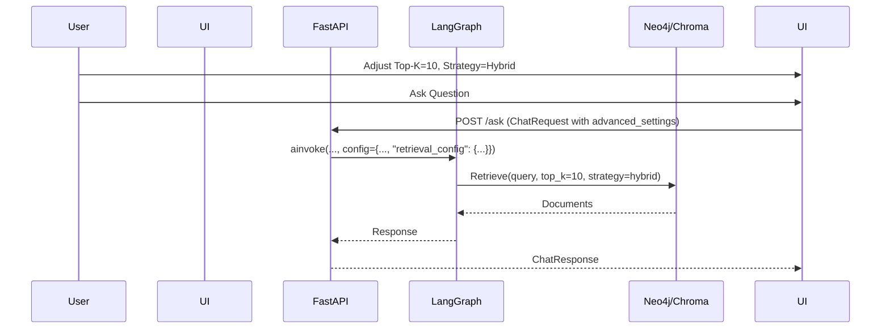

# Implementation Plan: Spec-055

## 📋 Branch Strategy
- `feature/055-rag-precision`

## 🛑 User Review Required
> [!IMPORTANT]
> - [ ] **API Breaking Change**: `POST /sessions/{id}/ask`의 Body 스키마가 변경됩니다 (`dict` -> `ChatRequest`). 기존 클라이언트가 있다면 영향이 있을 수 있으나, 현재는 Admin UI가 주 사용자이므로 안전할 것으로 판단됩니다.

## 🎯 Core Strategy

### Architecture Context


| Component | Strategy | Reasoning |
|:---:|:---|:---|
| **API DTO** | Pydantic Model (`ChatRequest`) | 명시적인 타입 검증과 Swagger 문서화를 위해 `dict` 대신 구조화된 DTO 사용 |
| **LangGraph Config** | `configurable` Dictionary | LangChain/LangGraph의 표준 설정 주입 방식을 사용하여 런타임에 파라미터 전달 |
| **Streamlit UI** | `st.expander` | 평소에는 숨겨져 있다가 필요할 때만 열어서 쓸 수 있도록 하여 UI 복잡도 최소화 |

## 📂 Proposed Changes

### [Interface Layer]

#### [MODIFY] `app/interfaces/api/v1/dto/rag.py`
- `AdvancedSettings` 모델 추가 (`top_k`, `temperature`, `search_strategy`)
- `ChatRequest` 모델 추가 (기존 endpoint payload 대체)

#### [MODIFY] `app/interfaces/api/v1/endpoints/rag.py`
- `ask_agent` 함수의 payload 타입을 `dict` → `ChatRequest`로 변경
- LangGraph `config`에 `retrieval_config` 키로 settings 주입

### [Application Layer]

#### [MODIFY] `app/infrastructure/ai/ingestion_orchestrator.py` or Retriever
- LangGraph 노드 내부에서 `config`를 읽어 Retriever 호출 시 파라미터 적용 확인
- (필요 시) `ConversationalRAGAgent`가 `configurable`을 잘 전달하는지 확인

### [Presentation Layer (Admin)]

#### [MODIFY] `admin/pages/4_RAG_Playground.py`
- 사이드바 혹은 메인 채팅창 하단에 `Advanced Settings` Expander 추가
- API 호출 시 해당 dictionary 구성하여 전송

## 🧪 Verification Plan

### Automated Tests
```bash
# Unit Tests (DTO Validation)
uv run pytest tests/unit/interfaces/api/v1/dto/test_rag_dto.py

# Integration Tests (API Endpoint)
uv run pytest tests/integration/functional/test_api_endpoints.py
```

### Manual Verification
1. **Swagger UI**: `/docs` 접속하여 `POST /ask`의 Request Schema가 `ChatRequest`로 변경되었는지 확인.
2. **Playground Test**:
    - Top-K를 1로 설정하고 질문 -> 답변과 함께 소스 문서가 1개만 오는지 확인.
    - Top-K를 5로 설정하고 질문 -> 소스 문서가 5개 오는지 확인.
