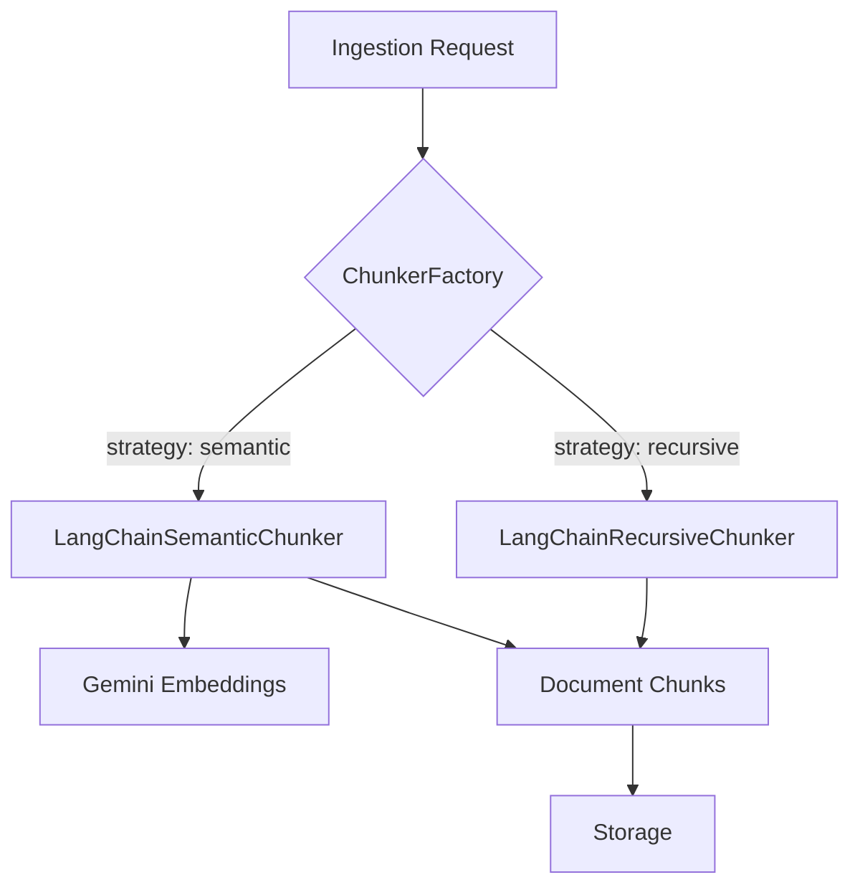

# Implementation Plan: Spec-056

## 📋 Branch Strategy
- `feat/spec-056-semantic-chunking`

## 🎯 Core Strategy
고정 크기 분할(Recursive) 방식에서 의미적 유사성 기반 분할(Semantic) 방식으로 확장합니다. LangChain의 `Experimental` 서비스와 Gemini Embeddings를 활용하여 문맥의 단절을 최소화합니다.

### Architecture Context

| Component | Strategy | Reasoning |
|:---:|:---|:---|
| **Semantic Chunker** | Similarity-based split | Preserve context continuity |
| **Factory Pattern** | Dynamic switching | High extensibility & Backward compatibility |
| **Admin UI** | Parametrized Control | User-driven optimization |

## 📂 Proposed Changes

### Domain & VO
- `app/domain/value_objects/chunk_config.py`: [NEW] 청킹 전략 및 파라미터 정의
- `app/domain/entities/job.py`: [MODIFY] IngestionJob에 chunking_config 필드 추가

### Infrastructure
- `app/infrastructure/chunker/semantic_chunker.py`: [NEW] LangChain SemanticChunker 래퍼 구현
- `app/infrastructure/chunker/chunker_factory.py`: [NEW] 전략에 따른 Chunker 생성 로직
- `app/infrastructure/chunker/langchain_chunker.py`: [MODIFY] 인터페이스 준수 및 리팩토링

### Application & API
- `app/application/services/ingestion.py`: [MODIFY] Chunking 설정 반영 및 run() 로직 고도화
- `app/interfaces/api/v1/dto/ingest.py`: [MODIFY] IngestRequest에 config 추가
- `app/interfaces/api/v1/dto/jobs.py`: [MODIFY] JobResponse에 docs_ids 추가
- `app/interfaces/api/v1/endpoints/ingest.py`: [MODIFY] 요청 시 config 주입
- `app/interfaces/api/v1/endpoints/jobs.py`: [MODIFY] docs_ids 맵핑 로직 추가

### Admin UI
- `admin/pages/0_Ingestion_Management.py`: [MODIFY] 청킹 설정 위젯 추가

## 🧪 Verification Plan

### Automated Tests
- `uv run pytest tests/unit/infrastructure/chunker/test_semantic_chunker.py`: Semantic 분할 로직 검증
- `uv run pytest tests/integration/functional/test_ingestion_with_semantic.py`: API-Service-Storage 전체 흐름 검증
