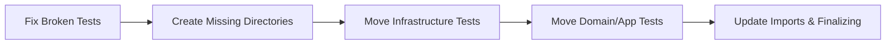

# Implementation Plan: Spec-058

## 📋 Branch Strategy
- `feat/spec-058-test-restructuring` (이미 main에 병합된 Spec 056 이후의 신규 브랜치 전략)

## 🛑 User Review Required
> [!IMPORTANT]
> - [x] **테스트 구조 변경**: 기존 테스트 파일들의 물리적 위치가 대폭 변경됩니다. 커밋 로그 가독성을 위해 기능 수정(Stability)과 구조 변경(Restructuring)을 분리하여 진행합니다.

> [!WARNING]
> - [x] **임포트 경로 수정**: 파일 이동에 따라 `tests/unit/` 내의 테스트 파일끼리 참조하는 경로가 깨질 수 있으며, 이를 일괄 수정하는 과정이 포함됩니다. (Ruff fix 연계)

## 🎯 Core Strategy

### Architecture Context


| Component | Strategy | Reasoning |
|:---:|:---|:---|
| **Stability** | Context-Mocking | RAGNodes 인터페이스 변경(config 인자) 대응 |
| **Restructuring** | Mirroring app/ | Clean Architecture 계층 구조 가독성 확보 |
| **Imports** | Ruff + Manual Fix | 구조 변경 후 자동화된 임포트 최적화 |

## 📂 Proposed Changes

### [Unit Test Stability]
#### [MODIFY] `tests/unit/infrastructure/rag/test_rag_nodes.py`
최근 추가된 `RunnableConfig` 필드를 테스트 케이스에 주입합니다.
```python
# Before
result = await nodes.retrieve_hybrid(state)

# After
config = {"configurable": {"retrieval_config": {"top_k": 5}}}
result = await nodes.retrieve_hybrid(state, config=config)
```

### [Unit Test Restructuring]
#### [MOVE/NEW] Infrastructure Layer
*   `tests/unit/infrastructure/test_llm_factory.py` → `tests/unit/infrastructure/factories/test_llm_factory.py`
*   `tests/unit/infrastructure/test_chroma_storage.py` → `tests/unit/infrastructure/repositories/test_chroma.py`
*   `tests/unit/infrastructure/test_neo4j_graph_repository.py` → `tests/unit/infrastructure/repositories/test_neo4j_graph.py`
*   `tests/unit/infrastructure/scrapers/` 디렉토리 신설 및 이동

#### [MOVE/NEW] Domain Layer
*   `tests/unit/domain/test_extractor.py` → `tests/unit/domain/services/test_extractor.py`
*   `tests/unit/domain/test_job_entity.py` → `tests/unit/domain/entities/test_job.py`
*   `tests/unit/domain/services/` 디렉토리 신설 및 이동

## 🧪 Verification Plan

### Automated Tests
```bash
# 1단계: Stability 수정 후 실행 (Pass 확인)
uv run pytest tests/unit/infrastructure/rag/test_rag_nodes.py

# 2단계: 전체 구조 변경 후 실행
uv run pytest tests/unit

# 3단계: 린트 체크
uv run ruff check tests/unit
```

### Manual Verification
1. `tree tests/unit` 명령을 통해 소스 코드(`app/`)와 디렉토리 위계가 일치하는지 확인.
2. `scripts/verify_semantic_data.py` 등을 실행하여 실제 런타임에 영향이 없는지 확인.
