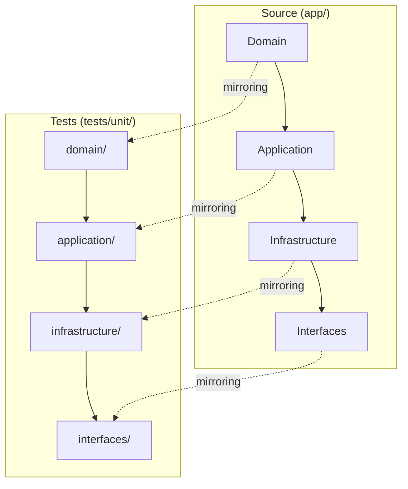

# Spec-058: Unit Test Restructuring & Stability Upgrade

## 📋 배경 및 문제 정의 (Background & Problem)

### 현재 상황
현재 시스템의 유닛 테스트 디렉토리인 `tests/unit`은 `app/` 소스 코드의 **Clean Architecture (4-Layer)** 구조와 완벽히 동반되지 않는 파편화된 상태입니다. 또한, 최근 `Spec 055`와 `Spec 056` 작업을 통해 `RAGNodes`의 주요 인터페이스가 변경(RunnableConfig 추가)되었으나, 기존 테스트 코드가 이를 반영하지 못해 테스트 스위트의 신뢰성이 저하되었습니다.

### 문제점
1.  **발견 가능성(Discoverability) 저하**: 소스 코드와 테스트 코드의 구조가 불일치하여 특정 기능에 대한 테스트를 찾거나 신규 테스트를 추가할 위치를 결정하기 어렵습니다.
2.  **기능적 결함**: `RAGNodes` 관련 유닛 테스트 7건이 `TypeError: missing 1 required positional argument`로 인해 실패하고 있어, CI/CD 및 회귀 테스트 도구로서의 역할을 상실했습니다.
3.  **유지보수 비용 증가**: 일관되지 않은 파일 배치로 인해 리팩토링이나 기능 확장 시 테스트 코드를 누락할 위험이 큽니다.

### 해결 방안
1.  **구조 동기화**: `tests/unit` 하위 디렉토리를 `app/` 레이어(`domain`, `application`, `infrastructure`, `interfaces`)와 1:1로 매핑하도록 재편합니다.
2.  **안정성 복구 (Stability Update)**: 깨져 있는 7개의 `RAGNodes` 유닛 테스트에 `RunnableConfig` Mock 인자를 주입하여 테스트 스위트를 정상화합니다.
3.  **표준화**: 테스트 파일 명명 및 배치 규칙을 확립하여 향후 확장에 대비합니다.

## 📊 개념도 (Conceptual Architecture)

## 🎯 요구사항 (Requirements)

### Functional Requirements
1.  현재 실패하는 7개의 `RAGNodes` 유닛 테스트(TypeError)를 수정하여 정상화해야 합니다.
2.  `tests/unit/` 내부의 모든 유닛 테스트 파일은 `app/`의 모듈 구조를 따라 적절한 하위 디렉토리로 이동되어야 합니다.
3.  파일 이동 후 수반되는 `import` 경로 오류가 모두 해결되어야 합니다.

### Non-Functional Requirements
1.  모든 테스트는 실제 인프라(Neo4j, ChromaDB) 의존성 없이 **Mocking** 환경에서 독립적으로 실행되어야 합니다.
2.  테스트 실행 속도에 부정적인 영향을 주지 않아야 합니다.

## ✅ Definition of Done
1.  `uv run pytest tests/unit` 명령 실행 시 158개(또는 이상)의 모든 테스트가 **PASS** 합니다.
2.  `tests/unit/` 디렉토리 아래에 `domain/`, `application/`, `infrastructure/`, `interfaces/` 서브 디렉토리가 적절히 구성되어 있습니다.
3.  `ruff check` 및 `ruff format`을 통과하여 코드 스타일과 임포트 정합성이 검증됩니다.
4.  테스트 커버리지가 기존 대비 저하되지 않았음을 확인합니다.
