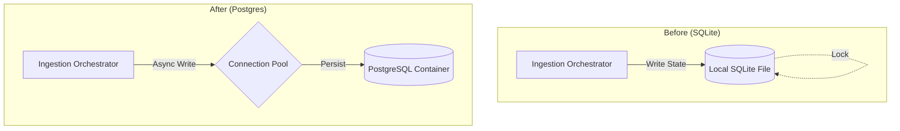

# Spec-060: Migrate from SQLite to Postgres Checkpointer

## 📋 배경 및 문제 정의 (Background & Problem)

### 현재 상황
현재 시스템은 LangGraph의 상태(State)를 `AsyncSqliteSaver`를 사용하여 로컬 SQLite 파일(`checkpoints.sqlite`)에 저장하고 있습니다. 또한 State 관리에 Custom TypedDict (`IngestionGraphState`)를 사용하고 있습니다.

### 문제점
1.  **동시성 제한**: SQLite의 파일 락으로 인해 여러 Ingestion Job이 동시에 실행될 때 `database is locked` 오류가 발생할 위험이 있습니다.
2.  **확장성 부재**: 컨테이너가 복제(Replica)되거나 분산 환경으로 확장될 때 로컬 파일 기반 상태는 공유될 수 없습니다.
3.  **디버깅 효율성 저하**: 표준 `MessagesState`를 사용하지 않아 LangSmith나 LangGraph의 기본 제공 도구(Time Travel, Repl) 활용이 제한적입니다.

### 해결 방안
1.  **PostgreSQL Migration**: `langgraph-checkpoint-sqlite`를 `langgraph-checkpoint-postgres`로 교체하여 동시성 및 데이터 무결성을 보장합니다.
2.  **MessagesState Adoption**: LangGraph 표준인 `MessagesState` 패턴으로 리팩토링하여 상태 관리의 표준성을 확보합니다.

## 📊 개념도 (Conceptual Architecture)

## 🎯 요구사항 (Requirements)

### Functional Requirements
1.  **Postgres Checkpointer**: SQLite 의존성을 제거하고 Postgres 기반의 Checkpointer로 완전히 대체해야 합니다.
2.  **Infrastructure**: Docker Compose에 PostgreSQL 서비스가 추가되어야 하며, 애플리케이션 시작 시 스키마가 자동 구성되어야 합니다.
3.  **MessagesState Migration**: `steps_history` (List[str])를 `messages` (List[BaseMessage])로 변환하여 LangGraph 표준을 준수해야 합니다.

### Non-Functional Requirements
1.  **Concurrency**: 동시에 5개 이상의 Ingestion Job이 실행되어도 DB Lock 오류 없이 상태가 저장되어야 합니다.
2.  **Compatibility**: 기존 코드(Agent, Scraper 등)의 변경을 최소화하는 Adapter 패턴을 유지해야 합니다.

## ✅ Definition of Done
1.  `docker-compose up` 실행 시 Postgres 컨테이너가 정상 구동되고 Python App과 연결되어야 한다.
2.  통합 테스트(`tests/integration/test_ingestion_graph.py`)가 Postgres Checkpointer 기반으로 통과해야 한다.
3.  Admin 대시보드에서 이전과 동일하게 Job 상태를 확인할 수 있어야 한다.
