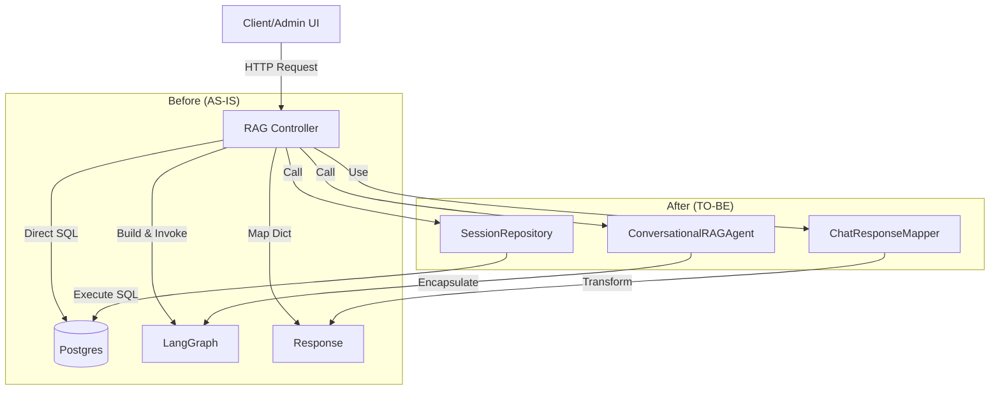

# Spec-062: RAG API 클린 아키텍처 리팩토링

## 📋 배경 및 문제 정의 (Background & Problem)

### 현재 상황
현재 `app/interfaces/api/v1/endpoints/rag.py`는 RAG 관련 모든 로직(요청 처리, DB 저장, SQL 실행, LangGraph 제어, 응답 매핑)을 포함하고 있습니다.

### 문제점
1.  **관심사 분리 위배**: 컨트롤러가 비즈니스 로직(Agent Orchestration)과 데이터 액세스 로직(Raw SQL)을 모두 처리하고 있어 `Fat Controller`가 되었습니다.
2.  **유지보수성 저하**: `reset_session` 등에서 변경 사항이 발생할 경우, API 계층 코드를 수정해야 하므로 영향 범위 파악이 어렵습니다.
3.  **테스트 용이성 부족**: 컨트롤러가 `database.pool`에 직접 의존하고 있어, 단위 테스트 시 Database Mocking이 복잡합니다.

### 해결 방안
`Clean Architecture` 원칙에 따라 계층별로 책임을 명확히 분리합니다.
1.  **Repository**: 세션 삭제 로직 (`delete_session`)을 `SessionRepository`로 이동.
2.  **Service**: Agent 실행 및 워크플로우 제어 로직을 `ConversationalRAGAgent` 서비스로 캡슐화.
3.  **DTO**: 응답 변환 로직을 `ChatResponseMapper`로 분리.

## 📊 개념도 (Conceptual Architecture)

## 🎯 요구사항 (Requirements)

### Functional Requirements
1.  **동작 일치성**: 리팩토링 전후의 API 입력/출력 및 시스템 동작이 100% 동일해야 합니다.
2.  **세션 삭제**: `reset_session` API는 `SessionRepository`를 통해 데이터를 삭제해야 합니다.
3.  **채팅 실행**: `ask_agent` API는 `ConversationalRAGAgent.ask()` 메서드를 호출하여 답변을 생성해야 합니다.

### Non-Functional Requirements
1.  **Code Complexity**: `rag.py` 파일의 라인 수 및 복잡도를 감소시켜야 합니다.
2.  **Testability**: Service와 Repository를 독립적으로 테스트할 수 있는 구조여야 합니다.

## ✅ Definition of Done
1.  `rag.py` 내에 `database.pool`을 직접 사용하는 코드가 제거되었다.
2.  `rag.py` 내에 `workflow.ainvoke` 등 LangGraph 제어 코드가 제거되었다.
3.  기존 통합 테스트(`tests/integration/functional/test_rag_session_cleanup.py`)가 통과한다.
4.  `ChatResponseMapper`가 구현되어 사용된다.
