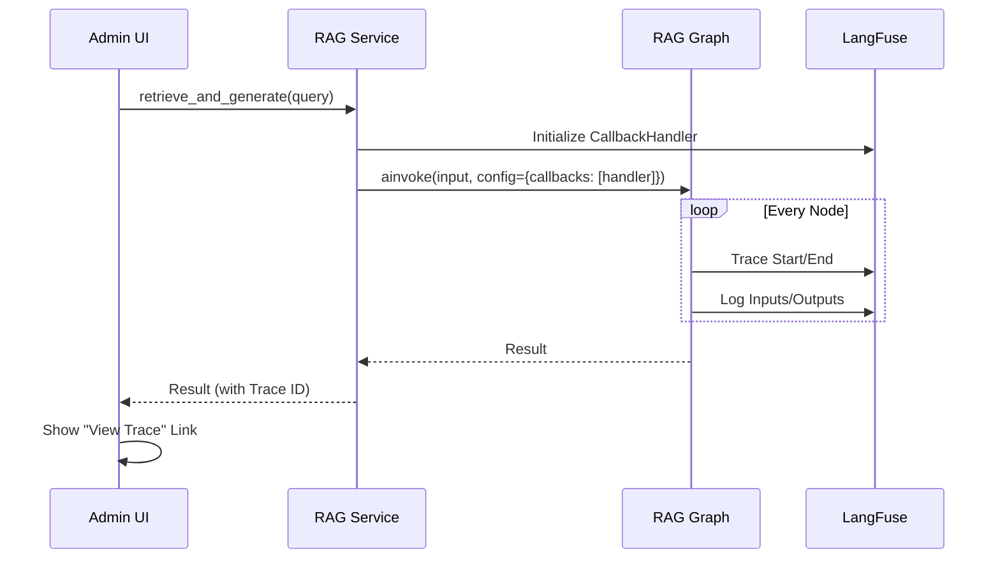

# Implementation Plan: Spec-064

## 📋 Branch Strategy
- `feature/spec-064-rag-observability`

## 🛑 User Review Required
> [!IMPORTANT]
> - [ ] **LangFuse Project Setup**: LangFuse 계정 생성 및 프로젝트 설정(API Keys)이 필요합니다.
> - [ ] **Dependency Addition**: `langfuse` 패키지가 추가됩니다.

## 🎯 Core Strategy
**LangChain Integration via Callbacks**:
RAG 파이프라인이 LangGraph/LangChain 기반이므로, `LangfuseCallbackHandler`를 Pipeline 실행 시 `config`에 주입하는 것이 가장 효율적입니다. 이를 통해 별도의 복잡한 로깅 코드 없이 자동화된 Tracing을 구현합니다.

### Architecture Context


| Component | Strategy | Reasoning |
|:---:|:---|:---|
| **Tracing Backend** | **LangFuse** | LLM Observability 분야의 표준이며, LangChain 통합이 강력함. |
| **Integration Point** | **RAG Service** | Graph 실행 시점에서 Callback을 주입하여 전체 파이프라인을 커버. |
| **UI Integration** | **Deep Link** | 복잡한 대시보드를 이중 구현하지 않고, LangFuse 상세 페이지로 연결. |

## 📂 Proposed Changes

### [Pipfile & Configuration]
#### [MODIFY] `pyproject.toml`
- `langfuse` 의존성 추가.

#### [NEW] `.env.example`
- `LANGFUSE_SECRET_KEY`, `LANGFUSE_PUBLIC_KEY`, `LANGFUSE_HOST` 추가.

### [Core App]
#### [NEW] `app/infrastructure/monitoring/langfuse_helper.py`
- LangFuse Handler 생성 및 초기화 로직 캡슐화.
- 연결 실패 시 Graceful fallback 처리.

#### [MODIFY] `app/application/services/rag.py`
- `retrieve_and_generate` 메서드에서 Handler 초기화 및 Config 주입.
- `RAGResult`에 `trace_id` 및 `trace_url` 필드 추가.

#### [MODIFY] `app/infrastructure/ai/rag_nodes.py`
- `generate_answer` 및 `rerank_results` 내부의 LLM 호출 시 `config` 객체 전달 (Callback 전파).
- `retrieve_hybrid` 등 주요 로직에 `@observe` 데코레이터 적용 고려 (Optional).

### [Admin UI]
#### [MODIFY] `admin/pages/4_RAG_Playground.py`
- 결과 화면에 "🔍 View Trace in LangFuse" 링크 버튼 추가.

### [Documentation]
#### [NEW] `docs/features/observability.md`
- **목표**: 사용자가 질문한 "어떻게 실시간 상태 확인이 가능한가?"에 대한 기술적 매커니즘(Async Batch via HTTP) 상세 통신 흐름 기록.
- **내용**:
  - LangFuse SDK의 Fire-and-Forget 아키텍처 다이어그램.
  - Latency에 영향을 주지 않는 비동기 배치 전송 원리.
  - Admin UI의 Deep Link 방식 설명.

## 🧪 Verification Plan

### Automated Tests
```bash
# Unit Tests (Callback Injection Test)
uv run pytest tests/unit/test_rag_observability.py

# Integration Tests (Real LangFuse connection could be mocked, or verify no crash)
uv run pytest tests/integration/test_rag_pipeline.py
```

### Manual Verification
1. `.env`에 LangFuse API Key 설정.
2. `Admin > RAG Playground` 진입.
3. 질문 입력 및 답변 생성.
4. "View Trace" 링크 클릭하여 LangFuse 페이지 이동.
5. Intent, Retrieval, Rerank, Generation 각 단계가 타임라인에 표시되는지 확인.
