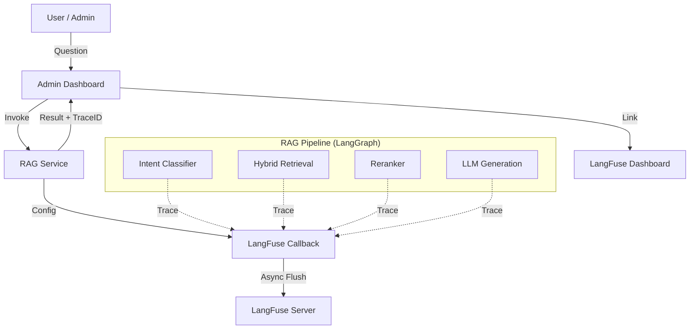

# Spec-064: RAG Observability Dashboard & Tracing

## 📋 배경 및 문제 정의 (Background & Problem)

### 현재 상황
Streamlit Admin 대시보드에서 RAG 파이프라인(Ingestion, Retrieval, Generation)을 실행하고 결과를 확인할 수 있으나, 현재는 최종 답변과 참조 문서(Chunks)만 확인할 수 있습니다. 중간 단계(Intent 분류, 검색 쿼리 변환, 리랭킹 점수, LLM 생성 시간 등)에 대한 구체적인 메트릭이나 로그는 터미널 로그에 의존하고 있습니다.

### 문제점
1.  **디버깅 어려움**: 답변 품질이 낮거나 이상한 경우, 어느 단계(Retrieval vs Rerank vs Generation)에서 문제가 발생했는지 파악하기 어렵습니다.
2.  **성능 분석 불가**: 각 단계별 소요 시간(Latency)이나 토큰 사용량(Cost)을 추적할 수 없어 최적화 지점을 찾기 어렵습니다.
3.  **이력 관리 부재**: 과거의 질의응답 내역을 체계적으로 조회하거나 비교 분석할 수 있는 도구가 없습니다.

### 해결 방안
**LangFuse**를 도입하여 RAG 파이프라인의 엔드투엔드 가시성(Observability)을 확보합니다.
1.  **LangFuse Integration**: LangChain/LangGraph와의 연동을 통해 별도의 복잡한 구현 없이 Tracing을 적용합니다.
2.  **Server-side Tracing**: RAG Service(`rag.py`, `rag_nodes.py`)에서 `LangfuseCallbackHandler`를 주입하여 모든 LLM 호출과 Chain 실행을 기록합니다.
3.  **Admin UI Integration**: RAG Playground에서 질의 실행 후, 해당 트레이스의 링크를 제공하거나 핵심 메트릭(Latency, Token)을 즉시 보여줍니다.

## 📊 개념도 (Conceptual Architecture)

## 🎯 요구사항 (Requirements)

### Functional Requirements
1.  **Trace All Steps**: Intent Classification, Query Rewrite, Retrieval, Reranking, Generation 단계가 모두 하나의 Trace로 묶여야 합니다.
2.  **Capture Metadata**: 각 단계의 입출력, Latency, Token Usage(Cost), Rerank Score 등이 기록되어야 합니다.
3.  **Environment Config**: `.env`를 통해 LangFuse 연결 정보(Public/Secret Key, Host)를 관리해야 합니다.
4.  **Admin UI Link**: RAG Playground에서 답변 생성 후, "View Trace in LangFuse" 버튼을 통해 해당 실행의 상세 로그로 이동할 수 있어야 합니다.

### Non-Functional Requirements
1.  **Async Logging**: Tracing으로 인해 RAG 응답 속도가 현저히 느려지지 않아야 합니다 (LangFuse SDK의 비동기 Batch 전송 활용).
2.  **Graceful Degrade**: LangFuse 서버 연결 실패 시에도 RAG 서비스는 정상 동작해야 합니다.

## ✅ Definition of Done
1.  로컬 환경에서 RAG 질문 시 LangFuse 대시보드에 Trace가 생성되는지 확인.
2.  Retrieval, Rerank 단계의 내부 파라미터(Top-k, Score 등)가 Trace에 포함되는지 확인.
3.  Admin RAG Playground에서 Trace 링크가 정상 작동하는지 확인.
4.  `test_rag_flow.py` 등 통합 테스트 실행 시에도 Trace가 정상 기록되는지 확인.
