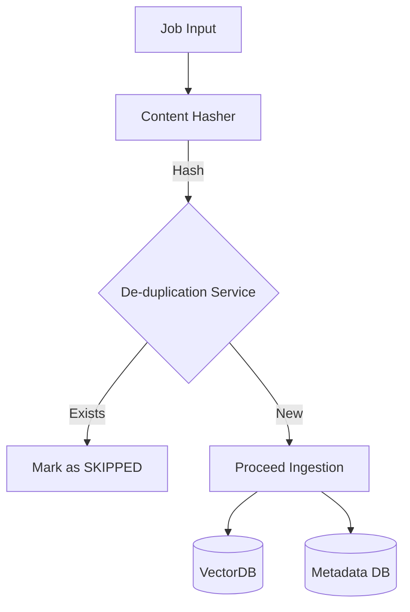

# Implementation Plan: Spec-065

## 📋 Branch Strategy
- `feature/spec-065-semantic-deduplication`

## 🛑 User Review Required
> [!IMPORTANT]
> - [x] **Schema Change**: `IngestionJob` 모델에 `content_hash` 필드 추가 필요 (Backward Compatibility 고려)

> [!WARNING]
> - [x] **Skipped Jobs**: 중복으로 Skip된 Job도 History에는 남지만, VectorDB에는 추가되지 않음을 명확히 해야 함.

## 🎯 Core Strategy

### Architecture Context


| Component | Strategy | Reasoning |
|:---:|:---|:---|
| **Hashing** | `SHA-256` of Raw Text | 충돌 가능성 극히 낮음, 계산 속도 빠름 |
| **Storage** | `IngestionJob` Table | 별도 테이블 관리 비용 절감, Job 단위 추적 용이 |
| **Lookup** | Neo4j Cypher Query | 기존 Job Repository 활용 가능 |

## 📂 Proposed Changes

### Domain & Application

#### [NEW] `app/application/services/deduplication_strategies.py`
- `DeduplicationStrategy` (Interface)
    - `async def is_duplicate(self, job: IngestionJob) -> bool`
- `MetadataComparisonStrategy(keys: list[str])`
    - 생성 시 비교할 `keys`를 주입받음 (예: `["video_id"]` or `["size", "mtime"]`)
    - Job Metadata와 DB의 최신 Job Metadata를 비교
- `ContentHashStrategy`
    - Content Hash 계산 및 비교

#### [MODIFY] `app/application/services/ingestion.py`
- `process_job` 내부에서 **Strategy Resolver**를 통해 적절한 전략 인스턴싱
    - 예: `if source_type == YOUTUBE: use MetadataComparisonStrategy(["video_id"])`
- 전략 실행 및 결과 처리

### Infrastructure

#### [MODIFY] `app/infrastructure/repositories/neo4j_job_repository.py`
- `create_job`, `update_job`: `content_hash` 필드 persist 처리
- `find_last_job_by_hash(source_url, hash)` 메서드 추가 (Optional) 또는 기존 리스트 활용

### Admin UI

#### [MODIFY] `admin/pages/0_Ingestion_Management.py` (Assuming location)
- "Force Refresh" Checkbox 추가
- Job 생성 시 `force` 파라미터 전달

## 🧪 Verification Plan

### Automated Tests
```bash
# Unit Tests
uv run pytest tests/unit/test_deduplication.py

# Integration Tests
uv run pytest tests/integration/test_ingestion_flow.py
```

### Manual Verification
1. **Duplicate Test**: 동일 URL 수집 요청 -> 두 번째 요청은 `Skipped` 상태 확인
2. **Change Test**: 내용 변경 후 수집 요청 -> 정상 `Completed` 확인
3. **Force Refresh**: 체크박스 선택 후 수집 요청 -> 중복이어도 `Completed` 확인
