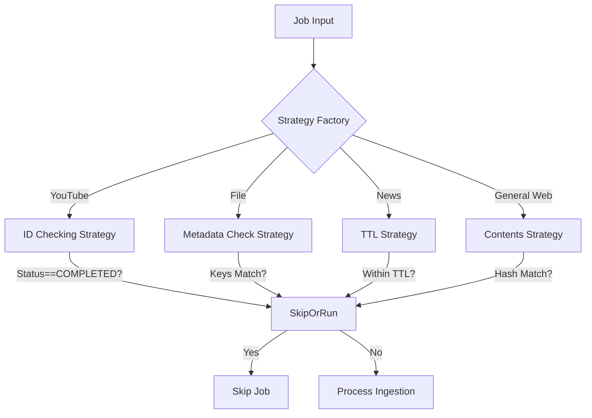

# Spec-065: Semantic De-Duplication (SDD)

## 📋 배경 및 문제 정의 (Background & Problem)

### 현재 상황
현재 RAG 파이프라인은 동일한 문서(URL 또는 파일)가 다시 입력되면 기존 내용을 무시하고 중복해서 처리하거나, 단순히 덮어씌우는 방식으로 동작할 수 있습니다. 특히 Chunk 단위로 VectorDB에 저장될 때, 동일한 내용이 중복 저장되면 검색 품질이 저하되고 저장 공간이 낭비됩니다.

### 문제점
1.  **중복 저장**: 내용이 변하지 않은 문서도 재수집 시 새로운 Chunk로 VectorDB에 추가될 가능성이 있음 (VectorDB에 따라 다름).
2.  **리소스 낭비**: 변경되지 않은 문서를 다시 임베딩하고 저장하는 비용 발생.
3.  **검색 품질 저하**: 동일한 내용이 여러 번 검색 결과에 나타나 Context Window를 낭비함.

### 해결 방안: Logic-Based Strategy Pattern (4 Types)
데이터 소스의 특성과 요구사항에 따라 4가지 독립적인 전략을 사용하여 유연하게 중복을 판단합니다.

1.  **ID Checking Strategy** (ID 확인 전략)
    *   **동작**: Source URL(또는 ID)이 이미 성공적으로 수집(COMPLETED)된 이력이 있는지 확인.
    *   **용도**: YouTube Video 등 고유 ID 기준으로 한 번만 수집하면 끝나는 불변 리소스.
    *   **로직**: `if exists(source_url) and status == COMPLETED: Duplicate`
2.  **Metadata Check Strategy** (메타데이터 비교 전략)
    *   **동작**: 정의된 Key들의 값이 이전 수집 데이터와 일치하는지 비교.
    *   **용도**: Local File (Size + Modified Time), YouTube (Video ID 등).
    *   **로직**: `if all(curr[key] == last[key]): Duplicate`
3.  **TTL Strategy** (수집 주기 확인 전략)
    *   **동작**: 마지막 수집 시점으로부터 일정 시간(TTL)이 지났는지 확인.
    *   **용도**: News, Portal 등 주기적 업데이트가 필요한 동적 페이지.
    *   **로직**: `if (now - last_created_at) < ttl: Duplicate`
4.  **Contents Strategy** (본문 해시 전략)
    *   **동작**: 실제 콘텐츠의 해시(Content Hash)를 비교.
    *   **용도**: URL은 같지만 내용 변경이 잦고 중요할 때 (General Web).
    *   **로직**: `if curr_hash == last_hash: Duplicate`

## 📊 개념도 (Conceptual Architecture)

## 🎯 요구사항 (Requirements)

### Functional Requirements
1.  **Hash Calculation**: 수집된 Text에 대해 SHA-256 해시를 계산해야 합니다.
2.  **Duplicate Check**: 수집 파이프라인 진입 시, 해당 Source(URL/File)의 최신 Hash와 비교해야 합니다.
3.  **Status Reporting**: 중복으로 인해 Skip된 경우, 사용자에게 "Skipped (Duplicate)" 상태를 알려야 합니다.
4.  **Force Option**: Admin UI에서 "Force Refresh" 체크박스를 통해 중복 검사를 무시할 수 있어야 합니다.

### Non-Functional Requirements
1.  **Low Latency**: 해시 계산 및 DB 조회는 매우 빠르게 이루어져야 합니다.
2.  **Consistency**: VectorDB와 Metadata DB 간의 데이터 불일치가 없도록 관리해야 합니다.

## ✅ Definition of Done
1.  동일한 문서를 두 번 수집 시도했을 때, 두 번째는 "Skipped" 처리되는지 확인.
2.  문서 내용을 수정하고 수집했을 때, 정상적으로 업데이트되는지 확인.
3.  "Force Refresh" 옵션 사용 시, 내용이 같아도 다시 수집되는지 확인.
4.  Admin Dashboard에서 Skip 된 Job의 상태를 확인할 수 있는지 확인.
