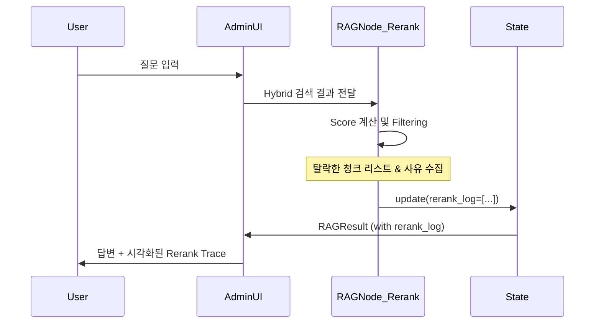

# Spec-066: Enhanced Trace Viewer

## 📋 배경 및 문제 정의 (Background & Problem)

### 현재 상황
현재 RAG Pipeline은 LangGraph를 기반으로 실행되며, `RAGResult`를 통해 최종 결과(답변, 검색된 청크 등)를 반환합니다. Admin UI의 "Observability & Trace" 페이지에서는 LangGraph Checkpointer의 State Snapshot을 조회하거나 LangFuse 대시보드로 이동하여 상세 로그를 볼 수 있습니다.

### 문제점
1. **Rerank 투명성 부족**: 현재 `RAGResult`에는 최종 선택된 청크만 포함되어 있어, Reranker가 어떤 청크들을 왜 탈락시켰는지($score 등)를 즉각적으로 알 수 없습니다.
2. **디버깅 공수**: "왜 이 청크가 검색되지 않았지?"라는 질문에 답하기 위해 매번 LangFuse로 이동하거나 복잡한 Raw State를 뒤져야 합니다.
3. **UI 단절**: 검색 결과 페이지(RAG Playground)와 상세 로그 페이지(Trace Viewer) 간의 유기적인 연결이 부족합니다.

### 해결 방안
1. **Domain 확장**: `RAGResult` 엔티티에 `rerank_log` 필드를 추가하여 탈락한 청크와 점수 정보를 포함합니다.
2. **Graph State 개선**: RAG 워크플로우 내의 Rerank 노드에서 상세 로그를 수집하여 State에 기록합니다.
3. **Admin UI 고도화**: Trace Viewer에서 재랭킹 과정을 시각화(Pass/Drop/Score)하여 보여주는 탭을 추가합니다.

## 📊 개념도 (Conceptual Architecture)

## 🎯 요구사항 (Requirements)

### Functional Requirements
1. `RAGResult` 및 `RAGGraphState`에 `rerank_log` 필드 추가 (List of Dict/Obj).
2. Rerank 노드에서 상위 K개 외의 'Dropped Chunks' 정보(ID, Text 일부, Score)를 로그에 기록.
3. Admin UI (3_Observability_&_Trace.py)에 'Rerank Analysis' 시각화 탭 추가.
4. RAG Playground에서 결과 하단에 해당 트레이스로 바로 이동할 수 있는 링크 제공.

### Non-Functional Requirements
1. 로그 데이터 크기를 최소화하기 위해 'Dropped Chunks'의 텍스트는 앞 100자만 보관.
2. 기존 하위 호환성 유지 (필드가 없어도 에러 발생 안 함).

## ✅ Definition of Done
1. RAG 실행 후 반환되는 데이터에 `rerank_log`가 올바르게 포함됨.
2. Admin UI에서 탈락한 청크의 리스트와 점수가 표/차트 형태로 표시됨.
3. 모든 통합 테스트(RAG Pipeline Flow) 통과.
4. 모든 문서는 `docs/templates` 규격을 준수함.
