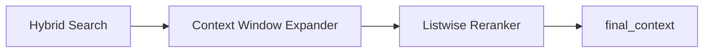

# Implementation Plan: Spec-067 Advanced Reranking

## 📋 Branch Strategy
- `feature/067-advanced-reranking`

## 🛑 User Review Required
> [!IMPORTANT]
> - **Listwise Cost**: Listwise 방식은 여러 청크를 하나의 프롬프트에 넣으므로 입력 토큰량이 증가합니다 (N개 청크 합산).
> - **Sliding Window 전략**: 인접 청크를 몇 개까지 포함할지에 따라 성능과 비용의 Trade-off가 발생합니다. 초기에는 전후 1개 청크(총 3개 조합)를 기본값으로 제안합니다.

## 🎯 Core Strategy
Pointwise 방식의 독립 평가 한계를 극복하기 위해, '상대적 순위'를 매기는 Listwise Reranker를 도입합니다.

### Architecture Context


| Component | Strategy | Reasoning |
|:---:|:---|:---|
| **Context Window** | 전후 1개 청크 병합 | 파편화된 정보 복원 및 문맥 강화 |
| **Reranker** | Listwise (N=5) | 청크 간 상대적 중요도 비교 가능 |
| **State** | strategy 필드 추가 | 유연한 리랭킹 전략 전환 지원 |

## 📂 Proposed Changes

### [RAG Pipeline]

#### [NEW] [listwise_reranker.py](file:///Users/ck/Project/doit/rag-ingestion/app/domain/services/prompts/listwise_reranker.py)
- Listwise Reranking 전용 프롬프트 정의 (JSON Array 반환 기대).

#### [MODIFY] [rag_state.py](file:///Users/ck/Project/doit/rag-ingestion/app/domain/value_objects/rag_state.py)
- `rerank_strategy`: 사용될 리랭킹 전략 필드 추가.
- `rerank_log`: Listwise 로그 기록 포맷 지원.

#### [MODIFY] [rag_nodes.py](file:///Users/ck/Project/doit/rag-ingestion/app/infrastructure/ai/rag_nodes.py)
- `rerank_results` 메서드 리팩토링: 전략에 따른 분기(Pointwise vs Listwise).
- `_expand_context_window` (Private): 인접 청크 데이터 로딩 로직 추가.
- `_get_listwise_rankings` (Private): Listwise LLM 호출 로직.

## 🧪 Verification Plan

### Automated Tests
```bash
# Unit Test: Listwise Logic
uv run pytest tests/unit/application/services/test_listwise_reranker.py

# Integration Test: RAG Pipeline with Advanced Reranking
uv run pytest tests/integration/test_rag_advanced_reranking.py
```

### Manual Verification
1. **Admin UI**: Trace Viewer에서 `rerank_strategy: listwise` 확인 및 랭킹 결과 검증.
2. **Playground**: 문맥이 끊어지기 쉬운 긴 문서 질문 테스트 (예: 특정 수식이나 문장이 여러 청크에 걸친 경우).
