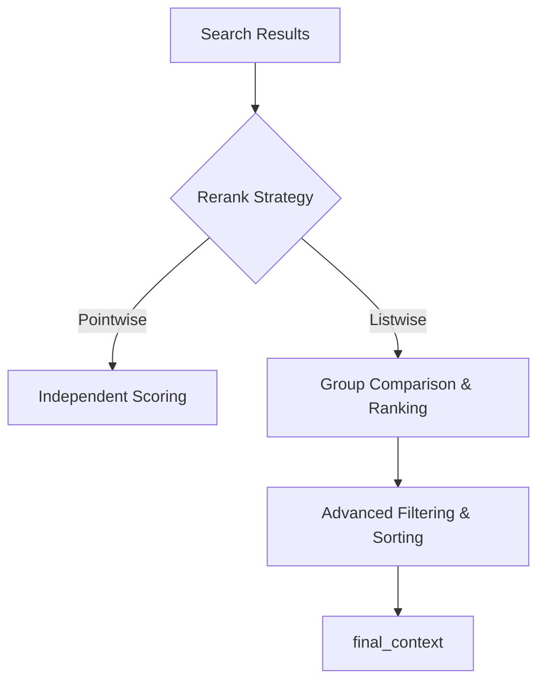

# Spec-067: Advanced Reranking Logic Research

## 📋 배경 및 문제 정의 (Background & Problem)

### 현재 상황
**Spec 048** 및 **Spec 066**을 통해 Rerank 노드가 구현되어, 검색된 청크들을 LLM이 다시 평가하고 필터링하는 기능이 작동 중입니다. 현재는 **Pointwise Reranking** 방식을 사용하며, 각 청크를 독립적으로 질문과의 연관성을 0~5점 사이로 평가합니다.

### 문제점
1. **맥락 파편화 (Context Fragmentation)**: 정보가 여러 청크에 걸쳐 나뉘어 있는 경우, 개별 청크는 질문에 대한 직접적인 답변을 포함하지 않아 낮은 점수를 받고 탈락(Dropped)될 수 있습니다.
2. **비교 불가 (Lack of Comparison)**: Pointwise 방식은 여러 청크 중 어떤 것이 상대적으로 더 우수한지 비교하지 못하므로, 최적의 컨텍스트 조합을 선택하는 데 한계가 있습니다.
3. **비용 및 지연 시간 (Cost & Latency)**: 각 청크마다 개별 LLM 호출이 발생하여 청크 수가 많을수록 오버헤드가 증가합니다.

### 해결 방안
**Listwise Reranking** 및 **Sliding Window** 기법을 연구하고 도입하여 검색 정밀도를 혁신적으로 개선합니다.

1. **Listwise Strategy**: LLM에게 여러 청크를 한꺼번에 전달하여 상대적 중요도를 비교하고 순위를 매기게 합니다.
2. **Contextual Window (Sliding Window)**: 개별 청킹의 파편화를 해결하기 위해 인접 청크를 함께 고려하거나, 랭킹 과정에서 앞뒤 맥락을 보강합니다.
3. **Hybrid Reranking Model**: 비용 효율적인 리랭킹을 위해 경량 모델 기반 1차 필터링 후 고성능 모델 기반 Listwise 2차 리랭킹 구조를 검토합니다.

## 📊 개념도 (Conceptual Architecture)

## 🎯 요구사항 (Requirements)

### Functional Requirements
1. **Listwise Reranker 구현**: 상위 N개의 청크를 그룹화하여 한 번의 LLM 호출로 순위를 재조정하는 로직 추가.
2. **State 확장**: `RAGGraphState`에 리랭킹 전략 선택 옵션 및 비교 분석 기록을 위한 필드 추가.
3. **Sliding Window Support**: 청크 평가 시 인접 맥락을 포함할 수 있는 데이터 로딩 구조 보강.
4. **Benchmarking Tool**: 기존 Pointwise 방식과 새로운 방식의 정밀도/비용/지연 시간 비교 기능.

### Non-Functional Requirements
1. **Latency**: Listwise 도입 시 전체 RAG 응답 시간의 급격한 증가를 방지 (Batch 처리 최적화).
2. **Token Efficiency**: 불필요한 중복 텍스트 전송 최소화.

## ✅ Definition of Done
1. **Listwise Reranking** 로직 구현 및 `RAGNodes` 통합 완료.
2. **Sliding Window** 기반 컨텍스트 보강 기능 동작 확인.
3. 기존 **Pointwise** 방식과의 성능 비교 리포트 작성.
4. 모든 단위/통합 테스트 통과 및 Admin UI에서의 시각화 확인.
