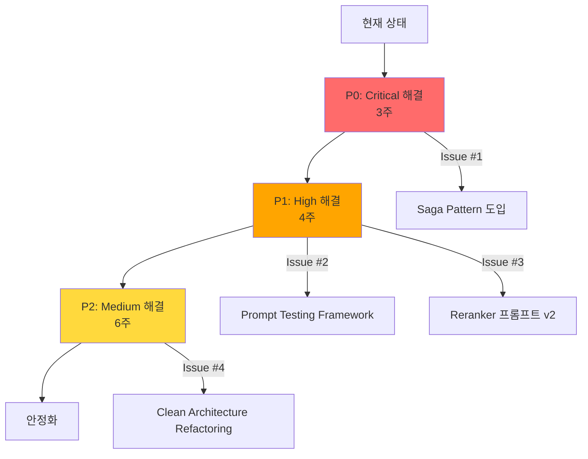

# Root Cause Analysis: RAG System Quality Issues

> 이 문서는 **Spec 068**의 심층 분석 문서로, 각 문제점에 대한 **5 Whys 분석**과 **실제 코드 증거**를 제시합니다.

---

## 📊 분석 프레임워크

### 분석 방법론
1. **5 Whys Technique**: 각 증상에 대해 "왜?"를 5번 반복하여 근본 원인 도달
2. **Code Evidence**: 실제 파일 및 라인 번호 기반 증거 제시
3. **Impact Analysis**: 각 문제가 사용자 경험에 미치는 영향도 평가
4. **Trade-off Analysis**: 해결 시 발생하는 비용 vs 이익 분석

### 영향도 분류
- 🔴 **Critical**: 시스템 핵심 기능 장애
- 🟠 **High**: 사용자 경험 심각한 저하
- 🟡 **Medium**: 특정 시나리오에서만 문제
- 🟢 **Low**: 코드 품질/유지보수성 이슈

---

## 🔴 Critical Issue #1: Ingestion Data Consistency (좀비 데이터)

### 증상
**Spec 043** 발견: "일론 머스크 위키피디아 페이지 수집 시, Neo4j에는 159개 청크가 저장되었으나 ChromaDB에는 0건"

### 5 Whys Analysis

**Why 1**: 왜 ChromaDB에 저장이 안 됐나?
→ 159개의 청크를 한 번에 `collection.add()` 호출했는데 Timeout 발생

**Why 2**: 왜 한 번에 호출했나?
→ `ChromaStorage.save_chunks()`가 Batching 로직 없이 구현됨
```python
# app/infrastructure/repositories/chroma.py (Before Spec 043)
def save_chunks(self, chunks: list[Chunk]):
    self.collection.add(
        ids=[c.id for c in chunks],  # 159개 한 번에
        documents=[c.text for c in chunks],
        ...
    )
```

**Why 3**: 왜 Batching을 처음부터 고려하지 않았나?
→ 초기 Spec (Spec 002)에서는 소규모 문서만 테스트 (10~20개 청크)

**Why 4**: 왜 대규모 문서 테스트를 안 했나?
→ **Integration Test 부족**: Spec 009/012에서 Integration Test를 정의했으나, **실패 시나리오**(대용량 문서, Timeout)는 Icebox 처리됨

**Why 5 (Root Cause)**: 왜 실패 시나리오가 Backlog에 남았나?
→ **"증상 치료" 개발 패턴**: 
  - 문제 발생 → 긴급 수정 (Spec 043 Batching 추가)
  - 근본 원인 (Test Coverage 부족)은 해결 안 됨
  - 다른 곳에서 동일한 패턴 (한 번에 대량 처리) 재발 가능

### Impact
- 🔴 **Critical**: 검색 불가능한 좀비 데이터 생성
- **User Impact**: "분명히 수집했는데 검색 안 됨" → 신뢰도 하락

### Code Evidence
```python
# ❌ Before (Spec 043 이전)
# app/infrastructure/repositories/chroma.py:45
def save_chunks(self, chunks: list[Chunk]):
    self.collection.add(ids=..., documents=..., ...)  # 한 번에 모두

# ✅ After (Spec 043 이후)
# app/infrastructure/repositories/chroma.py:47
def save_chunks(self, chunks: list[Chunk]):
    batch_size = CHROMA_BATCH_SIZE  # 20
    for i in range(0, len(chunks), batch_size):
        batch = chunks[i:i+batch_size]
        self.collection.add(...)  # 배치 단위로
```

### 개선 방안
1. **Transaction Guarantee** (Saga Pattern):
   ```python
   async def save_document_transactional(doc: Document, chunks: list[Chunk]):
       # Step 1: Save to Neo4j
       neo4j_result = await neo4j_repo.save(doc, chunks)
       if not neo4j_result.success:
           raise IngestionError("Neo4j save failed")
       
       # Step 2: Save to ChromaDB
       try:
           await chroma_repo.save_chunks(chunks)
       except Exception as e:
           # Compensate: Rollback Neo4j
           await neo4j_repo.delete(doc.id)
           raise IngestionError("Chroma save failed, rolled back") from e
   ```

2. **Integration Test 보강**:
   ```python
   # tests/integration/test_ingestion_edge_cases.py
   def test_large_document_ingestion():
       """159개 이상 청크를 가진 문서 수집 테스트"""
       doc = create_dummy_document(chunk_count=200)
       result = ingestion_service.ingest(doc)
       
       assert neo4j_repo.get_chunks(doc.id) == 200
       assert chroma_repo.get_chunks(doc.id) == 200  # ✅ 일관성 검증
   ```

---

## 🟠 High Issue #2: Intent Classifier Prompt Bias

### 증상
"어쩌다 어른" 프로그램 질문은 잘 작동하나, "알쓸신잡" 같은 다른 프로그램은 의도 분류 실패

### 5 Whys Analysis

**Why 1**: 왜 "알쓸신잡"은 실패하나?
→ Intent Classifier의 Few-Shot 예시에 "어쩌다 어른"만 있고 "알쓸신잡"은 없음

**Why 2**: 왜 "어쩌다 어른"만 예시로 들어갔나?
→ 개발/테스트 시 자주 사용한 데이터가 프롬프트에 하드코딩됨
```python
# app/domain/services/intent_classifier.py:132
User: "어쩌다 어른에 대해서 알려줘"
→ {"intent": "general_query", "targets": ["어쩌다 어른"], ...}
```

**Why 3**: 왜 프롬프트 테스트 데이터가 편향됐나?
→ **테스트 데이터셋 부재**: 
  - Spec 048, 055 등 여러 차례 RAG 품질 개선을 했으나, **표준 벤치마크 데이터셋**이 없음
  - 개발자가 손으로 테스트할 때마다 동일한 질문 재사용

**Why 4**: 왜 벤치마크 데이터셋을 만들지 않았나?
→ **"빠른 배포" 압박**: 
  - 문제 발생 → Spec 생성 → 긴급 수정 → 배포
  - 품질 검증 인프라 (Test Suite, Benchmark) 구축은 우선순위 밀림

**Why 5 (Root Cause)**: 왜 품질 검증이 후순위인가?
→ **개발 프로세스 문제**: 
  - SDD Mode에서 Plan에 "테스트 작성"은 명시하지만, **"프롬프트 품질 검증"**은 명시 안 함
  - Constitution/Agent.md에 TDD 규칙은 있으나, **Prompt Engineering 품질 기준**은 없음

### Impact
- 🟠 **High**: 특정 도메인에만 작동하는 RAG → 확장성 제한
- **User Impact**: "왜 어떤 질문은 되고 어떤 건 안 돼?" → 예측 불가능한 시스템

### Code Evidence
```python
# ❌ 현재 프롬프트 (하드코딩된 예시)
# app/domain/services/intent_classifier.py:118-133
**Examples:**

User: "인공지능이 뭐야?"
User: "Claude와 GPT-4를 비교해줘"
User: "이 문서 요약해줘" (after discussing LangChain)
User: "Python 관련된 것만 보여줘"
User: "어쩌다 어른에 대해서 알려줘"  # ❌ 특정 프로그램에 편향
```

### 개선 방안

#### 1. Dynamic Few-Shot Learning (RAG 기반)
```python
class DynamicIntentClassifier:
    async def classify(self, query: str, history: list[dict]) -> UserIntent:
        # 1. 유사한 과거 질문 검색 (Few-Shot 예시로 활용)
        similar_queries = await self.example_retriever.search(query, k=5)
        
        # 2. 동적 프롬프트 생성
        examples = [
            f"User: {q.query}\n→ {q.intent_json}"
            for q in similar_queries
        ]
        prompt = self._build_dynamic_prompt(query, examples)
        
        # 3. LLM 호출
        return await self.llm.agenerate(prompt)
```

#### 2. Prompt Testing Framework
```python
# tests/prompt/test_intent_classifier.py
@pytest.mark.parametrize("test_case", INTENT_TEST_CASES)
def test_intent_classification_accuracy(test_case):
    """Intent Classifier 정확도 테스트 (100개 케이스)"""
    result = intent_classifier.classify(test_case.query, [])
    
    assert result.intent == test_case.expected_intent
    assert set(result.targets) == set(test_case.expected_targets)

# tests/prompt/intent_test_cases.json
INTENT_TEST_CASES = [
    {"query": "어쩌다 어른에 대해 알려줘", "expected_intent": "general_query", ...},
    {"query": "알쓸신잡 요약해줘", "expected_intent": "summarize", ...},
    {"query": "세바시에서 김미경 강연 찾아줘", "expected_intent": "filter_by_topic", ...},
    # ... 100개 이상
]
```

#### 3. Prompt Versioning & A/B Testing
```python
# app/domain/services/prompts/intent_classifier_v2.py
INTENT_CLASSIFIER_PROMPT_V2 = """
You are an expert intent classifier.
[Version 2.0 - Removed hard-coded examples]

Instead of fixed examples, analyze the query based on these patterns:
- If query mentions specific entity names → targets should include them
- If query contains comparison words (vs, 비교, 차이) → intent: compare
...
"""

# config/admin_config.py
PROMPT_VERSION = "v2"  # A/B 테스트용 플래그
```

---

## 🟠 High Issue #3: Reranker의 독소조항 (PENALTY Rule)

### 증상
"일론 머스크의 스페이스X와 테슬라 비교" 질문 시, 두 주제 모두 낮은 점수로 필터링됨

### 5 Whys Analysis

**Why 1**: 왜 필터링됐나?
→ Reranker가 "FAMOUS NAME이 다른 맥락에 나오면 0~1점" 규칙 적용

**Why 2**: 왜 이런 규칙이 생겼나?
→ **Spec 048** 당시 테스트: "일론 머스크와 스티브 잡스 비교" 질문 시 Wikipedia 전기가 노이즈로 판단됨
```python
# Spec 048 Issue:
# Query: "일론 머스크와 스티브 잡스의 공통점"
# Retrieved Chunk 1: "일론 머스크의 어린 시절..." (Wikipedia 전기)
# → LLM이 이를 "관련성 높음"으로 잘못 평가
```

**Why 3**: 왜 Wikipedia 전기가 노이즈인가?
→ 질문이 "공통점"을 묻는데, 전기는 개별 인물만 다루므로 비교에 부적합

**Why 4**: 왜 LLM이 이를 자동으로 판단 못 하나?
→ **Reranker 프롬프트가 불명확**: 
  - "Relevance Score"만 요구, "질문의 의도를 고려하라"는 지시 없음
  - LLM이 단순히 "질문에 인물 이름이 나오니까 관련 있음"으로 판단

**Why 5 (Root Cause)**: 왜 프롬프트가 불명확한가?
→ **Hard-coded Rule로 우회**: 
  - 근본 해결 (프롬프트 개선)이 아닌, **페널티 규칙 추가**로 우회
  - 결과: Over-filtering (과도한 필터링) 부작용 발생

### Impact
- 🟠 **High**: 유효한 정보도 차단 → Recall 하락
- **User Impact**: "분명 관련 있는데 왜 검색 안 돼?"

### Code Evidence
```python
# ❌ 현재 Reranker 프롬프트 (독소조항)
# app/domain/services/prompts/reranker.py:15
- PENALTY: Heavily penalize (score 1 or 0) documents that mention a FAMOUS NAME 
  from the query but in a COMPLETELY DIFFERENT life or career context.

# 문제 시나리오:
# Query: "일론 머스크의 SpaceX와 Tesla 비교"
# Chunk 1: "SpaceX는 일론 머스크가 설립한 우주 기업..."  → Score 1 (❌ 다른 맥락으로 오판)
# Chunk 2: "Tesla는 일론 머스크의 전기차 회사..."       → Score 1 (❌ 다른 맥락으로 오판)
```

### 개선 방안

#### 1. Context-Aware Reranking (독소조항 제거)
```python
# ✅ 개선된 Reranker 프롬프트 (v2)
RERANKER_PROMPT_V2 = """
You are an expert information retriever.

Evaluate the chunk's relevance by considering:
1. **Query Intent**: What is the user trying to accomplish?
   - Comparison query: Does the chunk help compare the targets?
   - Factual query: Does the chunk contain direct answers?
   
2. **Contextual Consistency**: 
   - Does the chunk's topic align with the query's specific context?
   - Example: If query asks about "AI in healthcare", chunk about "AI in finance" is less relevant.
   
3. **Information Utility**:
   - Does the chunk provide actionable or insightful information for the query?
   
Score 1-10 based on OVERALL UTILITY, not just keyword matching.

Query: {query}
Chunk: {chunk_text}

Output JSON:
{{
    "score": <int>,
    "reasoning": "<Why this score? What makes it useful or not?>",
    "query_intent": "<Your understanding of what user wants>"
}}
"""
```

#### 2. Self-Verification Step
```python
class RerankerWithVerification:
    async def rerank(self, query: str, chunks: list[Chunk]) -> list[ScoredChunk]:
        # 1차 Reranking
        scored_chunks = await self._score_chunks(query, chunks)
        
        # 2차 Self-Verification (낮은 점수를 받은 청크 재검증)
        low_scored = [c for c in scored_chunks if c.score < 3]
        if low_scored:
            verification_prompt = f"""
            These chunks received low scores. 
            Re-evaluate if any were incorrectly penalized:
            
            Query: {query}
            Chunks: {low_scored}
            
            Should any of these be rescued? Provide justification.
            """
            rescued = await self.llm.agenerate(verification_prompt)
            # 점수 조정
        
        return scored_chunks
```

---

## 🟡 Medium Issue #4: Clean Architecture 경계 모호

### 증상
`rag_nodes.py`가 `infrastructure/repositories/`에 위치하나, 실제로는 Application 로직 포함

### 5 Whys Analysis

**Why 1**: 왜 Infrastructure에 있나?
→ LangGraph를 "기술 구현체"로 간주하여 Infrastructure로 분류

**Why 2**: 왜 LangGraph를 Infrastructure로 봤나?
→ **Spec 006 (Clean Architecture)** 당시, Repository Pattern에만 집중
  - Neo4j, ChromaDB → Infrastructure (✅ 맞음)
  - LangGraph → Infrastructure (❓ 애매함)

**Why 3**: 왜 LangGraph 분류가 애매한가?
→ LangGraph는 **Workflow Orchestration Tool**임
  - Infrastructure: 기술적 세부사항 (DB, External API)
  - Application: Use Case 구현 (비즈니스 워크플로우)
  - LangGraph는 후자에 가까움

**Why 4**: 왜 처음에 이를 구분 못 했나?
→ **DDD 경험 부족**: 
  - DDD에서 "Workflow"는 Application Service의 책임
  - 하지만 Spec 006 당시 Repository Pattern만 알고 Application Service 개념은 약했음

**Why 5 (Root Cause)**: 왜 Application Service 개념이 약했나?
→ **아키텍처 학습 부족**: 
  - Clean Architecture 책은 읽었으나, **실전 적용 경험 부족**
  - 결과: Theory는 알지만 "어떤 코드를 어디에 둘지" 판단 미숙

### Impact
- 🟡 **Medium**: 당장은 작동하나, 유지보수 시 혼란
- **Developer Impact**: "이 코드를 수정하려면 어디를 봐야 하지?" → 생산성 저하

### Code Evidence
```python
# ❌ 현재 구조 (혼란)
app/infrastructure/repositories/
├── rag_nodes.py          # ❌ Application 로직인데 Infrastructure에 위치
├── rag_graph.py          # ❌ Graph Builder도 마찬가지
├── neo4j_document_repository.py  # ✅ 올바름 (Repository 구현체)
└── chroma.py             # ✅ 올바름

# ✅ 이상적 구조
app/application/services/rag/
├── nodes.py              # RAG Nodes (Use Case 로직)
├── graph_builder.py      # Graph 구성 (Workflow Orchestration)
└── orchestrator.py       # High-level RAG Orchestrator

app/infrastructure/rag/
└── langgraph_adapter.py  # LangGraph SDK Wrapper (기술 구현체)
```

### 개선 방안

#### 1. Gradual Migration (점진적 이동)
```python
# Step 1: 새 파일 생성 (이동 준비)
# app/application/services/rag/nodes.py
from app.infrastructure.repositories.rag_nodes import (  # ❌ 임시 import
    classify_intent,
    retrieve_hybrid,
    ...
)

# Step 2: 실제 로직 이동 (한 번에 하나씩)
async def classify_intent_new(state: RAGGraphState) -> RAGGraphState:
    """New implementation in Application layer"""
    ...

# Step 3: Graph Builder에서 새 함수 사용
# app/application/services/rag/graph_builder.py
graph.add_node("classify_intent", classify_intent_new)
```

#### 2. Architecture Decision Record (ADR)
```markdown
# ADR-001: RAG Graph를 Application Layer로 이동

## Context
LangGraph 기반 RAG Workflow가 Infrastructure Layer에 위치하여 계층 책임이 모호함.

## Decision
LangGraph Graph Builder와 Nodes를 Application Layer로 이동.
- LangGraph SDK Wrapper만 Infrastructure에 유지.

## Consequences
- ✅ 책임 명확화: Application = Use Case, Infrastructure = 기술 구현체
- ⚠️ Import 정리 필요: 기존 코드 의존성 수정

## Migration Plan
1. 새 디렉토리 생성: `app/application/services/rag/`
2. Nodes 하나씩 이동 (1 Node = 1 Commit)
3. 모든 테스트 통과 확인 후 기존 파일 삭제
```

---

## 🟢 Low Issue #5: Semantic Chunking 미적용

### 증상
`RecursiveCharacterTextSplitter`의 기계적 분할로 인해 문맥 단절 발생

### 5 Whys Analysis

**Why 1**: 왜 Semantic Chunking을 안 쓰나?
→ **Spec 056**에서 제안만 되고 실제 구현 안 됨

**Why 2**: 왜 구현 안 됐나?
→ "비용 vs 품질" Trade-off를 측정하지 않아 우선순위 결정 못 함

**Why 3**: 왜 Trade-off를 측정 안 했나?
→ **POC (Proof of Concept) 프로세스 부재**: 
  - Spec에서 제안 → 바로 Full Implementation 시도
  - 작은 실험 없이 큰 작업으로 접근 → 부담되어 미루어짐

**Why 4**: 왜 POC 프로세스가 없나?
→ **SDD Mode가 "완성된 결과물"만 요구**: 
  - Plan에서 "실험"이나 "A/B 테스트"는 명시하기 애매함
  - "완성 or 미완성" 이분법 → 실험적 작업 진입 장벽 높음

**Why 5 (Root Cause)**: 왜 SDD가 실험을 지원 안 하나?
→ **Constitution/Agent.md 설계 한계**: 
  - SDD Mode는 "Production-ready Code" 가정
  - **Research Spec** 같은 별도 카테고리 부재

### Impact
- 🟢 **Low**: 당장은 RecursiveChunker로도 작동
- **Future Impact**: RAG 정밀도 한계 도달 시 병목

### 개선 방안

#### 1. Research Spec 카테고리 도입
```markdown
# Spec-072: Semantic Chunking POC (Research)

## 목표
**Production 배포가 아닌, 실험 및 Trade-off 측정이 목표**

## Tasks
- [ ] LangChain SemanticChunker 샘플 코드 작성 (1일)
- [ ] 10개 문서로 비용/품질 비교 (1일)
  - Metric: Chunk 품질 (사람이 읽고 평가), API 비용, Latency
- [ ] 결과 리포트 작성 → 사용자 의사결정 지원

## Definition of Done
❌ Production 배포 불필요
✅ "적용해야 하는지" 판단할 데이터 확보
```

#### 2. Feature Flag 기반 실험
```python
# config/admin_config.py
class ChunkingStrategy(Enum):
    RECURSIVE = "recursive"
    SEMANTIC = "semantic"

CHUNKING_STRATEGY = ChunkingStrategy.RECURSIVE  # Default

# app/domain/services/chunker.py
def get_chunker(strategy: ChunkingStrategy):
    if strategy == ChunkingStrategy.SEMANTIC:
        return SemanticChunker()  # 실험용
    return RecursiveChunker()  # 기본
```

---

## 📋 요약: Root Cause Patterns

### 공통 패턴 발견

| 근본 원인 | 발생한 문제들 | 해결 방향 |
|-----------|---------------|-----------|
| **증상 치료 개발** | Issue #1 (좀비 데이터), #3 (독소조항) | Test-Driven 프로세스 강화, Integration Test 필수화 |
| **테스트 데이터 부재** | Issue #2 (프롬프트 편향) | Prompt Benchmark Dataset 구축 (100+ 케이스) |
| **아키텍처 경험 부족** | Issue #4 (계층 혼재) | ADR (Architecture Decision Record) 도입, 리팩토링 우선순위 |
| **실험 프로세스 부재** | Issue #5 (Semantic Chunking 미적용) | Research Spec 카테고리 신설, POC 프로세스 정립 |

### 개선 로드맵



---

## ✅ Next Steps

1. **User Review** (현재 단계)
   - 이 분석 문서를 검토하고 우선순위 합의
   
2. **Quick Wins 선택** (1주 내 완료 가능)
   - [ ] Reranker 독소조항 제거 (#3)
   - [ ] Prompt Test Cases 20개 작성 (#2)
   
3. **Major Refactoring 계획** (Spec 069~076)
   - [ ] Spec 069: Clean Architecture Compliance Audit
   - [ ] Spec 070: Robust Deduplication Framework
   - [ ] Spec 071: Prompt Engineering Audit

4. **프로세스 개선**
   - [ ] Constitution.md에 "Prompt Quality Standard" 추가
   - [ ] Agent.md에 "Research Spec" 카테고리 추가
