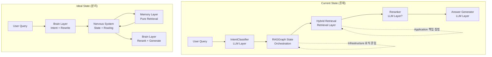

# Spec-068: RAG System Architecture Review & Root Cause Analysis

## 📋 배경 및 문제 정의 (Background & Problem)

### 현재 상황
RAG 시스템이 **Spec 001 ~ Spec 067**을 거치며 지속적으로 진화했지만, 최근 여러 퀄리티 이슈가 반복적으로 발생하고 있습니다. 특히 **Spec 048 (RAG Precision)**, **Spec 065 (Semantic Deduplication)**, **Spec 067 (Advanced Reranking)** 등 증상 치료식 개선이 계속되고 있으나, 근본적인 설계 문제나 누락된 부분에 의해 문제가 재발할 가능성이 높습니다.

### 문제점
1. **RAG 3계층 아키텍처의 불명확성**: Retrieval/Orchestration/LLM Layer 간 책임이 혼재되어 있음
2. **클린 아키텍처 + DDD 위반**: Infrastructure와 Application 영역의 경계가 모호함
3. **Ingestion 파이프라인 설계 결함**: LLM 활용 부족, 중복 처리 버그, 임시방편식 해결
4. **프롬프트 편향 및 독소조항**: 특정 예시에 과도하게 최적화된 프롬프트, 제약 조건의 부작용

### 해결 방안
지금까지의 67개 Spec과 아키텍처 문서, 코드베이스를 **전면 재검토**하여:
- 증상이 아닌 **근본 원인(Root Cause)**을 식별
- 아키텍처 차원의 **구조적 개선 방향** 제시
- 향후 Spec 우선순위 및 리팩토링 로드맵 수립

---

## 📊 개념도 (Conceptual Architecture)

### RAG 3-Layer Architecture (현재 vs 이상)



---

## 🔍 4대 핵심 영역 분석

### 1. RAG 3계층 아키텍처 문제점

#### 1.0 🔴 근본적 구조 문제: 개념과 코드의 괴리

**❌ 핵심 문제**: RAG 3-Layer Architecture가 **문서상의 개념**으로만 존재하고, **실제 코드 구조에 전혀 반영되지 않음**

##### 현재 상태 분석

**문서 (`docs/architecture/rag_pipeline.md`)**:
```markdown
### 레이어 구조
| Layer | Component | Responsibility |
| Brain | Intent Classifier, Query Rewriter | LLM 의사결정 |
| Nervous System | LangGraph (RAGGraphState) | State 기반 흐름 제어 |
| Memory/Body | Document Repository, Graph Repository | 물리적 검색 |
```

**실제 코드 구조**:
```python
app/infrastructure/ai/
├── rag_nodes.py          # ❌ Brain + Orchestration + Retrieval 모두 혼재
├── rag_graph.py          # ❌ 단순히 Node를 연결만 함
└── (no layer separation)

# rag_nodes.py (774 lines) 내부:
class RAGNodes:
    def classify_intent(self, ...):        # Brain Layer
    def route_decision(self, ...):         # Orchestration Layer  
    def retrieve_hybrid(self, ...):        # Retrieval Layer
    def rerank_results(self, ...):         # Brain Layer
    def generate_answer(self, ...):        # Brain Layer
```

**문제점**:
1. **Layer 구분 없음**: 모든 로직이 `RAGNodes` 한 클래스에 집중
2. **개념적 분리만 존재**: 주석으로만 "Brain Layer", "Nervous System" 표기
3. **재사용 불가**: Brain Layer 로직을 다른 파이프라인에서 재사용 불가능
4. **테스트 어려움**: Layer별 독립 테스트 불가능

##### 이상적인 코드 구조 (제안)

```python
# Brain Layer (LLM Decision Making)
app/domain/rag/brain/
├── __init__.py
├── intent_classifier.py      # Intent Classification
├── query_rewriter.py          # Query Rewriting
├── reranker.py                # Reranking Logic
└── answer_generator.py        # Answer Generation

# Orchestration Layer (Workflow Control)
app/application/rag/orchestration/
├── __init__.py
├── rag_orchestrator.py        # High-level RAG Service
├── filter_router.py           # Intent → Filters 변환
└── state_manager.py           # RAGGraphState 관리

# Retrieval Layer (Data Access)
app/infrastructure/rag/retrieval/
├── __init__.py
├── hybrid_retriever.py        # Vector + Keyword + Graph 조합
├── vector_retriever.py        # ChromaDB 검색
├── keyword_retriever.py       # Neo4j Keyword 검색
└── graph_retriever.py         # Neo4j Graph Traversal

# Graph Builder (Infrastructure)
app/infrastructure/rag/
├── graph_builder.py           # LangGraph 조합
└── langgraph_adapter.py       # LangGraph SDK Wrapper
```

##### Impact

- 🔴 **Critical**: 
  - 아키텍처 문서와 코드가 완전히 불일치
  - 새 개발자는 "3-Layer 디자인"을 코드에서 전혀 찾을 수 없음
  - Layer별 책임 구분이 불명확하여 코드 수정 시 어디를 봐야 할지 모름

##### 🔧 개선 방향

1. **Layer별 디렉토리 분리** (Phase 3: 4주 작업)
   - `brain/`, `orchestration/`, `retrieval/` 3개 디렉토리 생성
   - `RAGNodes` 클래스를 Layer별 클래스로 분해
   
2. **Layer 간 Protocol 정의**
   - `BrainLayer` ↔ `OrchestrationLayer` ↔ `RetrievalLayer` Interface 명시
   - 각 Layer는 Protocol에만 의존하도록 설계

3. **공통 vs 개별 책임 분리**
   - **공통 사용 (Shared)**: `RAGGraphState`, `Chunk`, `UserIntent` 등 Value Objects
   - **Brain Layer 전용**: LLM Prompt, Intent Classification
   - **Orchestration Layer 전용**: Routing Logic, Fallback Strategy  
   - **Retrieval Layer 전용**: Repository 접근, Filter 적용

---

#### 1.1 Brain Layer (LLM Decision Making)
**책임**: Intent Classification, Query Rewriting, Reranking, Answer Generation

**✅ 잘 된 부분**:
- `IntentClassifier`: 의도 분류 로직이 Domain Service로 잘 캡슐화됨
- `RAGGraphState`: State 기반 흐름 제어가 명시적으로 관리됨 (Spec 033)

**❌ 문제점**:
1. **Reranker의 책임 모호**: Reranker가 Brain Layer에 속해야 하는지, Orchestration Layer의 일부인지 불명확
   - 현재: `rerank_chunks` 노드가 `infrastructure/repositories/rag_nodes.py`에 위치
   - **근본 원인**: Reranker는 LLM 판단이므로 Brain Layer여야 하나, Infrastructure에 섞여 있음
   
2. **Answer Generator의 Context 의존성**: 
   - `generate_answer` 노드가 Retrieval 결과에 강하게 결합되어 Context 부재 시 Hallucination 발생
   - **Spec 034**에서 Negative Constraints를 추가했으나, 이는 증상 치료일 뿐

**🔧 개선 방향**:
- Reranker를 `app/domain/services/reranker.py`로 이동 (Brain Layer로 명확히 분류)
- Answer Generator에 **Self-Verification Step** 추가: 생성된 답변이 Context에 근거하는지 자체 검증

---

#### 1.2 Orchestration Layer (Nervous System)
**책임**: State 관리, Flow Control, 의사결정 라우팅

**✅ 잘 된 부분**:
- LangGraph 기반 State Management (Spec 033)
- `RAGGraphState` TypedDict로 중간 상태 명시

**❌ 문제점**:
1. **Filter Logic의 위치 논란**:
   - `route_decision` 노드가 Manual Filters와 Auto Filters를 병합하는데, 이 로직이 Orchestration에 있어야 하는지 의문
   - **근본 원인**: Filter Merge는 비즈니스 로직이므로 Domain Service가 담당해야 하나, Graph Node에 하드코딩됨
   
2. **Fallback Logic의 복잡도**:
   - **Spec 034**에서 Filter Fallback을 추가했으나, Graph State에 `fallback_triggered` 플래그만 추가하여 처리
   - 복잡한 Fallback 전략 (TTL, Content Hash 등)을 State에서 관리하기 어려움

**🔧 개선 방향**:
- `FilterMergeService` 도입: Manual/Auto Filters 병합 로직을 Domain Service로 분리
- `FallbackStrategyFactory`: 다양한 Fallback 전략을 Strategy Pattern으로 관리

---

#### 1.3 Retrieval Layer (Memory/Body)
**책임**: 순수 데이터 검색, Filter 강제 실행

**✅ 잘 된 부분**:
- Repository Pattern으로 Neo4j/ChromaDB 추상화
- Hybrid Search (Vector + Keyword + Graph) 병렬 실행

**❌ 문제점**:
1. **Filter 강제성의 함정**:
   - **Spec 033 Issue**: "Claude와 GPT-4 비교" 질문 시 Exact Match 실패로 검색 결과 0건
   - **근본 원인**: Retrieval Layer가 Filter를 너무 엄격하게 적용하여 Fuzzy Matching 부재
   
2. **Graph Retrieval의 미활용**:
   - Graph Search가 구현되어 있으나, Entity 추출 품질이 낮아 실질적 효과 미미
   - **Spec 016 (Entity Relationship Extraction)** 이후 개선되지 않음

**🔧 개선 방향**:
- **Fuzzy Filter Matching**: `source` 필터 적용 시 Semantic Similarity 기반 매칭 도입
- **Entity Extraction 품질 개선**: LLM 기반 Entity Linking 및 Alias 관리

---

### 2. 클린 아키텍처 + DDD 위반 사항

#### 2.1 Infrastructure ↔ Application 경계 모호

**❌ 주요 위반 사례**:

| 파일 | 현재 위치 | 문제점 | 이상적 위치 |
|------|-----------|--------|-------------|
| `rag_nodes.py` | `infrastructure/repositories/` | RAG 노드 구현이 Infrastructure에 있으나, 실제로는 Application 로직 (Use Case Orchestration) | `application/services/rag/` 또는 `infrastructure/rag/graph.py` |
| `IntentClassifier` | `domain/services/` | ✅ 올바름 | - |
| `Reranker` | `domain/services/prompts/` | Prompt만 Domain에 있고, 실제 로직은 `rag_nodes.py`에 혼재 | `domain/services/reranker.py` |
| `LangGraphAdapter` | `infrastructure/brain/adapter.py` | ❓ Brain Adapter가 Infrastructure인지 Application인지 모호 | `application/services/rag/graph_adapter.py` |

**근본 원인 분석**:
- **Spec 006 (Clean Architecture)** 당시 Repository Pattern에만 집중하여, Graph/Workflow 레이어 분류를 명확히 하지 않음
- LangGraph가 "기술적 구현체"로 간주되어 Infrastructure에 배치되었으나, 실제로는 **Use Case Orchestration Tool**

**🔧 개선 방향**:
1. **RAG Graph → Application Layer 이동**:
   - `infrastructure/repositories/rag_nodes.py` → `application/services/rag/nodes.py`
   - `infrastructure/repositories/rag_graph.py` → `application/services/rag/graph_builder.py`
   
2. **Adapter 재분류**:
   - `LangGraphAdapter`는 Infrastructure로 유지 (LangGraph SDK 래핑)
   - 실제 Business Flow는 Application의 `RAGOrchestrator` Service에서 관리

---

#### 2.2 Domain Service의 LLM 의존성 문제

**❌ 현재 상태**:
```python
# app/domain/services/intent_classifier.py
from app.application.interfaces.llm import LLMInterface  # ❌ Domain이 Application 참조
```

**근본 원인**:
- `LLMInterface`가 `app/application/interfaces/`에 위치하여 Dependency Rule 위반
- Domain Service가 LLM에 의존하는 것은 맞으나, Interface 위치가 잘못됨

**🔧 개선 방향**:
- `LLMInterface`를 `app/domain/interfaces/llm.py`로 이동
- Application Layer는 Domain의 Protocol만 의존하도록 수정

---

### 3. Ingestion 파이프라인 설계 결함

#### 3.1 LLM 활용 부족

**❌ 현재 상태**:
- Ingestion 단계에서 LLM은 **Semantic Extractor** (Entity/Relation 추출)에만 제한적으로 사용됨
- 수집된 Raw Markdown → Chunking → Embedding 과정이 기계적으로 진행

**근본 원인**:
1. **Content Cleaning 미흡**: Scraper가 추출한 Markdown에 여전히 Noise가 많음 (표, 각주, 광고)
   - **Spec 027 (Smart Scraper)**, **Spec 046/047**: Scraper 개선에만 집중, LLM 기반 Post-Processing 부재
   
2. **Semantic Chunking 미적용**: 
   - **Spec 056 (Semantic Chunking Upgrade)**: 제안만 되고 실제 적용 안 됨
   - 현재는 `RecursiveCharacterTextSplitter`의 기계적 분할에만 의존

**🔧 개선 방향**:
1. **LLM-based Content Refiner** 도입:
   ```
   Raw Markdown → LLM Cleaner (노이즈 제거, 구조화) → Cleaned Markdown → Chunking
   ```
   
2. **Semantic Chunking 실제 적용**:
   - Google AI Semantic Chunker 또는 LangChain의 `SemanticChunker` 적용
   - 비용 vs 품질 Trade-off 실험 필요

---

#### 3.2 중복 처리 (Deduplication) 설계 결함

**❌ 문제 사례**:
- **Spec 065 (Semantic Deduplication)**: 4가지 Strategy (ID/Metadata/TTL/Contents) 제안
- 실제 구현: Content Hash만 부분적으로 적용, 나머지는 미완성
- **버그 기록**: "중복 처리 버그가 많았었고 근본적인 해결보다 코 앞에 놓은 해결로 진행"

**근본 원인 분석**:
1. **Strategy Pattern 미구현**: 
   - 4가지 전략이 문서로만 존재, 실제 코드에는 `if-elif` 하드코딩
   
2. **중복 판단 시점 불명확**:
   - Ingestion Graph의 어느 단계에서 중복을 체크하는지 명확하지 않음
   - `collect_data` 노드? `validate` 노드? `store` 노드?

3. **Vector Store 중복 체크 누락**:
   - Neo4j에는 Document ID 기반 중복 방지가 있으나, ChromaDB는 중복 저장 가능
   - **Spec 043 (Robust Ingestion)**: Batch 처리만 추가, 중복 체크 로직 없음

**🔧 개선 방향**:
1. **DeduplicationService 도입** (Domain Service):
   ```python
   class DeduplicationService:
       def __init__(self, strategy: DeduplicationStrategy):
           self.strategy = strategy
       
       async def is_duplicate(self, job: IngestionJob) -> bool:
           return await self.strategy.check(job)
   ```

2. **Ingestion Graph에 명시적 Dedup Node 추가**:
   ```
   collect_data → check_duplicate → [Skip or Proceed] → extract → chunk → store
   ```

3. **ChromaDB 중복 방지**:
   - Document ID 기반 `upsert` 로직 추가 (현재는 `add`만 사용)

---

#### 3.3 Ingestion State Management 부족

**❌ 현재 상태**:
- `IngestionState`는 있으나, 실제 Error Handling이나 Rollback 메커니즘이 없음
- **Spec 043**: Neo4j 성공, ChromaDB 실패 시 "좀비 데이터" 생성 가능

**근본 원인**:
- **Transactional Guarantee 부재**: Neo4j와 ChromaDB 간 2PC (Two-Phase Commit) 없음
- **Partial Failure 전략 부재**: 일부 Chunk 저장 실패 시 전체 롤백할지, 부분 성공으로 처리할지 정책 없음

**🔧 개선 방향**:
1. **Saga Pattern 도입** (Distributed Transaction 대안):
   - Store Neo4j → Success → Store Chroma → Failure → Compensate (Neo4j 삭제)
   
2. **Ingestion Audit Log**:
   - 모든 저장 단계를 로그로 남겨 Replay 가능하도록 설계

---

### 4. 프롬프트 편향 및 독소조항

#### 4.1 특정 예시에 과도한 최적화

**❌ Intent Classifier 프롬프트 분석**:
```python
# app/domain/services/intent_classifier.py:132
User: \"어쩌다 어른에 대해서 알려줘\"
→ {{\"intent\": \"general_query\", \"targets\": [\"어쩌다 어른\"], \"reasoning\": \"User is asking about a specific program\"}}
```

**문제점**:
1. **"어쩌다 어른" 프로그램에 과도하게 특화**: 
   - 이 예시가 사용자가 자주 테스트한 데이터로 추정
   - 다른 프로그램명 (예: "알쓸신잡", "유퀴즈")에도 동일하게 작동할지 검증 불필요

2. **Few-Shot Learning의 역효과**:
   - 예시가 5개밖에 없어 LLM이 이들만 학습하여 Over-fitting 가능성
   - 새로운 Intent Type 추가 시 예시를 일일이 업데이트해야 함

**🔧 개선 방향**:
1. **Zero-Shot → Few-Shot 전환**:
   - 현재: 고정된 5개 예시
   - 개선: RAG 기반 Dynamic Few-Shot (유사한 과거 질문을 검색하여 예시로 제공)

2. **프롬프트 테스트 데이터셋 구축**:
   - 다양한 도메인 (뉴스, 위키, YouTube, 기술 블로그)의 질문 100개 이상 수집
   - Intent Classification 정확도를 Metric으로 측정

---

#### 4.2 독소조항 (Toxic Constraints)

**❌ Reranker 프롬프트 분석**:
```python
# app/domain/services/prompts/reranker.py:15
- PENALTY: Heavily penalize (score 1 or 0) documents that mention a FAMOUS NAME 
  from the query but in a COMPLETELY DIFFERENT life or career context 
  (e.g. Wikipedia bio vs TV Show guesting).
```

**문제점**:
1. **과도한 페널티**: "FAMOUS NAME"이 다른 맥락에 나오면 무조건 0~1점
   - **부작용**: 동일 인물의 다양한 활동을 다룬 문서가 모두 탈락
   - **예시**: "일론 머스크의 SpaceX"와 "일론 머스크의 Tesla"를 비교 질문 시, 둘 다 탈락 가능

2. **"COMPLETELY DIFFERENT" 판단 기준 모호**:
   - LLM이 "다른 맥락"을 어떻게 정의할지 불명확
   - Wikipedia Bio는 모든 활동을 포함하므로, 이게 "다른 맥락"인지 애매함

**근본 원인**:
- **Spec 048**: 특정 테스트 케이스 ("일론 머스크와 스티브 잡스 비교" 시 Wikipedia 전기가 노이즈로 판단됨)에서 발생한 문제를 과도하게 일반화
- **Hard-coded Rule**: Domain Knowledge를 Prompt에 하드코딩하여 유연성 상실

**🔧 개선 방향**:
1. **Context-Aware Penalty**:
   - "다른 맥락"을 판단하는 기준을 프롬프트에서 제거
   - 대신 Reranker에게 "Query Context와의 일관성"을 점수 기준으로 제시

2. **Prompt Versioning**:
   - Reranker 프롬프트를 버전 관리하여 A/B 테스트 가능하도록 설계
   - 독소조항 제거 전후 성능 비교

3. **Meta-Prompting**:
   - LLM에게 "이 문서가 질문과 다른 맥락인지 판단하고, 그 이유를 설명하라"고 요청
   - 단순 점수가 아닌 Reasoning 기반 필터링

---

## 🎯 우선순위 개선 과제 (Recommendations)

### High Priority (즉시 착수)

1. **[P0] Clean Architecture Refactoring**
   - `LLMInterface` → `domain/interfaces/` 이동
   - `rag_nodes.py` → `application/services/rag/` 재배치
   - **예상 공수**: 3일
   - **Spec 제안**: Spec 069 - "Clean Architecture Compliance Audit"

2. **[P0] Deduplication Service 완성**
   - 4가지 Strategy 실제 구현
   - Ingestion Graph에 Dedup Node 추가
   - **예상 공수**: 5일
   - **Spec 제안**: Spec 070 - "Robust Deduplication Framework"

3. **[P1] Prompt Quality Audit**
   - Intent Classifier 예시 다양화 (최소 20개)
   - Reranker 독소조항 제거 및 A/B 테스트
   - **예상 공수**: 3일
   - **Spec 제안**: Spec 071 - "Prompt Engineering Audit \u0026 Optimization"

---

### Medium Priority (2주 내)

4. **[P1] Semantic Chunking 적용**
   - LangChain SemanticChunker POC
   - 비용/품질 Trade-off 측정
   - **예상 공수**: 4일
   - **Spec 제안**: Spec 072 - "Semantic Chunking Implementation"

5. **[P2] Fuzzy Filter Matching**
   - Source Filter에 Semantic Similarity 도입
   - "Claude" vs "claude", "GPT-4" vs "gpt4" 등 매칭
   - **예상 공수**: 3일
   - **Spec 제안**: Spec 073 - "Intelligent Filter Matching"

6. **[P2] Reranker Layer Separation**
   - Reranker를 Domain Service로 분리
   - Brain Layer 책임 명확화
   - **예상 공수**: 2일
   - **Spec 제안**: Spec 074 - "Reranker Architecture Refinement"

---

### Low Priority (향후 검토)

7. **[P3] LLM-based Content Cleaner**
   - Ingestion 후처리에 LLM 도입
   - 노이즈 제거 자동화
   - **예상 공수**: 7일
   - **Spec 제안**: Spec 075 - "LLM-Powered Content Refinement"

8. **[P3] Saga Pattern for Ingestion**
   - Distributed Transaction 보장
   - Rollback 메커니즘 구축
   - **예상 공수**: 10일
   - **Spec 제안**: Spec 076 - "Ingestion Transaction Integrity"

---

## ✅ Definition of Done

1. **분석 완료**: 4대 핵심 영역 (3계층/클린아키텍처/Ingestion/Prompt)의 문제점 문서화 ✅
2. **우선순위 제시**: P0/P1/P2 개선 과제 로드맵 수립 ✅
3. **User Review**: 사용자가 분석 내용을 검토하고 다음 액션 결정
4. **Backlog 업데이트**: 승인된 개선 과제를 `backlog/queue.md`에 등록

---

## 📚 참고 문헌

- **Architecture Docs**: 
  - `docs/architecture/rag_pipeline.md` - RAG 3-Layer 개념
  - `docs/architecture/architecture.md` - Clean Architecture 원칙
  
- **관련 Specs**:
  - Spec 033 - LangGraph State Management
  - Spec 034 - RAG Pipeline Recovery (Filter Fallback)
  - Spec 043 - Robust Ingestion (Chroma Batching)
  - Spec 048 - RAG Precision (Reranker 도입)
  - Spec 065 - Semantic Deduplication
  - Spec 067 - Advanced Reranking

- **Code References**:
  - `app/domain/services/intent_classifier.py`
  - `app/domain/services/prompts/reranker.py`
  - `app/infrastructure/repositories/rag_nodes.py`
