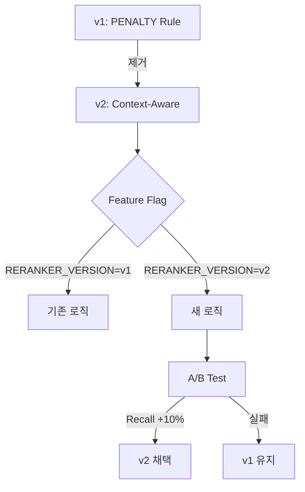

# Implementation Plan: Spec-069

## 📋 Branch Strategy
- `feature/069-reranker-prompt-optimization`

## 🛑 User Review Required

> [!IMPORTANT]
> - [ ] **v2 프롬프트 승인**: Context-Aware 평가 기준이 적절한지 검토
> - [ ] **A/B 테스트 기준 승인**: Recall +10%, Precision -5% 기준이 적절한지 확인

> [!WARNING]
> - [ ] **PENALTY 규칙 제거**: 기존 테스트 케이스("어쩌다 어른")에서 품질 저하 가능성

## 🎯 Core Strategy

### Architecture Context

**전략**: Feature Flag 기반 A/B Testing으로 위험 최소화



| Component | Strategy | Reasoning |
|:---:|:---|:---|
| **Prompt** | Context-Aware 평가 | PENALTY 규칙의 Over-filtering 해결 |
| **배포** | Feature Flag | 안전한 롤백 가능 |
| **검증** | A/B Testing | 정량적 비교 |

## 📂 Proposed Changes

### Domain Layer (Prompts)

#### [NEW] `app/domain/services/prompts/reranker_v2.py`

Context-Aware Reranker Prompt 추가. PENALTY 규칙을 제거하고 Multi-Entity Query 처리 가이드라인 추가.

```python
RERANKER_PROMPT_V2 = """
You are an expert information retriever...

**Context-Aware Evaluation Guidelines:**

1. **Multi-Entity Queries** (e.g., "A와 B 비교"):
   - A document about A is relevant even if it doesn't mention B
   
2. **Name Mentions**:
   - General biography is still SOMEWHAT RELEVANT (score 4-6)
   - Only score 0-1 if DIFFERENT person with same name

3. **Self-Verification**:
   - Ask yourself: "Does this chunk help answer the query?"
"""
```

---

### Configuration Layer

#### [MODIFY] `config/admin_config.py`

Feature Flag 추가로 v1/v2 선택 가능.

```python
# Reranker Prompt Version Control
RERANKER_VERSION = "v1"  # Options: "v1" (default), "v2"
```

---

### Infrastructure Layer (RAG)

#### [MODIFY] `app/infrastructure/ai/rag_nodes.py`

`_get_rerank_score()` 메서드에서 Feature Flag 기반으로 Prompt 선택.

```python
from app.domain.services.prompts.reranker import RERANKER_PROMPT
from app.domain.services.prompts.reranker_v2 import RERANKER_PROMPT_V2
from app.core.config import RERANKER_VERSION

class RAGNodes:
    def _get_rerank_score(self, chunk: Chunk, ...):
        # Feature Flag 기반 Prompt 선택
        reranker_prompt = (
            RERANKER_PROMPT_V2 if RERANKER_VERSION == "v2" 
            else RERANKER_PROMPT
        )
        prompt = reranker_prompt.format(query=query, chunk_text=chunk.text)
        ...
```

---

### Scripts (A/B Testing)

#### [NEW] `scripts/compare_reranker_versions.py`

v1 vs v2 A/B 테스트 스크립트. 10개 테스트 질문으로 Recall/Precision 측정.

```python
TEST_QUERIES = [
    # 비교 질문
    {"query": "일론 머스크의 SpaceX와 Tesla 비교", "expected_recall": 0.8},
    # 특정 컨텍스트 (기존 테스트)
    {"query": "어쩌다 어른에서 김영하 출연분", "expected_recall": 0.7},
    # ... 총 10개
]

async def run_test(version: str):
    # Set version, execute RAG, calculate metrics
    ...
```

---

## 🧪 Verification Plan

### Automated Tests

#### Unit Test: Prompt Validation

```bash
# Test reranker v2 prompt format
uv run pytest tests/unit/domain/prompts/test_reranker_v2.py -v
```

**Expected Result**: JSON 파싱 성공, score 0-10 범위 확인

#### Integration Test: Feature Flag

```bash
# Test v2 integration with feature flag
uv run pytest tests/unit/infrastructure/rag/test_rag_reranker.py -v
```

**Expected Result**: v2 프롬프트가 정상 작동, 기존 인터페이스 유지

---

### Manual Verification

#### Step 1: A/B 테스트 실행

```bash
# 1. v1 Baseline 측정
python scripts/compare_reranker_versions.py --version v1 --output results_v1.json

# 2. v2 실행
python scripts/compare_reranker_versions.py --version v2 --output results_v2.json

# 3. 결과 비교
python scripts/compare_results.py results_v1.json results_v2.json
```

**Expected Output**:
```
=== Reranker A/B Test Results ===
Version: v1 → Recall: 0.65, Precision: 0.82
Version: v2 → Recall: 0.75 (+15.4% ✅), Precision: 0.80 (-2.4% ✅)

Decision: v2 WINS
```

#### Step 2: Admin UI 검증

1. Admin UI Playground 접속
2. 비교 질문 입력: "일론 머스크의 SpaceX와 Tesla 비교"
3. RAG Inspector에서 Reranker 점수 확인

**Expected Result**:
- v1: SpaceX=1점, Tesla=1점 (❌)
- v2: SpaceX=8점, Tesla=8점 (✅)

---

## 🔄 Rollback Plan

### Trigger Conditions
- v2 Recall이 v1보다 낮음
- v2 Precision이 v1보다 **-10% 이상** 하락
- 사용자 품질 저하 보고

### Rollback Procedure

```python
# config/admin_config.py
RERANKER_VERSION = "v1"  # v2 → v1 롤백
```

재시작 불필요, 즉시 적용됨.

---

## ✅ Definition of Done

- [ ] `reranker_v2.py` 생성 및 Prompt Syntax 검증
- [ ] Feature Flag `RERANKER_VERSION` 추가
- [ ] `_get_rerank_score()` 메서드에 버전 선택 로직 추가
- [ ] Unit Test 2개 작성 및 통과
- [ ] A/B 테스트 스크립트 작성 및 실행
- [ ] v2 Recall +10% 이상 확인
- [ ] v2 Precision -5% 이내 확인
- [ ] 최종 결정 완료 (v2 채택 또는 v1 유지)
- [ ] 결과를 `spec.md`에 문서화
- [ ] 모든 변경사항 커밋 및 PR 생성
