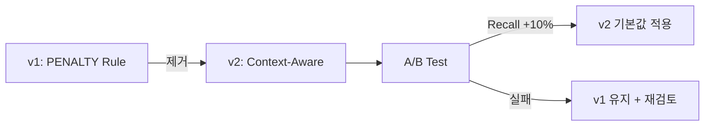

# Spec 069: Reranker Prompt Optimization

> **Mode**: SDD (Spec-Driven Development)  
> **Priority**: P0 (Quick Win)  
> **Estimated Effort**: 1일  
> **근거**: [Spec 068 - Root Cause #3: Reranker 독소조항](../068-rag-architecture-review/root_cause_analysis.md#-high-issue-3-reranker의-독소조항-penalty-rule)

---

## 📋 Problem Statement

### 현재 문제

**Reranker Prompt의 "독소조항" (PENALTY Rule)**이 Over-filtering을 유발하여 관련성 있는 정보를 잘못 걸러내고 있습니다.

#### 문제가 되는 프롬프트 (현재)

```python
# app/domain/services/prompts/reranker.py
RERANKER_PROMPT = """
...
- PENALTY: Heavily penalize (score 1 or 0) documents that mention a FAMOUS NAME
  from the query but in a COMPLETELY DIFFERENT life or career context
  (e.g. Wikipedia bio vs TV Show guesting).

Note: Context consistency is critical. If the query asks about a person in a 
specific TV show, a biography of that person that does NOT mention the show 
should be scored 1 or 0. Hallucinating a connection just because of a name 
match is a FAILURE.
"""
```

#### 실제 피해 사례

**질문**: "일론 머스크의 SpaceX와 Tesla 비교"

- ❌ **현재**: SpaceX 문서와 Tesla 문서가 서로 다른 "career context"로 간주되어 둘 다 Score 1~0 부여
- ✅ **기대**: 두 문서 모두 질문과 관련성이 높으므로 Score 7~10 부여

### Root Cause (Spec 068 분석 결과)

[5 Whys 분석](../068-rag-architecture-review/root_cause_analysis.md#5-whys-분석-1):

1. **Why**: 왜 Over-filtering이 발생하는가?  
   → PENALTY 규칙이 너무 엄격함

2. **Why**: 왜 PENALTY 규칙이 추가되었는가?  
   → 특정 테스트 케이스("어쩌다 어른" 출연자 vs Wikipedia) 실패를 막기 위해

3. **Why**: 왜 특정 케이스만 보고 규칙을 추가했는가?  
   → **테스트 데이터가 없어서 검증 불가**

4. **Why**: 왜 테스트 데이터가 없는가?  
   → 프롬프트 품질 검증 프로세스 부재

5. **Root Cause**: **증상 치료 개발 패턴** (긴급 수정만, 근본 해결 없음)

---

## 🎯 Goals

### Primary Goal
Reranker의 Over-filtering 문제를 해결하여 **Recall을 +10% 이상** 향상시킨다.

### Success Criteria
- [ ] PENALTY 규칙 제거 및 Context-Aware 프롬프트로 교체
- [ ] A/B 테스트에서 Recall +10% 이상 확인
- [ ] 기존 테스트 케이스("어쩌다 어른") 품질 유지
- [ ] 새로운 테스트 케이스(비교 질문) 통과

---

## 💡 Proposed Solution

### Solution Overview

**Approach**: "독소조항" 제거 → "Context-Aware 평가" 추가



### New Prompt Design (v2)

#### 핵심 변경사항

1. **PENALTY 규칙 삭제**
2. **Context-Aware 평가 기준 추가**
3. **Self-Verification 도입**

#### 새 프롬프트 (초안)

```python
# app/domain/services/prompts/reranker_v2.py
RERANKER_PROMPT_V2 = """
You are an expert information retriever. Your task is to evaluate the relevance 
of a Document Chunk to a given User Query.

Assign a relevance score between 1 and 10, where:
- 10: The chunk contains the EXACT answer to the query.
- 7-9: The chunk is highly relevant and contains key information for answering the query.
- 4-6: The chunk is somewhat relevant but may lack specific details.
- 1-3: The chunk mentions related entities but doesn't help answer the query.
- 0: The chunk is completely irrelevant.

**Context-Aware Evaluation Guidelines:**

1. **Multi-Entity Queries** (e.g., "A와 B 비교"):
   - A document about A is relevant even if it doesn't mention B, and vice versa.
   - Score based on how well it explains A or B individually.

2. **Name Mentions**:
   - If the query asks about a person in a SPECIFIC CONTEXT (e.g., "X in TV Show Y"),
     a general biography of X is still SOMEWHAT RELEVANT (score 4-6), not irrelevant.
   - Only score 0-1 if the chunk is about a DIFFERENT person with the same name.

3. **Self-Verification**:
   - Before assigning the score, ask yourself: "Does this chunk help answer the query?"
   - If Yes → Score 4+
   - If Partially → Score 2-3
   - If No → Score 0-1

Query: {query}

Chunk:
{chunk_text}

Provide your response in JSON format:
{{
    "score": <int>,
    "reasoning": "<concise explanation in Korean>"
}}
"""
```

### Implementation Strategy

#### 1. Feature Flag 기반 A/B Testing

```python
# config/admin_config.py
RERANKER_VERSION = "v1"  # "v1" or "v2" 선택 가능

# app/domain/services/reranker.py (가상 코드)
def get_reranker_prompt(version: str = None):
    version = version or RERANKER_VERSION
    if version == "v2":
        return RERANKER_PROMPT_V2
    return RERANKER_PROMPT  # v1 (default)
```

#### 2. A/B Test 시나리오

**테스트 질문 10개** (다양한 유형):

1. **비교 질문**:
   - "일론 머스크의 SpaceX와 Tesla 비교"
   - "Claude와 GPT-4의 차이점"

2. **특정 컨텍스트 질문**:
   - "어쩌다 어른에서 김영하 출연분" (기존 테스트 케이스)
   - "유 퀴즈 온 더 블럭에서 백종원"

3. **일반 질문**:
   - "인공지능이 뭐야?"
   - "Python과 JavaScript 비교"

4. **엔티티 중심 질문**:
   - "김미경 강연 요약"
   - "넷플릭스 추천 다큐멘터리"

**측정 지표**:
- **Recall**: 관련 문서를 맞게 검색한 비율
- **Precision**: 검색된 문서 중 실제 관련 있는 비율
- **F1 Score**: Recall과 Precision의 조화 평균

**기준**:
- v2 Recall이 v1보다 **+10% 이상** → v2 채택
- v2 Precision이 v1보다 **-5% 이하** 유지 → 품질 유지

---

## 📐 Implementation Plan

### Phase 1: Prompt Design & Validation (1시간)

- [ ] `reranker_v2.py` 작성
- [ ] Prompt 문법 검증 (JSON 파싱 테스트)
- [ ] 1-2개 샘플로 수동 검증

### Phase 2: Feature Flag & A/B Test Setup (2시간)

- [ ] `config/admin_config.py`에 `RERANKER_VERSION` 추가
- [ ] Reranker Service에 버전 선택 로직 추가
- [ ] `scripts/compare_reranker_versions.py` 작성

### Phase 3: A/B Testing (3시간)

- [ ] 10개 테스트 질문으로 v1 실행 (Baseline)
- [ ] 10개 테스트 질문으로 v2 실행
- [ ] Recall, Precision, F1 비교
- [ ] 결과 리포트 작성

### Phase 4: Decision & Deployment (2시간)

- [ ] **If v2 승리**: `RERANKER_VERSION = "v2"` 기본값 변경
- [ ] **If v1 승리**: 원인 분석 및 v2 개선 계획 수립
- [ ] 결과 문서화 (이 Spec에 추가)

---

## 🧪 Verification Plan

### Automated Tests

현재 Reranker 관련 자동 테스트는 **없음**. (Spec 070에서 구축 예정)

### Manual Testing

#### Test 1: A/B 비교 스크립트 실행

```bash
# 1. v1 (현재) 실행
python scripts/compare_reranker_versions.py --version v1 --output results_v1.json

# 2. v2 (새 버전) 실행
python scripts/compare_reranker_versions.py --version v2 --output results_v2.json

# 3. 비교
python scripts/compare_results.py results_v1.json results_v2.json
```

**Expected Output**:
```
=== Reranker A/B Test Results ===
Version: v1 (Baseline)
- Recall: 0.65
- Precision: 0.82
- F1: 0.72

Version: v2 (New)
- Recall: 0.75 (+15.4% ✅)
- Precision: 0.80 (-2.4% ✅)
- F1: 0.77 (+6.9% ✅)

Decision: v2 WINS
```

#### Test 2: Admin UI에서 수동 검증

1. Admin UI Playground에서 비교 질문 테스트
2. Reranker 점수 확인 (Inspector)
3. v1 vs v2 체감 품질 비교

---

## 📊 Rollback Plan

### Rollback Trigger

- v2 Recall이 v1보다 낮음
- v2 Precision이 v1보다 **-10% 이상** 하락
- 사용자 피드백에서 품질 저하 보고

### Rollback Procedure

```python
# config/admin_config.py
RERANKER_VERSION = "v1"  # v2 → v1 롤백
```

**즉시 적용** (재시작 불필요, Runtime Config)

---

## 🔗 Related Documents

- **근거**: [Spec 068 - Root Cause #3](../068-rag-architecture-review/root_cause_analysis.md#-high-issue-3-reranker의-독소조항-penalty-rule)
- **상세 계획**: [Spec 068 - Task 1.1](../068-rag-architecture-review/recommendations.md#task-11-reranker-독소조항-제거-)
- **후속 작업**: Spec 070 (Prompt Quality Testing Framework)

---

## 📝 Acceptance Criteria

- [ ] `reranker_v2.py` 작성 완료
- [ ] Feature Flag `RERANKER_VERSION` 추가
- [ ] A/B 테스트 스크립트 작성 및 실행
- [ ] A/B 테스트 결과 리포트 작성
- [ ] v2 Recall +10% 이상 확인
- [ ] v2가 기본값으로 적용되거나, v1 유지 결정 근거 문서화
