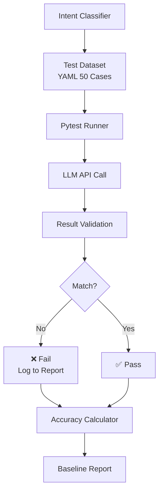

# Implementation Plan: Spec-070

## 📋 Branch Strategy
- `feature/070-prompt-quality-testing-framework`

## 🛑 User Review Required

> [!IMPORTANT]
> - [ ] **Test Dataset 구성 승인**: 50개 테스트 케이스의 도메인 분포 및 Intent 분류가 적절한지 검토 필요
> - [ ] **CI/CD 임계값 설정**: Accuracy 80%를 기준으로 할지, 혹은 조정이 필요한지 의사결정 필요

> [!WARNING]
> - [ ] **LLM API 비용**: 50개 케이스 실행 시 LLM API 호출 비용 발생 (테스트당 약 $0.0001 × 50 = $0.005)

---

## 🎯 Core Strategy

### Architecture Context



| Component | Strategy | Reasoning |
|:---:|:---|:---|
| **Test Dataset** | YAML 포맷 | 비개발자도 케이스 추가 가능 (maintainability) |
| **Test Runner** | Pytest Parametrized | 50개 케이스를 개별적으로 실행하여 실패 케이스 추적 용이 |
| **Validation** | Exact Match (Intent) + Fuzzy Match (Targets) | Intent는 엄밀하게, Targets는 유연하게 |
| **CI/CD** | GitHub Actions | 기존 Pytest 통합 구조 활용 (신규 인프라 불필요) |

### Key Decisions

1. **YAML vs JSON**:
   - **선택**: YAML
   - **이유**: 비개발자도 읽고 수정 가능, 주석 지원

2. **Accuracy 임계값 80%**:
   - **근거**: Spec 068 분석 결과 현재 특정 도메인 Accuracy < 50% 추정
   - **목표**: 다양한 도메인에서 최소 80% 보장

3. **LLM Temperature = 0**:
   - **이유**: 테스트 재현성 보장 (동일 입력 → 동일 출력)

---

## 📂 Proposed Changes

### Test Dataset 구축

#### [NEW] `tests/prompt/intent_test_cases.yaml`

**Purpose**: Intent Classifier 품질 검증용 50개 테스트 케이스

**Structure**:
```yaml
test_cases:
  - id: 001
    category: general_query
    query: "어쩌다 어른에 대해 알려줘"
    expected_intent: "general_query"
    expected_targets: ["어쩌다 어른"]
    reasoning: "프로그램 이름을 명시한 일반 질문"
  
  - id: 002
    category: general_query
    query: "알쓸신잡에 대해 알려줘"
    expected_intent: "general_query"
    expected_targets: ["알쓸신잡"]
    reasoning: "다른 프로그램 - 편향 테스트"
  
  # ... 48개 더
```

**Test Categories** (각 10개):
- **General Query**: 일반 질문 (TV 프로그램, 기술 주제 등)
- **Compare**: 비교 질문 ("A와 B 비교", "X vs Y")
- **Summarize**: 요약 요청 ("요약해줘", "정리해줘")
- **Filter by Topic**: 토픽 필터링 ("Python 관련된 것만", "AI 문서만")
- **Edge Cases**: 
  - 모호한 질문 ("이것에 대해 알려줘")
  - 긴 질문 (100자 이상)
  - 다국어 혼용 ("RAG에 대해 알려줘")
  - 부정형 질문 ("X가 아닌 Y에 대해")

---

### Pytest 스크립트 구현

#### [NEW] `tests/prompt/test_intent_classifier_quality.py`

**Purpose**: YAML 테스트 케이스 기반 Intent Classifier 품질 자동 검증

**Implementation**:
```python
import pytest
import yaml
from pathlib import Path

from app.domain.services.intent_classifier import IntentClassifier
from app.application.interfaces.llm import LLMInterface

# Load Test Cases
test_cases_path = Path(__file__).parent / "intent_test_cases.yaml"
with open(test_cases_path) as f:
    data = yaml.safe_load(f)
    TEST_CASES = data["test_cases"]

@pytest.mark.asyncio
@pytest.mark.parametrize("test_case", TEST_CASES, ids=lambda tc: tc["id"])
async def test_intent_classification_accuracy(test_case, llm_interface: LLMInterface):
    """
    Intent Classifier 품질 테스트 (50개 케이스)
    
    Given: 테스트 질문
    When: Intent Classifier 실행
    Then: Intent, Targets가 예상과 일치
    """
    # Given
    query = test_case["query"]
    expected_intent = test_case["expected_intent"]
    expected_targets = set(test_case["expected_targets"])
    
    # When
    classifier = IntentClassifier(llm_interface)
    result = await classifier.classify(query, history=[])
    
    # Then
    assert result.intent.value == expected_intent, \
        f"Intent mismatch. Expected: {expected_intent}, Got: {result.intent.value}"
    
    # Fuzzy Match for Targets (포함 관계)
    result_targets = set(result.targets)
    assert expected_targets.issubset(result_targets), \
        f"Targets mismatch. Expected: {expected_targets}, Got: {result_targets}"


def calculate_accuracy(results: list[dict]) -> dict:
    """Test 결과로부터 Accuracy 계산"""
    total = len(results)
    intent_correct = sum(1 for r in results if r["intent_match"])
    targets_correct = sum(1 for r in results if r["targets_match"])
    
    return {
        "total_cases": total,
        "intent_accuracy": intent_correct / total,
        "targets_accuracy": targets_correct / total,
        "overall_accuracy": (intent_correct + targets_correct) / (2 * total),
    }
```

**Fixture 추가**:
```python
# tests/conftest.py에 추가
@pytest.fixture
def llm_interface():
    """Intent Classifier 테스트용 LLM Interface"""
    from app.infrastructure.ai.langchain_adapter import LangChainLLMAdapter
    from app.core.config import get_settings
    settings = get_settings()
    return LangChainLLMAdapter(model_name=settings.LLM_MODEL_NAME, temperature=0.0)
```

---

### Baseline Report 생성

#### [NEW] `specs/070-prompt-quality-testing-framework/baseline_report.md`

**Purpose**: 현재 Intent Classifier의 성능 측정 및 실패 케이스 분석

**Sections**:
1. **Overall Metrics**:
   - Intent Accuracy: X%
   - Targets Accuracy: Y%
   - Overall Accuracy: Z%

2. **Category Breakdown**:
   | Category | Accuracy | Pass | Fail |
   |----------|----------|------|------|
   | General Query | 90% | 9 | 1 |
   | Compare | 70% | 7 | 3 |
   | ... | ... | ... | ... |

3. **Failure Analysis**:
   - 실패 케이스 ID 및 원인 분류
   - 개선 방향 제안

4. **Recommendations**:
   - Prompt 수정 제안
   - Few-Shot 예시 추가 제안

---

### CI/CD 통합

#### [NEW] `.github/workflows/prompt_quality.yml`

**Purpose**: PR 생성 시 Prompt Quality Test 자동 실행

**Implementation**:
```yaml
name: Prompt Quality Test

on:
  pull_request:
    paths:
      - 'app/domain/services/prompts/**'
      - 'app/domain/services/intent_classifier.py'
      - 'tests/prompt/**'

jobs:
  prompt-test:
    runs-on: ubuntu-latest
    
    steps:
      - uses: actions/checkout@v3
      
      - name: Set up Python
        uses: actions/setup-python@v4
        with:
          python-version: '3.12'
      
      - name: Install uv
        run: pip install uv
      
      - name: Install dependencies
        run: uv sync
      
      - name: Run Prompt Quality Test
        env:
          GEMINI_API_KEY: ${{ secrets.GEMINI_API_KEY }}
        run: |
          uv run pytest tests/prompt/test_intent_classifier_quality.py -v --tb=short
      
      - name: Check Accuracy Threshold
        run: |
          # Python 스크립트로 Accuracy 계산 후 80% 미만 시 exit 1
          uv run python scripts/check_prompt_accuracy.py --threshold 0.8
```

---

## 🧪 Verification Plan

### Automated Tests

#### 1. Pytest 실행 (Core Verification)
```bash
# 전체 Prompt Quality Test 실행
uv run pytest tests/prompt/test_intent_classifier_quality.py -v

# 특정 카테고리만 테스트
uv run pytest tests/prompt/test_intent_classifier_quality.py -v -k "general_query"

# Baseline Report 생성
uv run python scripts/generate_baseline_report.py --output specs/070-prompt-quality-testing-framework/baseline_report.md
```

**Expected Output**:
```
tests/prompt/test_intent_classifier_quality.py::test_intent_classification_accuracy[001] PASSED
tests/prompt/test_intent_classifier_quality.py::test_intent_classification_accuracy[002] PASSED
...
tests/prompt/test_intent_classifier_quality.py::test_intent_classification_accuracy[050] PASSED

===== 50 passed in 120.5s =====
```

#### 2. CI/CD Simulation (Local)
```bash
# GitHub Actions Workflow 로컬 실행
act pull_request -j prompt-test
```

**Expected Result**:
- ✅ All tests pass
- ✅ Accuracy >= 80%

---

### Manual Verification

#### 1. Test Case 품질 검증

**Step 1**: YAML 파일 수동 검토
```bash
cat tests/prompt/intent_test_cases.yaml | grep "category:" | sort | uniq -c
```

**Expected Output**:
```
  10 general_query
  10 compare
  10 summarize
  10 filter_by_topic
  10 edge_cases
```

**Step 2**: 실제 LLM으로 샘플 케이스 실행
```bash
uv run python scripts/test_single_intent_case.py --case-id 002
```

**Expected Output**:
```
Query: "알쓸신잡에 대해 알려줘"
Result: {"intent": "general_query", "targets": ["알쓸신잡"]}
Expected: general_query, ["알쓸신잡"]
Status: ✅ PASS
```

#### 2. Baseline Report 검토

**Step 1**: Baseline Report 생성 후 확인
```bash
uv run python scripts/generate_baseline_report.py --output specs/070-prompt-quality-testing-framework/baseline_report.md
cat specs/070-prompt-quality-testing-framework/baseline_report.md
```

**Expected Sections**:
- Overall Metrics 표시
- Category Breakdown 테이블
- Failure Analysis (실패 케이스 목록)

**Step 2**: Admin UI에서 실패 케이스 수동 테스트
- Admin Playground에서 실패 케이스 질문 입력
- Intent Classification 결과 확인
- 실제로 틀렸는지 검증

#### 3. CI/CD 통합 확인

**Step 1**: PR 생성 후 GitHub Actions 로그 확인
```bash
gh pr create --title "feat(spec-070): prompt quality testing framework" --draft
```

**Expected Behavior**:
- ✅ Workflow "Prompt Quality Test" 자동 실행
- ✅ 50개 테스트 모두 통과
- ✅ Accuracy >= 80% 확인

---

## 📊 Risk Mitigation

### Risk 1: LLM API 불안정성
**문제**: LLM API가 일시적으로 실패하면 테스트 전체 실패  
**완화 방안**: 
- Retry 로직 추가 (`tenacity` 라이브러리)
- Timeout 설정 (30초)

### Risk 2: Accuracy 임계값 너무 높음
**문제**: 현재 Accuracy가 60%인데 80%를 요구하면 CI 항상 실패  
**완화 방안**:
- Phase 1: Baseline 측정만 (임계값 검증 비활성화)
- Phase 2: Prompt 개선 후 임계값 활성화

### Risk 3: Test Case 편향
**문제**: 50개 케이스가 여전히 특정 도메인에 편향  
**완화 방안**:
- 외부 검토 요청 (사용자에게 케이스 리뷰 의뢰)
- 실제 사용자 질문 로그 분석하여 케이스 보완
