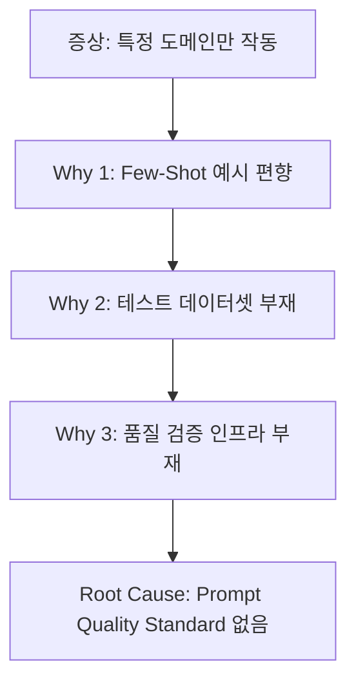
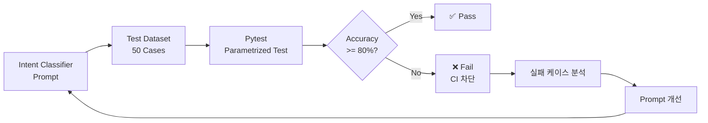

# Spec-070: Prompt Quality Testing Framework

> **Mode**: SDD (Spec-Driven Development)  
> **Priority**: P0 (Quick Win)  
> **Estimated Effort**: 2일  
> **근거**: [Spec 068 - Root Cause #2: Intent Classifier Prompt Bias](../068-rag-architecture-review/root_cause_analysis.md#-high-issue-2-intent-classifier-prompt-bias)

---

## 📋 배경 및 문제 정의 (Background & Problem)

### 현재 상황

RAG 시스템의 **Intent Classifier**가 특정 도메인(예: "어쩌다 어른")에 편향되어 있어, 다른 도메인에 대한 질문은 의도 분류 정확도가 낮습니다.

#### 문제 발생 코드
```python
# app/domain/services/intent_classifier.py (현재는 rag_nodes.py에 인라인)
# Few-Shot Examples가 하드코딩되어 있음
INTENT_CLASSIFIER_PROMPT = """
...
**Examples:**
User: "어쩌다 어른에 대해서 알려줘"
→ {"intent": "general_query", "targets": ["어쩌다 어른"], ...}
"""
```

**문제점**:
- "어쩌다 어른"만 예시로 있어서 **"알쓸신잡", "세바시"** 등 다른 프로그램 질문은 제대로 분류되지 않음
- 프롬프트 변경 후 **품질 검증 프로세스가 없어** 회귀(regression) 발생 가능

### 문제점

**Spec 068 Root Cause Analysis**에 따르면, Intent Classifier 편향의 근본 원인은:



**5 Whys 분석 요약**:
1. **Why**: 왜 "알쓸신잡"은 실패하나? → Intent Classifier의 Few-Shot 예시에 "어쩌다 어른"만 있음
2. **Why**: 왜 편향된 예시만 있나? → 테스트 데이터셋 부재로 편향 발견 불가
3. **Why**: 왜 테스트 데이터셋이 없나? → Prompt Quality 검증 프로세스 부재
4. **Why**: 왜 검증 프로세스가 없나? → SDD Mode에서 Prompt 품질 기준 명시 안 함
5. **Root Cause**: **Constitution/Agent.md에 Prompt Engineering 품질 기준 부재**

### 해결 방안

**Prompt Quality Testing Framework** 구축:
1. **다양한 도메인**을 포함한 **50개 테스트 케이스** 작성 (YAML)
2. **Pytest 기반 자동 검증** 스크립트
3. **Baseline Accuracy 측정** 및 실패 케이스 분석
4. **CI/CD 통합**으로 프롬프트 변경 시 자동 검증

---

## 📊 개념도 (Conceptual Architecture)



**구성 요소**:
- **Test Dataset**: `tests/prompt/intent_test_cases.yaml`
  - 5개 Intent 카테고리 × 10개 = 50개 케이스
  - 각 케이스: `{query, expected_intent, expected_targets, reasoning}`
- **Pytest Script**: `tests/prompt/test_intent_classifier_quality.py`
  - YAML 파싱 → LLM 호출 → Assertion
  - Accuracy/Precision/Recall 계산
- **CI/CD**: `.github/workflows/prompt_quality.yml`
  - PR 생성 시 자동 테스트
  - Accuracy < 80% 시 CI 실패

---

## 🎯 요구사항 (Requirements)

### Functional Requirements

1. **Test Dataset 다양성**:
   - 최소 5개 도메인 (TV 프로그램 3종, 기술 주제 2종 등)
   - 각 Intent 타입별로 균등 분포 (General Query, Compare, Summarize, Filter, Edge Cases)
   
2. **자동 검증**:
   - Pytest로 50개 케이스 실행
   - Intent Type, Targets, Reasoning 정확도 측정
   - 결과 리포트 자동 생성

3. **Baseline 측정**:
   - 현재 Intent Classifier의 정확도 측정 (Benchmark)
   - 실패 케이스 분석 및 개선 방향 제안

4. **CI/CD 통합**:
   - GitHub Actions에 Prompt Quality Test 추가
   - Accuracy 임계값 (80%) 미달 시 PR 차단

### Non-Functional Requirements

1. **테스트 실행 시간**: 50개 케이스 < 5분 (LLM API 병렬 호출)
2. **유지보수성**: YAML 기반 테스트 케이스로 비개발자도 추가 가능
3. **재현성**: 동일 케이스 재실행 시 동일 결과 보장 (LLM Temperature=0)

---

## ✅ Definition of Done

1. **Test Dataset 완성**:
   - [ ] `tests/prompt/intent_test_cases.yaml` 50개 케이스 작성
   - [ ] 5개 Intent 카테고리 균등 분포 확인

2. **Pytest 스크립트 작동**:
   - [ ] `uv run pytest tests/prompt/test_intent_classifier_quality.py -v` 통과
   - [ ] Accuracy/Precision/Recall 자동 계산

3. **Baseline Report 작성**:
   - [ ] `specs/070-prompt-quality-testing-framework/baseline_report.md` 작성
   - [ ] 현재 Accuracy 및 실패 케이스 분석 포함

4. **CI/CD 통합**:
   - [ ] `.github/workflows/prompt_quality.yml` 작성
   - [ ] PR에서 Prompt Quality Test 자동 실행 확인

5. **Documentation**:
   - [ ] `walkthrough.md` 작성 (테스트 결과 스크린샷 포함)
   - [ ] `pr_description.md` 작성 (템플릿 준수)

---

## 📈 Expected Impact

### 정량적 개선
- **Intent Classification Accuracy**: 현재 미측정 → 80% 이상 보장
- **회귀 방지**: 프롬프트 변경 시 자동 검증으로 품질 저하 방지
- **개발 속도**: Prompt 개선 후 수동 테스트 불필요

### 정성적 개선
- **신뢰성**: 다양한 도메인에서 일관된 성능
- **확장성**: 새 도메인 추가 시 테스트 케이스만 추가하면 됨
- **프로세스 개선**: Constitution.md에 "Prompt Quality Standard" 추가로 향후 모든 Prompt 품질 보장
