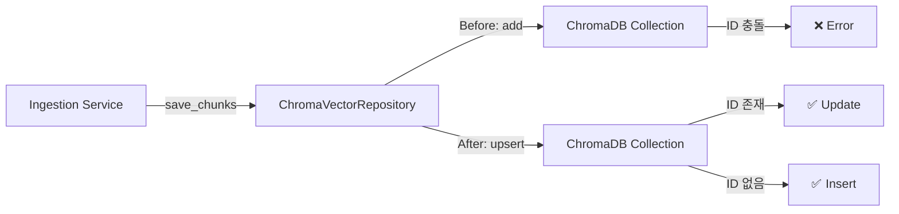

# Implementation Plan: Spec-071

## 📋 Branch Strategy
- `feature/071-chromadb-upsert-logic`

## 🛑 User Review Required

> [!IMPORTANT]
> - [ ] **ChromaDB API 변경 영향 범위 확인**: `add` → `upsert` 변경이 기존 Ingestion 워크플로우에 영향 없는지 확인 필요
> - [ ] **Integration Test 실행 환경**: Docker Compose로 Neo4j + ChromaDB 환경이 로컬에서 정상 동작하는지 확인 필요

## 🎯 Core Strategy

### Architecture Context



| Component | Strategy | Reasoning |
|:---:|:---|:---|
| **ChromaVectorRepository** | `add` → `upsert` 메서드 변경 | 중복 저장 방지, 데이터 일관성 보장 |
| **Integration Test** | 중복 수집 시나리오 추가 | 재수집 케이스 검증 |
| **Manual Verification** | Admin UI로 2번 수집 테스트 | 실제 사용자 시나리오 확인 |

### 핵심 전략
1. **ChromaDB API 변경**: `collection.add()` → `collection.upsert()`
2. **영향 범위 최소화**: 메서드 시그니처 동일, 내부 구현만 변경
3. **TDD 접근**: Integration Test 먼저 작성 → 구현 → 검증

---

## 📂 Proposed Changes

### ChromaDB Repository Layer

#### [MODIFY] [chroma.py](file:///Users/ck/Project/doit/rag-ingestion/app/infrastructure/repositories/chroma.py)
**변경 내용**: ChromaDB `add` 메서드를 `upsert`로 변경

**수정 위치 1**: `save()` 메서드 (Line 102)
```python
# Before
self.collection.add(
    documents=[document.content], 
    metadatas=[flattened_metadata], 
    ids=[str(document.id)]
)

# After
self.collection.upsert(
    documents=[document.content], 
    metadatas=[flattened_metadata], 
    ids=[str(document.id)]
)
```

**수정 위치 2**: `save_chunks()` 메서드 (Line 152)
```python
# Before
self.collection.add(
    ids=batch_ids, 
    documents=batch_documents, 
    metadatas=batch_metas
)

# After
self.collection.upsert(
    ids=batch_ids, 
    documents=batch_document, 
    metadatas=batch_metas
)
```

**이유**:
- `upsert`는 ID 존재 시 업데이트, 없으면 Insert → 멱등성(Idempotency) 보장
- 동일 문서 재수집 시 중복 저장 방지

---

#### [NEW] [test_duplicate_ingestion.py](file:///Users/ck/Project/doit/rag-ingestion/tests/integration/test_duplicate_ingestion.py)
**목적**: 중복 수집 시나리오 검증 Integration Test 작성

**테스트 케이스**:
1. **동일 문서 2번 수집 시 ChromaDB 중복 저장 없음**
2. **Neo4j와 ChromaDB 데이터 일관성 유지**
3. **업데이트된 메타데이터 정상 반영**

**구현 예시**:
```python
import pytest
from app.application.services.ingestion import IngestionService
from app.infrastructure.repositories.chroma import ChromaVectorRepository
from app.infrastructure.repositories.neo4j_graph_repository import Neo4jGraphRepository

@pytest.mark.integration
async def test_duplicate_document_ingestion():
    """동일 문서를 2번 수집 시 중복 저장 방지 테스트"""
    # Given: 문서 1차 수집
    doc_url = "https://example.com/test-document"
    result1 = await ingestion_service.ingest_url(doc_url)
    
    # When: 동일 문서 2차 수집
    result2 = await ingestion_service.ingest_url(doc_url)
    
    # Then: ChromaDB에 중복 저장 없음
    chroma_chunks = chroma_repo.get_chunks(result1.document_id)
    assert len(chroma_chunks) == result1.chunk_count  # 중복 없음
    
    # Neo4j도 일관성 유지
    neo4j_chunks = neo4j_repo.get_chunks(result1.document_id)
    assert len(neo4j_chunks) == len(chroma_chunks)
```

---

## 🧪 Verification Plan

### Automated Tests

```bash
# Unit Tests (기존 테스트 모두 통과 확인)
uv run pytest tests/unit/infrastructure/repositories/test_chroma.py -v

# Integration Tests (새로 작성한 중복 수집 테스트)
uv run pytest tests/integration/test_duplicate_ingestion.py -v

# Full Test Suite
uv run pytest
```

### Manual Verification

1. **Docker Compose 환경 시작**
   ```bash
   docker compose up -d
   ```

2. **Admin UI로 문서 2번 수집**
   - Streamlit Admin UI 접속 (`http://localhost:8501`)
   - "Web URL 수집" 탭에서 동일 URL 입력 후 2번 수집
   - Expected: 2번째 수집도 성공 (에러 없음)

3. **ChromaDB 데이터 확인**
   ```python
   # Python Shell로 직접 확인
   from app.infrastructure.repositories.chroma import ChromaVectorRepository
   
   repo = ChromaVectorRepository()
   all_chunks = repo.get_all_chunk_metadata()
   
   # 동일 parent_id로 중복된 chunk_id가 없는지 확인
   chunk_ids = [c["id"] for c in all_chunks]
   assert len(chunk_ids) == len(set(chunk_ids))  # 중복 없음
   ```

4. **Neo4j와 일관성 확인**
   - Neo4j Browser에서 동일 문서의 청크 수 조회
   - ChromaDB의 청크 수와 일치 확인

---

## 📝 Risk Assessment

| Risk | Impact | Mitigation |
|------|--------|------------|
| `upsert` 메서드가 기존 `add`와 다르게 동작 | Medium | Integration Test로 사전 검증, Rollback Plan 준비 |
| 기존 테스트 실패 가능성 | Low | 메서드 시그니처 동일, 내부 구현만 변경 |
| ChromaDB 버전 호환성 | Low | 현재 사용 중인 ChromaDB 버전에서 `upsert` 지원 확인 필요 |

---

## 🚀 Rollback Plan

만약 `upsert` 변경 후 문제 발생 시:
1. Git Revert로 즉시 이전 버전 복구
2. `collection.add()` 유지 + 별도 중복 체크 로직 추가 (Plan B)

```python
# Plan B: add() 유지 + 중복 체크
def save_chunks(self, chunks: list[Chunk]) -> None:
    existing_ids = self.get_all_chunk_ids()
    new_chunks = [c for c in chunks if str(c.id) not in existing_ids]
    
    if new_chunks:
        self.collection.add(...)  # 신규만 저장
```
