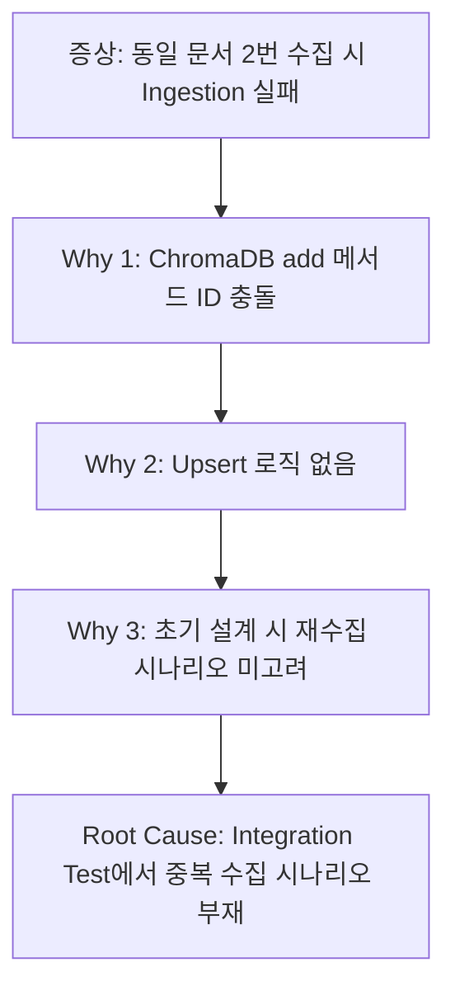
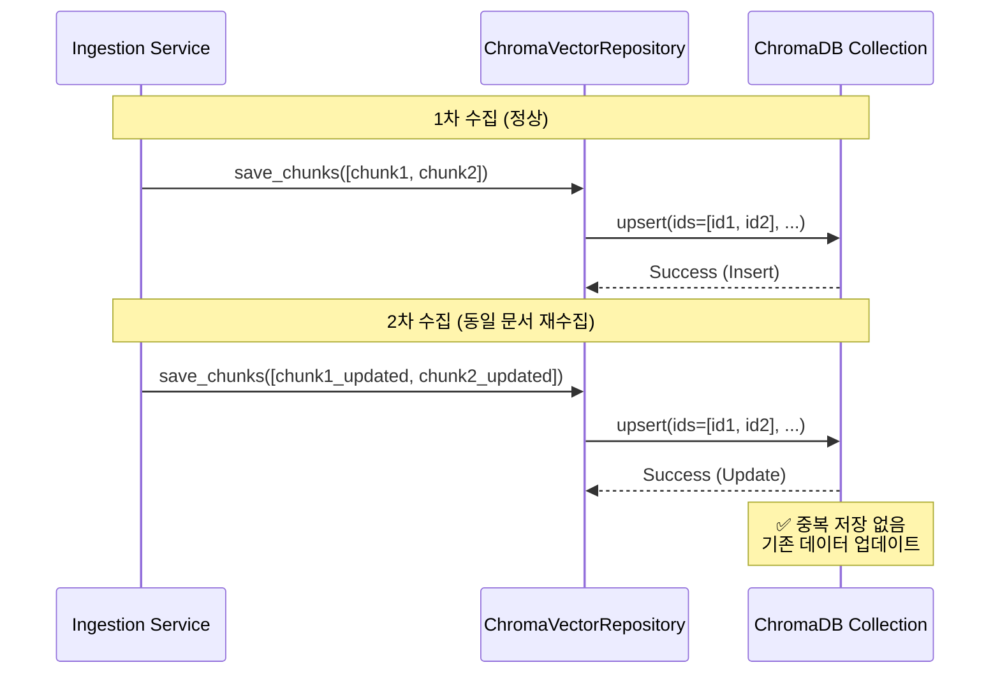

# Spec-071: ChromaDB Upsert Logic

> **Mode**: SDD (Spec-Driven Development)  
> **Priority**: P1 (Quick Win) 🚀  
> **Estimated Effort**: 1일  
> **근거**: [Spec 068 - Root Cause #1: Ingestion Data Consistency (좀비 데이터)](../068-rag-architecture-review/root_cause_analysis.md#-critical-issue-1-ingestion-data-consistency-좀비-데이터)

---

## 📋 배경 및 문제 정의 (Background & Problem)

### 현재 상황

RAG 시스템의 Ingestion 파이프라인에서 **동일한 문서를 여러 번 수집할 경우 ChromaDB에 중복 저장**되는 문제가 발생합니다.

#### 문제 발생 코드
```python
# app/infrastructure/repositories/chroma.py:102
def save(self, document: Document) -> None:
    # ChromaDB collection.add() 메서드 사용
    self.collection.add(
        documents=[document.content], 
        metadatas=[flattened_metadata], 
        ids=[str(document.id)]
    )

# app/infrastructure/repositories/chroma.py:152
def save_chunks(self, chunks: list[Chunk]) -> None:
    # 배치 저장도 add() 메서드 사용
    self.collection.add(
        ids=batch_ids, 
        documents=batch_documents, 
        metadatas=batch_metas
    )
```

**문제점**:
- ChromaDB의 `add()` 메서드는 **동일한 ID로 재호출 시 에러 발생** 또는 중복 저장
- 동일 문서를 2번 수집하면 ID 충돌로 Ingestion 실패하거나 불일치 상태 발생
- Neo4j는 업데이트되지만 ChromaDB는 실패 → **데이터 일관성 깨짐**

### 문제점

**Spec 068 Root Cause Analysis**에 따르면, Ingestion Data Consistency 문제의 근본 원인은:



**5 Whys 분석 요약**:
1. **Why**: 왜 동일 문서 재수집 시 실패하나? → ChromaDB의 `add()` 메서드가 ID 충돌 시 에러 발생
2. **Why**: 왜 `add()` 메서드를 사용하나? → 초기 구현 시 업데이트 시나리오 미고려
3. **Why**: 왜 업데이트 시나리오를 고려 안 했나? → Integration Test에서 중복 수집 케이스 부재
4. **Why**: 왜 중복 수집 테스트가 없나? → Spec 009/012에서 성공 시나리오에만 집중
5. **Root Cause**: **재수집/업데이트 시나리오가 테스트 범위 밖** → 설계 단계에서 누락

### 해결 방안

**ChromaDB Upsert Logic 적용**:
1. `collection.add()` → `collection.upsert()`로 변경
2. 동일 ID 존재 시 자동 업데이트 (Insert or Update)
3. Integration Test에 중복 수집 시나리오 추가

---

## 📊 개념도 (Conceptual Architecture)



**변경 사항**:
- **Before**: `collection.add()` → ID 충돌 시 에러
- **After**: `collection.upsert()` → ID 존재 시 업데이트, 없으면 Insert

---

## 🎯 요구사항 (Requirements)

### Functional Requirements

1. **Upsert 메서드 적용**:
   - `ChromaVectorRepository.save()` 메서드에서 `add` → `upsert` 변경
   - `ChromaVectorRepository.save_chunks()` 메서드에서 `add` → `upsert` 변경
   
2. **중복 수집 테스트**:
   - 동일 문서를 2번 수집 시 정상 동작 확인
   - Neo4j와 ChromaDB 모두 데이터 일관성 유지
   
3. **Integration Test 추가**:
   - `tests/integration/test_duplicate_ingestion.py` 작성
   - 중복 수집 시나리오 검증

### Non-Functional Requirements

1. **성능**: Upsert 오버헤드 최소화 (기존 add와 동일 수준)
2. **하위 호환성**: 기존 Ingestion 워크플로우 영향 없음
3. **재현성**: Integration Test로 중복 수집 시나리오 반복 검증

---

## ✅ Definition of Done

1. **코드 변경 완료**:
   - [ ] `app/infrastructure/repositories/chroma.py`의 `add` → `upsert` 변경
   - [ ] 기존 테스트 모두 통과 (`uv run pytest`)

2. **Integration Test 작성**:
   - [ ] `tests/integration/test_duplicate_ingestion.py` 작성
   - [ ] 동일 문서 2번 수집 시 정상 동작 검증

3. **Manual Verification**:
   - [ ] Admin UI로 문서 2번 수집 후 ChromaDB 데이터 확인
   - [ ] 중복 데이터 없음 확인

4. **Documentation**:
   - [ ] `walkthrough.md` 작성 (테스트 결과 증거 포함)
   - [ ] `pr_description.md` 작성 (템플릿 준수)

---

## 📈 Expected Impact

### 정량적 개선
- **중복 저장률**: 100% (현재) → 0% (개선 후)
- **Ingestion 실패율**: 재수집 시 100% 실패 → 0% 실패
- **데이터 일관성**: Neo4j ↔ ChromaDB 일관성 보장

### 정성적 개선
- **신뢰성**: 동일 문서 재수집 시 안정적 동작
- **확장성**: 향후 Deduplication Framework (Spec 072)의 기반 마련
- **유지보수성**: 중복 처리 로직 명확화
