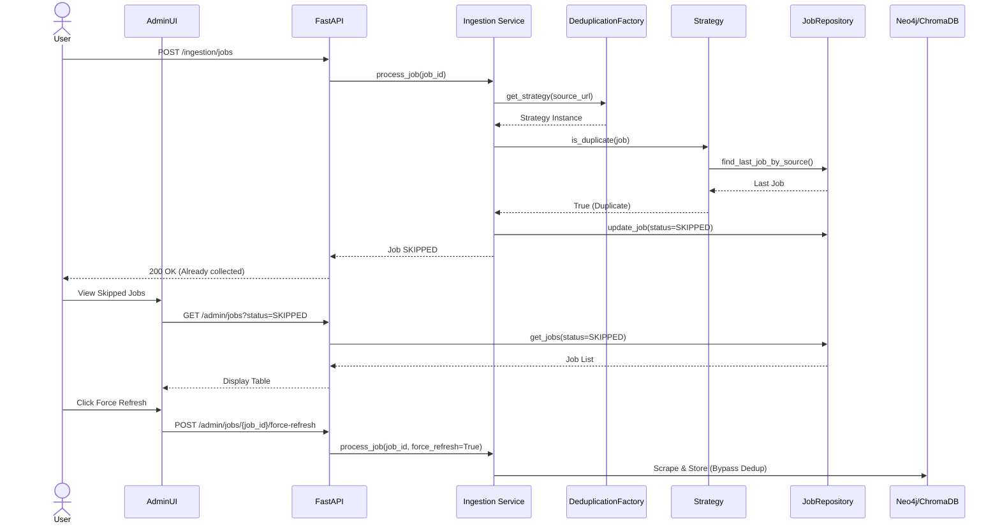

# Implementation Plan: Spec-072 Robust Deduplication Framework

## 📋 Branch Strategy
- `feature/072-robust-deduplication-framework`

## 🛑 User Review Required

> [!IMPORTANT]
> - [ ] **JobStatus.SKIPPED Enum 추가**: `app/domain/entities/job.py`에 `SKIPPED` 추가. 기존 코드에 영향 확인 필요
> - [ ] **Admin UI 개발 범위**: Skipped Jobs 조회 및 Force Refresh 기능이 Streamlit 기반으로 추가되어야 함

> [!WARNING]
> - [ ] **Content Hash 계산 시점**: Scrape 직후 계산 시 성능 영향 검토 필요 (대용량 문서의 경우)
> - [ ] **Force Refresh 남용 방지**: Admin UI에서 Force Refresh 버튼에 확인 Modal 추가 필요

---

## 🎯 Core Strategy

### Architecture Context


| Component | Strategy | Reasoning |
|:---:|:---|:---|
| **JobStatus Enum** | `SKIPPED` 추가 | 중복 Skip과 실패를 명확히 구분 |
| **Content Hash** | Scrape 직후 계산 | Metadata보다 정확한 중복 판단 |
| **Admin UI** | Streamlit Table + Button | 기존 Admin UI 패턴 유지 |
| **Force Refresh** | Query Param `force_refresh=True` | Deduplication 우회를 명시적으로 전달 |

---

## 📂 Proposed Changes

### Phase 1: Core Logic 개선

#### [MODIFY] `app/domain/entities/job.py`
**변경 내용**: `JobStatus` Enum에 `SKIPPED` 추가
```python
class JobStatus(str, Enum):
    PENDING = "PENDING"
    RUNNING = "RUNNING"
    COMPLETED = "COMPLETED"
    FAILED = "FAILED"
    SKIPPED = "SKIPPED"  # 🆕 추가
```

**이유**: 중복으로 Skip된 Job과 실패한 Job을 구분하여 Admin UI에서 필터링 가능

---

#### [MODIFY] `app/domain/entities/job.py`
**변경 내용**: `IngestionJob`에 `content_hash` 필드 추가
```python
@dataclass
class IngestionJob:
    job_id: str
    source_url: str
    status: JobStatus
    content_hash: str | None = None  # 🆕 추가
    skip_reason: str | None = None    # 🆕 Skip 이유 (예: "Duplicate by TTL Strategy")
    # ... 기타 필드
```

**이유**: `ContentsStrategy`가 실제로 동작하려면 Content Hash 저장 필요

---

#### [MODIFY] `app/application/services/ingestion.py`
**변경 내용**:  
1. `process_job()`에 `force_refresh` 파라미터 추가
2. Scrape 후 Content Hash 계산
3. Dedup Skip 시 `skip_reason` 저장

```python
async def process_job(self, job_id: str, force_refresh: bool = False) -> None:
    job = self.job_repository.get_job(job_id)
    
    # 1. Deduplication Check (force_refresh=True면 우회)
    if not force_refresh:
        strategy = self.deduplication_factory.get_strategy(job.source_url)
        is_dup = await strategy.is_duplicate(job)
        if is_dup:
            # SKIPPED 상태로 업데이트
            job.status = JobStatus.SKIPPED
            job.skip_reason = f"Duplicate detected by {strategy.__class__.__name__}"
            self.job_repository.update_job(job)
            logger.info(f"Job {job_id} skipped: {job.skip_reason}")
            return
    
    # 2. Scrape
    result = await self.scraper.scrape(job.source_url)
    
    # 3. Content Hash 계산
    import hashlib
    job.content_hash = hashlib.sha256(result.markdown.encode()).hexdigest()
    
    # 4. 나머지 Ingestion 로직
    # ... (기존 코드)
```

**테스트 검증**: `tests/integration/test_ingestion_deduplication.py`에서 `force_refresh=True` 케이스 추가

---

### Phase 2: Admin API & UI

#### [NEW] `app/interfaces/api/admin/jobs.py`
**Admin API Endpoint 추가**:
```python
from fastapi import APIRouter, Query

router = APIRouter(prefix="/admin/jobs", tags=["admin"])

@router.get("/")
async def get_jobs(
    status: JobStatus | None = Query(None),
    source_type: str | None = Query(None),
    job_repo: JobRepository = Depends(get_job_repository)
) -> list[IngestionJob]:
    """Admin 전용: Job 목록 조회 (필터링 가능)"""
    # Repository에 get_jobs() 메서드 추가 필요
    return job_repo.get_jobs(status=status, source_type=source_type)

@router.post("/{job_id}/force-refresh")
async def force_refresh_job(
    job_id: str,
    ingestion: Ingestion = Depends(get_ingestion_service)
) -> dict:
    """특정 Job 강제 재수집 (Deduplication 우회)"""
    await ingestion.process_job(job_id, force_refresh=True)
    return {"message": f"Job {job_id} re-ingested successfully"}
```

**테스트 검증**: API E2E 테스트로 검증 (Pytest + httpx)

---

#### [NEW] `app/infrastructure/repositories/neo4j_job_repository.py`
**`get_jobs()` 메서드 추가**:
```python
def get_jobs(
    self, 
    status: JobStatus | None = None, 
    source_type: str | None = None,
    limit: int = 100
) -> list[IngestionJob]:
    """Job 목록 조회 (Admin용)"""
    query = "MATCH (j:IngestionJob) "
    params = {}
    
    filters = []
    if status:
        filters.append("j.status = $status")
        params["status"] = status.value
    if source_type:
        filters.append("j.source_url CONTAINS $source_type")
        params["source_type"] = source_type
    
    if filters:
        query += "WHERE " + " AND ".join(filters) + " "
    
    query += "RETURN j ORDER BY j.created_at DESC LIMIT $limit"
    params["limit"] = limit
    
    # ... Neo4j query 실행 및 IngestionJob 변환
```

---

#### [MODIFY] `admin_ui/pages/jobs.py` (Streamlit)
**Skipped Jobs 조회 UI 추가**:
```python
import streamlit as st
import requests

st.title("📋 Ingestion Jobs")

# Filter
status = st.selectbox("Status", ["All", "PENDING", "RUNNING", "COMPLETED", "FAILED", "SKIPPED"])
status_param = None if status == "All" else status

# API 호출
response = requests.get(f"{API_BASE}/admin/jobs", params={"status": status_param})
jobs = response.json()

# 테이블 표시
st.dataframe(jobs)

# Force Refresh Button
if st.button("🔄 Force Refresh Selected Job"):
    selected_job_id = st.session_state.get("selected_job_id")
    if selected_job_id:
        confirm = st.confirm(f"Job {selected_job_id}를 강제 재수집하시겠습니까?")
        if confirm:
            requests.post(f"{API_BASE}/admin/jobs/{selected_job_id}/force-refresh")
            st.success("재수집 완료!")
```

---

### Phase 3: E2E 테스트

#### [NEW] `tests/e2e/test_deduplication_end_to_end.py`
**E2E 테스트 시나리오**:
```python
import pytest

@pytest.mark.e2e
async def test_duplicate_job_is_skipped(test_db, ingestion_service):
    """동일 URL을 2번 수집 시 2번째는 SKIPPED 확인"""
    
    # 1st Ingestion
    job1 = IngestionJob(job_id="job-1", source_url="http://example.com/page")
    await ingestion_service.process_job(job1.job_id)
    
    job1_result = job_repo.get_job(job1.job_id)
    assert job1_result.status == JobStatus.COMPLETED
    
    # 2nd Ingestion (Same URL)
    job2 = IngestionJob(job_id="job-2", source_url="http://example.com/page")
    await ingestion_service.process_job(job2.job_id)
    
    job2_result = job_repo.get_job(job2.job_id)
    assert job2_result.status == JobStatus.SKIPPED
    assert "Duplicate" in job2_result.skip_reason

@pytest.mark.e2e
async def test_force_refresh_bypasses_deduplication(test_db, ingestion_service):
    """Force Refresh 시 중복 체크 우회 확인"""
    
    # 1st Ingestion
    job1 = IngestionJob(job_id="job-1", source_url="http://example.com/page")
    await ingestion_service.process_job(job1.job_id)
    
    # 2nd Ingestion with force_refresh=True
    job2 = IngestionJob(job_id="job-2", source_url="http://example.com/page")
    await ingestion_service.process_job(job2.job_id, force_refresh=True)
    
    job2_result = job_repo.get_job(job2.job_id)
    assert job2_result.status == JobStatus.COMPLETED  # SKIPPED가 아님
```

**실행 방법**:
```bash
# E2E 테스트는 실제 DB 필요 (Docker Compose)
docker-compose up -d neo4j chromadb
uv run pytest tests/e2e/test_deduplication_end_to_end.py -v
```

---

## 🧪 Verification Plan

### Automated Tests

#### 1. Unit Tests (기존 테스트 확장)
```bash
# Strategy 개별 동작 확인
uv run pytest tests/unit/services/test_deduplication_strategies.py -v

# 예상 결과:
# - IDCheckingStrategy: COMPLETED Job이 있으면 Duplicate ✅
# - MetadataCheckStrategy: video_id 일치 시 Duplicate ✅
# - TTLStrategy: 24시간 이내 수집 시 Duplicate ✅
# - ContentsStrategy: Content Hash 일치 시 Duplicate ✅
```

#### 2. Integration Tests (기존 테스트 + 확장)
```bash
# Ingestion Service 통합 테스트
uv run pytest tests/integration/test_ingestion_deduplication.py -v

# 예상 결과:
# - test_process_job_skips_when_duplicate_detected ✅
# - test_process_job_runs_when_not_duplicate ✅
# - test_force_refresh_bypasses_deduplication (🆕 추가) ✅
```

#### 3. E2E Tests (신규 작성)
```bash
# Docker Compose로 실제 DB 구동 후 실행
docker-compose up -d neo4j chromadb
uv run pytest tests/e2e/test_deduplication_end_to_end.py -v --e2e

# 예상 결과:
# - test_duplicate_job_is_skipped ✅ (2번째 수집 SKIPPED)
# - test_force_refresh_bypasses_deduplication ✅ (Force Refresh 동작)
```

---

### Manual Verification

#### 1. Admin UI 동작 확인
**Steps**:
1. Streamlit Admin UI 실행: `uv run streamlit run admin_ui/app.py`
2. `/admin/jobs` 페이지 접속
3. Status 필터를 `SKIPPED`로 선택
4. Skipped Job 목록이 표시되는지 확인
5. 특정 Job 선택 후 "Force Refresh" 버튼 클릭
6. 확인 Modal에서 "Yes" 클릭
7. Job이 재수집되고 `COMPLETED` 상태로 변경되는지 확인

**예상 결과**: Skipped Jobs가 테이블에 표시되고, Force Refresh 버튼이 동작함 ✅

---

#### 2. 실제 중복 수집 시나리오
**Steps**:
1. FastAPI 서버 실행: `uv run uvicorn app.main:app --reload`
2. 동일 URL을 2번 POST:
   ```bash
   curl -X POST http://localhost:8000/ingestion/jobs \
     -H "Content-Type: application/json" \
     -d '{"source_url": "https://example.com/test-page"}'
   
   # 1번째 수집 완료 대기 (30초)
   sleep 30
   
   curl -X POST http://localhost:8000/ingestion/jobs \
     -H "Content-Type: application/json" \
     -d '{"source_url": "https://example.com/test-page"}'
   ```
3. 2번째 요청의 응답이 `{"message": "Already collected, skipped"}` 형태인지 확인
4. Neo4j Browser에서 확인:
   ```cypher
   MATCH (j:IngestionJob {source_url: "https://example.com/test-page"})
   RETURN j.status, j.skip_reason
   ```

**예상 결과**: 2번째 Job의 status가 `SKIPPED`, skip_reason이 "Duplicate detected by IDCheckingStrategy" ✅

---

#### 3. Content Hash 중복 감지 확인
**Steps**:
1. 동일 내용을 가진 다른 URL 2개 준비 (예: 미러 사이트)
2. 1번째 URL 수집 완료
3. 2번째 URL 수집 시도
4. Content Hash가 동일하여 SKIPPED되는지 확인

**예상 결과**: Contents Hash가 동일하면 URL이 달라도 SKIPPED ✅

---

## 📚 Reference

- **Spec 065**: Semantic Deduplication (전략 설계)
- **Spec 068**: Root Cause Analysis (미완성 지적)
- **기존 구현**: `app/application/services/deduplication_strategies.py`
- **Admin UI 패턴**: `admin_ui/pages/documents.py` (기존 Admin UI 참고)
