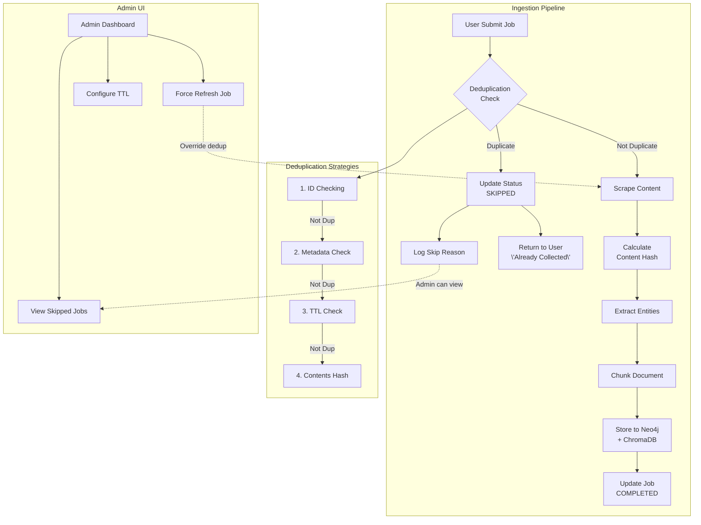

# Spec-072: Robust Deduplication Framework

## 📋 배경 및 문제 정의 (Background & Problem)

### 현재 상황
**Spec 065 (Semantic Deduplication)**에서 4가지 중복 제거 전략(ID Checking, Metadata Check, TTL, Contents Hash)을 설계했고, 현재 다음 구현이 완료된 상태입니다:

**✅ 이미 구현된 것 (Spec 065 완료)**:
1. **`DeduplicationStrategy` 추상 클래스**: `app/application/services/deduplication_strategies.py`
   - `IDCheckingStrategy`: Source URL 기반 중복 체크
   - `MetadataCheckStrategy`: 파일 크기, video_id 등 메타데이터 비교
   - `TTLStrategy`: 마지막 수집 시간 + TTL 기반 중복 판단
   - `ContentsStrategy`: Content Hash 비교
2. **`Dedup lationFactory`**: Source URL 패턴 기반 Strategy 선택
   - YouTube → `MetadataCheckStrategy(keys=["video_id"])`
   - File → `MetadataCheckStrategy(keys=["file_size"])`
   - 기타 → `IDCheckingStrategy`
3. **`Ingestion` 서비스 통합**: `app/application/services/ingestion.py`에서 `process_job()` 시작 시 중복 체크
4. **Integration 테스트**: `tests/integration/test_ingestion_deduplication.py`

**[Spec 068 Root Cause Analysis](../068-rag-architecture-review/spec.md#32-중복-처리-deduplication-설계-결함)** 지적사항:
> **근본 원인 분석**:  
> 1. **Strategy Pattern 미구현**: 4가지 전략이 문서로만 존재, 실제 코드에는 `if-elif` 하드코딩  
> 2. **중복 판단 시점 불명확**: Ingestion Graph의 어느 단계에서 중복을 체크하는지 명확하지 않음  
> 3. **Vector Store 중복 체크 누락**: Neo4j에는 Document ID 기반 중복 방지가 있으나, ChromaDB는 중복 저장 가능

→ **현재 상태 재평가**: Spec 065에서 Strategy Pattern과 Ingestion 통합은 이미 구현되었으나, **일부 기능이 미완성** 상태임.

### 문제점

**🔴 Critical Issues (미완성)**:
1. **Admin UI 부재**: 
   - 중복 Skip된 Job 조회 기능 없음
   - Strategy 선택 옵션 없음 (현재 Factory가 자동 선택만)
   - Force Refresh 버튼 없음 (강제 재수집 불가)

2. **JobStatus Enum 불완전**:
   - `JobStatus.SKIPPED` 없음 (현재: `PENDING`, `RUNNING`, `COMPLETED`, `FAILED`만)
   - 중복 Skip 시 어떤 상태로 저장해야 할지 명확하지 않음

3. **E2E 검증 부족**:
   - Integration 테스트는 Mock 기반이므로 실제 DB 동작 검증 안 됨
   - 동일 문서 2번 수집 시 실제로 Skip되는지 확인 필요

**🟠 High Priority (개선 필요)**:
4. **Strategy 우선순위 로직 부재**:
   - 현재 Factory는 URL 패턴만으로 1개 Strategy 선택
   - 실제로는 **여러 Strategy를 순서대로** 확인해야 함  
     (예: YouTube → Metadata Check → TTL Check → Contents Check)

5. **Content Hash 구현 누락**:
   - `ContentsStrategy`는 구현되어 있으나, **실제 Content Hash 계산 로직이 Ingestion에 없음**
   - `IngestionJob.content_hash` 필드도 추가 필요

6. **Admin 중복 관리 기능 부재**:
   - 중복으로 Skip된 Job 목록 조회 불가
   - 특정 Source 강제 재수집 옵션 없음

### 해결 방안
Spec 065에서 설계한 Deduplication Framework를 **완성**하고, Admin UI 및 E2E 검증을 추가하여:
- 불필요한 재수집 방지
- 사용자가 중복 정책을 관리할 수 있도록 개선
- 실제 동작을 E2E 테스트로 검증

---

## 📊 개념도 (Conceptual Architecture)

### Deduplication Flow (완성 후)

---

## 🎯 요구사항 (Requirements)

### Functional Requirements
1. **JobStatus.SKIPPED Enum 추가**: 중복으로 Skip된 Job을 명시적으로 표시
2. **Content Hash 계산**: Scrape 후 Content Hash를 `IngestionJob.content_hash`에 저장
3. **Admin UI - Skipped Jobs 조회**: 
   - 중복으로 Skip된 Job 목록 (Source URL, Skip Reason, 마지막 수집 시간)
   - 필터링: Source Type, Date Range
4. **Admin UI - Force Refresh**: 
   - 특정 Job을 강제 재수집 (Deduplication 우회)
   - `force_refresh=True` 플래그 추가
5. **E2E 검증 테스트**: 
   - 동일 URL을 2번 수집 시 2번째는 SKIPPED 확인
   - Force Refresh 시 재수집 확인
6. **Strategy 선택 로직 개선**: Factory가 여러 Strategy를 순서대로 적용 (설정 가능)

### Non-Functional Requirements
1. **Performance**: Deduplication Check는 100ms 이내 (DB Query 최적화)
2. **Observability**: Skip 시 로그에 Strategy 이름 및 Reason 기록
3. **Backward Compatibility**: 기존 `IDCheckingStrategy` 기본 동작 유지

---

## ✅ Definition of Done
1. `JobStatus.SKIPPED` Enum 추가 및 `IngestionJob` 스키마 업데이트 ✅
2. Content Hash 계산 로직 추가 (`hashlib.sha256`) ✅
3. Admin API: `GET /admin/jobs?status=SKIPPED` Endpoint 추가 ✅
4. Admin UI: Skipped Jobs 테이블 및 Force Refresh 버튼 추가 ✅
5. E2E 테스트: 동일 URL 2번 수집 시 SKIPPED 확인 ✅
6. Integration Test: 모든 Strategy 개별 테스트 통과 ✅
7. Documentation: `docs/architecture/deduplication.md` 업데이트 ✅
8. Spec 068 체크리스트의 **Deduplication 완성** 항목 완료 ✅
