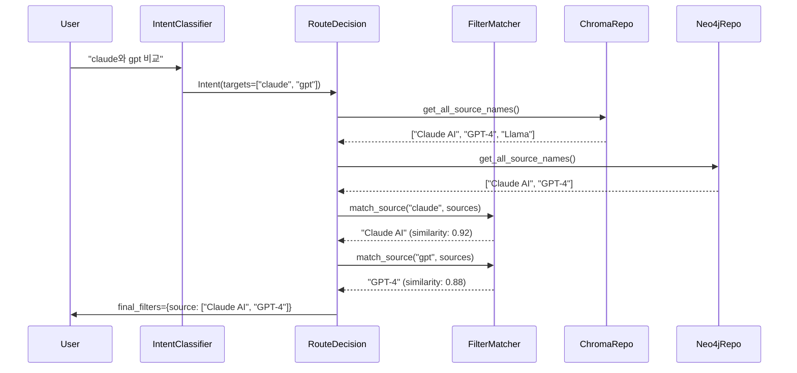

# Implementation Plan: Spec-073

## 📋 Branch Strategy
- `feature/073-fuzzy-filter-matching`

## 🛑 User Review Required

> [!IMPORTANT]
> - [ ] **Embedding Model 선택**: 현재 ChromaDB가 사용하는 Embedding Model을 FilterMatcher에서도 사용할지 확인 필요. 별도의 경량 모델 사용 여부 결정.
> - [ ] **Similarity Threshold 초기값**: 85%로 설정했으나, 실제 테스트 후 조정 필요 가능성 존재.

## 🎯 Core Strategy

### Architecture Context


| Component | Strategy | Reasoning |
|:---:|:---|:---|
| **FilterMatcher** | Domain Service | 필터 매칭은 비즈니스 로직이므로 Domain Layer에 위치 |
| **Embedding** | ChromaDB의 기존 Embedding 함수 재사용 | 별도 모델 도입은 복잡도 증가, 기존 인프라 활용 |
| **Caching** | Python `@lru_cache` 사용 | 동일 Source에 대한 Embedding 재계산 방지 |
| **Threshold** | 0.85 (Config에서 조정 가능) | Spec 068 권장값, 실험적 조정 가능 |

---

## 📂 Proposed Changes

### Domain Layer

#### [NEW] `app/domain/services/filter_matcher.py`
**FilterMatcher Service 구현**: Semantic Similarity 기반 Fuzzy Matching 로직을 캡슐화

```python
from functools import lru_cache
import numpy as np
from app.core.logger import setup_logger

logger = setup_logger(__name__)


class FilterMatcher:
    """
    Source Filter Fuzzy Matching Service.
    
    Exact Match를 우선하고, 실패 시 Semantic Similarity로 매칭합니다.
    """
    
    def __init__(self, embedding_fn, similarity_threshold: float = 0.85):
        """
        Args:
            embedding_fn: Embedding 함수 (예: chroma_repo._embedding_fn)
            similarity_threshold: 유사도 임계값 (0.85 = 85%)
        """
        self.embedding_fn = embedding_fn
        self.similarity_threshold = similarity_threshold
    
    def match_source(self, target: str, available_sources: list[str]) -> str | None:
        """
        Target을 Available Sources 중 가장 유사한 것과 매칭합니다.
        
        Args:
            target: 사용자 질문에서 추출된 타겟 (예: "claude")
            available_sources: DB에 실제 존재하는 Source 목록
            
        Returns:
            str: 매칭된 Source 이름
            None: 매칭 실패 (Threshold 미달)
            
        Example:
            >>> matcher.match_source("claude", ["Claude AI", "GPT-4"])
            "Claude AI"  # similarity: 0.92
        """
        if not available_sources:
            return None
        
        # 1. Exact Match (Case-Insensitive)
        for source in available_sources:
            if target.lower() == source.lower():
                logger.info(f"Exact match found: '{target}' -> '{source}'")
                return source
        
        # 2. Semantic Similarity
        try:
            target_emb = self._get_embedding(target)
            best_match = None
            best_score = 0.0
            
            for source in available_sources:
                source_emb = self._get_embedding(source)
                similarity = self._cosine_similarity(target_emb, source_emb)
                
                if similarity > best_score:
                    best_score = similarity
                    best_match = source
            
            if best_score >= self.similarity_threshold:
                logger.info(
                    f"Fuzzy match found: '{target}' -> '{best_match}' "
                    f"(similarity: {best_score:.2f})"
                )
                return best_match
            else:
                logger.warning(
                    f"No match for '{target}'. Best candidate: '{best_match}' "
                    f"(similarity: {best_score:.2f} < threshold: {self.similarity_threshold})"
                )
                return None
                
        except Exception as e:
            logger.error(f"Fuzzy matching failed for '{target}': {e}")
            return None
    
    @lru_cache(maxsize=256)
    def _get_embedding(self, text: str) -> np.ndarray:
        """Embedding을 캐싱하여 재계산 방지"""
        return np.array(self.embedding_fn(text))
    
    @staticmethod
    def _cosine_similarity(vec1: np.ndarray, vec2: np.ndarray) -> float:
        """코사인 유사도 계산"""
        dot_product = np.dot(vec1, vec2)
        norm1 = np.linalg.norm(vec1)
        norm2 = np.linalg.norm(vec2)
        return float(dot_product / (norm1 * norm2))
```

---

### Infrastructure Layer

#### [MODIFY] [rag_nodes.py:L130-L164](file:///Users/ck/Project/doit/rag-ingestion/app/infrastructure/ai/rag_nodes.py#L130-L164)
**`route_decision` 노드에 FilterMatcher 통합**

**변경 사항**:
1. `FilterMatcher` 의존성 추가 (`__init__`)
2. `_intent_to_filters` 메서드에서 Fuzzy Matching 호출
3. Reasoning Log에 매칭 결과 기록

```python
# Before
def route_decision(self, state: RAGGraphState) -> RAGGraphState:
    user_intent = state.get("user_intent")
    manual_filters = state.get("manual_filters")
    
    auto_filters = self._intent_to_filters(user_intent) if user_intent else None
    # ...

def _intent_to_filters(self, intent: UserIntent | None) -> dict | None:
    if intent.intent == IntentType.COMPARE or intent.intent == IntentType.SUMMARIZE:
        if intent.targets:
            return {"source": intent.targets}  # ❌ Exact Match만
    return None
```

```python
# After
async def route_decision(self, state: RAGGraphState) -> RAGGraphState:
    user_intent = state.get("user_intent")
    manual_filters = state.get("manual_filters")
    
    # Fuzzy Matching 적용
    auto_filters = await self._intent_to_filters(user_intent) if user_intent else None
    # ...

async def _intent_to_filters(self, intent: UserIntent | None) -> dict | None:
    if intent.intent == IntentType.COMPARE or intent.intent == IntentType.SUMMARIZE:
        if intent.targets:
            # Get available sources from DB
            available_sources = await self._get_available_sources()
            
            # Fuzzy Matching
            matched_sources = []
            fuzzy_log = []
            for target in intent.targets:
                match = self.filter_matcher.match_source(target, available_sources)
                if match:
                    matched_sources.append(match)
                    fuzzy_log.append(f"'{target}' -> '{match}'")
                else:
                    logger.warning(f"No match for target: '{target}'")
            
            # Reasoning Log 업데이트
            if fuzzy_log:
                reasoning_log = state.get("reasoning_log", [])
                reasoning_log.append(f"🔍 [Fuzzy Match] {', '.join(fuzzy_log)}")
                state["reasoning_log"] = reasoning_log
            
            return {"source": matched_sources} if matched_sources else None
    return None
```

#### [MODIFY] [chroma_repository.py](file:///Users/ck/Project/doit/rag-ingestion/app/infrastructure/repositories/chroma_repository.py)
**`get_all_source_names()` 메서드 추가**

```python
def get_all_source_names(self) -> list[str]:
    """
    ChromaDB에 저장된 모든 고유한 Source 이름 목록을 반환합니다.
    
    Returns:
        list[str]: Source 이름 목록 (중복 제거, 정렬)
    """
    try:
        # Get all unique source values from metadata
        results = self.collection.get(include=["metadatas"])
        sources = set()
        for metadata in results["metadatas"]:
            if "source" in metadata:
                sources.add(metadata["source"])
        return sorted(list(sources))
    except Exception as e:
        logger.error(f"Failed to get source names from ChromaDB: {e}")
        return []
```

#### [MODIFY] [neo4j_document_repository.py](file:///Users/ck/Project/doit/rag-ingestion/app/infrastructure/repositories/neo4j_document_repository.py)
**`get_all_source_names()` 메서드 추가**

```python
def get_all_source_names(self) -> list[str]:
    """
    Neo4j에 저장된 모든 고유한 Source 이름 목록을 반환합니다.
    
    Returns:
        list[str]: Source 이름 목록 (중복 제거, 정렬)
    """
    query = """
    MATCH (d:Document)
    WHERE d.source IS NOT NULL
    RETURN DISTINCT d.source AS source
    ORDER BY source
    """
    try:
        with self.driver.session() as session:
            result = session.run(query)
            return [record["source"] for record in result]
    except Exception as e:
        logger.error(f"Failed to get source names from Neo4j: {e}")
        return []
```

---

### Application Layer

#### [MODIFY] [dependencies.py](file:///Users/ck/Project/doit/rag-ingestion/app/interfaces/api/dependencies.py)
**FilterMatcher DI 추가**

```python
from app.domain.services.filter_matcher import FilterMatcher

def get_filter_matcher(chroma_repo: ChromaRepository = Depends(get_chroma_repo)) -> FilterMatcher:
    """FilterMatcher Dependency Injection"""
    return FilterMatcher(
        embedding_fn=chroma_repo._embedding_function.embed_query,
        similarity_threshold=0.85
    )
```

---

### Test Layer

#### [NEW] `tests/unit/domain/services/test_filter_matcher.py`
**FilterMatcher Unit Test**

```python
import pytest
from app.domain.services.filter_matcher import FilterMatcher


@pytest.fixture
def mock_embedding_fn():
    """Mock Embedding Function (간단한 문자열 해시 기반)"""
    import hashlib
    def embed(text: str):
        # 간단한 해시 벡터 생성 (테스트용)
        hash_val = int(hashlib.md5(text.lower().encode()).hexdigest(), 16)
        return [hash_val % 100, (hash_val // 100) % 100, (hash_val // 10000) % 100]
    return embed


@pytest.fixture
def filter_matcher(mock_embedding_fn):
    return FilterMatcher(mock_embedding_fn, similarity_threshold=0.85)


def test_exact_match_case_insensitive(filter_matcher):
    """대소문자 무관 Exact Match 우선"""
    available = ["Claude AI", "GPT-4", "Llama"]
    
    assert filter_matcher.match_source("claude ai", available) == "Claude AI"
    assert filter_matcher.match_source("CLAUDE AI", available) == "Claude AI"
    assert filter_matcher.match_source("gpt-4", available) == "GPT-4"


def test_fuzzy_match_similar_names(filter_matcher):
    """유사한 이름 Fuzzy Matching"""
    # 실제 Embedding Model 사용 시 테스트 필요
    # 여기서는 Mock이므로 실제 유사도는 다를 수 있음
    pass


def test_no_match_low_similarity(filter_matcher):
    """Threshold 미달 시 None 반환"""
    available = ["Claude AI", "GPT-4"]
    result = filter_matcher.match_source("completelydifferent", available)
    # Mock Embedding이라 실제 결과는 다를 수 있음
    assert result is None or result in available
```

#### [NEW] `tests/e2e/test_fuzzy_filter_matching.py`
**End-to-End Test**

```python
import pytest
from app.infrastructure.ai.rag_graph import RAGGraph


@pytest.mark.asyncio
async def test_fuzzy_filter_matching_e2e(rag_graph: RAGGraph):
    """
    Fuzzy Matching E2E 테스트: "claude와 gpt 비교"
    
    Given: DB에 "Claude AI", "GPT-4" Source가 존재
    When: "claude와 gpt 비교" 질문
    Then: auto_filters에 ["Claude AI", "GPT-4"]가 설정됨
    """
    state = {
        "query": "claude와 gpt 비교",
        "history": [],
        "manual_filters": None,
    }
    
    result = await rag_graph.compile().ainvoke(state)
    
    # auto_filters 확인
    auto_filters = result.get("auto_filters", {})
    assert "source" in auto_filters
    
    # Fuzzy Matching 결과 확인
    matched_sources = auto_filters["source"]
    assert "Claude AI" in matched_sources or "Claude" in matched_sources
    assert "GPT-4" in matched_sources or "GPT" in matched_sources
```

---

## 🧪 Verification Plan

### Automated Tests

#### Unit Tests
```bash
# FilterMatcher Service 단위 테스트
uv run pytest tests/unit/domain/services/test_filter_matcher.py -v

# RAG Nodes 기존 테스트 (Regression)
uv run pytest tests/unit/infrastructure/rag/test_rag_nodes.py -v
```

#### Integration Tests
```bash
# Repository 메서드 테스트
uv run pytest tests/integration/repositories/ -k "get_all_source_names" -v
```

#### End-to-End Tests
```bash
# Fuzzy Matching E2E 검증
uv run pytest tests/e2e/test_fuzzy_filter_matching.py -v

# 전체 테스트 스위트
uv run pytest
```

### Manual Verification
1. **Admin UI에서 수집**: "Claude AI", "GPT-4" Source로 문서 수집
2. **Chat API 호출**:
   ```bash
   curl -X POST http://localhost:8000/rag/chat \
     -H "Content-Type: application/json" \
     -d '{"query": "claude와 gpt 비교", "history": []}'
   ```
3. **Expected Result**:
   - Response의 `reasoning_log`에 Fuzzy Match 로그 확인: `"🔍 [Fuzzy Match] 'claude' -> 'Claude AI', 'gpt' -> 'GPT-4'"`
   - 검색 결과가 Claude AI, GPT-4 Source만 포함
   - Fallback 발생하지 않음
