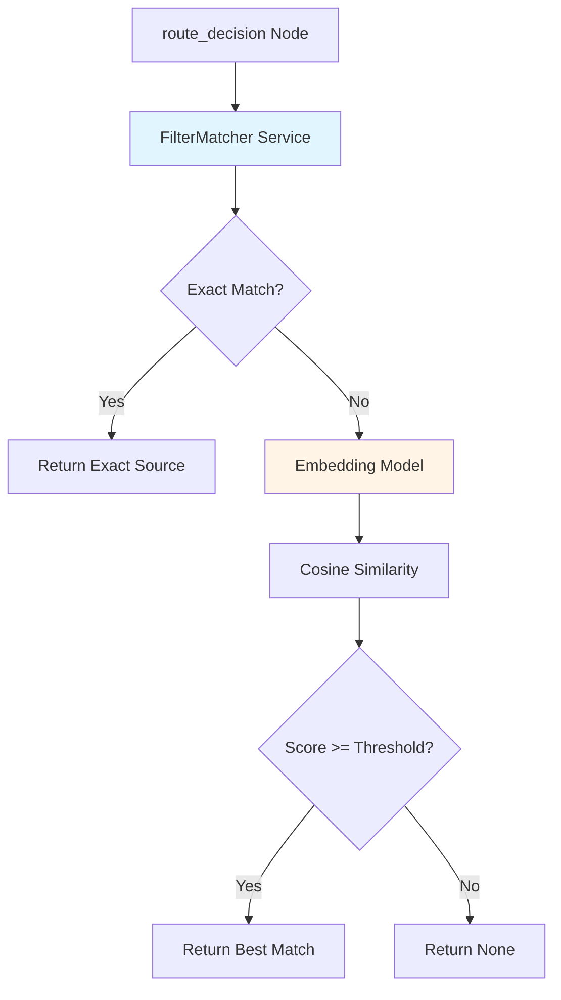

# Spec-073: Fuzzy Filter Matching

## 📋 배경 및 문제 정의 (Background & Problem)

### 현재 상황
RAG 시스템은 사용자 질문의 Intent를 분류하고 `targets` 필드를 추출하여 자동으로 Source Filter를 적용합니다. 예를 들어, "Claude와 GPT-4 비교" 질문 시 `targets: ["Claude", "GPT-4"]`가 추출되면 이를 ChromaDB와 Neo4j의 `source` 필터로 변환합니다.

**현재 Filter 적용 방식** ([`route_decision` 노드](file:///Users/ck/Project/doit/rag-ingestion/app/infrastructure/ai/rag_nodes.py#L130-L164)):
```python
def _intent_to_filters(self, intent: UserIntent | None) -> dict | None:
    if intent.intent == IntentType.COMPARE or intent.intent == IntentType.SUMMARIZE:
        if intent.targets:
            return {"source": intent.targets}  # ❌ Exact Match만 사용
    return None
```

이렇게 추출된 `source` 필터는 Repository(ChromaDB, Neo4j)에서 **Exact Match**로만 적용됩니다.

### 문제점

**[Spec 068 - Filter 강제성의 함정](file:///Users/ck/Project/doit/rag-ingestion/specs/068-rag-architecture-review/spec.md#L200-L211)에서 도출된 문제**:

1. **대소문자 불일치**:
   - 사용자: "claude에 대해 알려줘" → `targets: ["claude"]`
   - 실제 DB Source: `"Claude AI"` 또는 `"Claude"`
   - **결과**: Exact Match 실패, 검색 결과 0건 → Fallback 발생

2. **표기법 차이**:
   - 사용자: "GPT4" vs DB Source: "GPT-4"
   - 사용자: "스페이스X" vs DB Source: "SpaceX"
   - **결과**: Exact Match 실패, 관련 문서가 DB에 있음에도 필터링됨

3. **부분 문자열 매칭 부재**:
   - 사용자: "테슬라" vs DB Source: "Tesla (Company)"
   - **결과**: 필터 불일치로 검색 실패

4. **불필요한 Fallback**:
   - 현재 시스템은 Filter Match 실패 시 전체 검색으로 Fallback하지만, 이는 검색 품질 저하를 초래
   - **근본 원인**: 애초에 Filter Matching이 너무 엄격함

### 해결 방안
**Semantic Similarity 기반 Fuzzy Matching**을 도입하여 사용자 질문의 `targets`와 실제 DB의 Source 이름을 유연하게 매칭합니다.

- **Embedding 기반 Similarity**: "claude" ↔ "Claude AI" 간 Semantic Similarity 측정
- **Threshold 기반 Matching**: Similarity >= 85% 시 매칭 인정
- **Exact Match 우선**: 여전히 Exact Match가 있으면 우선 사용 (성능 최적화)

---

## 📊 개념도 (Conceptual Architecture)

### Before vs After

```mermaid
graph LR
    subgraph "Before: Exact Match Only"
        A1[사용자: 'claude 비교'] --> B1[Intent: targets=['claude']]
        B1 --> C1{Exact Match?}
        C1 -->|No| D1[검색 결과 0건]
        D1 --> E1[Fallback: 전체 검색]
    end
    
    subgraph "After: Fuzzy Filter Matching"
        A2[사용자: 'claude 비교'] --> B2[Intent: targets=['claude']]
        B2 --> C2[FilterMatcher Service]
        C2 --> D2{Exact Match?}
        D2 -->|No| E2[Semantic Similarity]
        E2 --> F2{Similarity >= 85%?}
        F2 -->|Yes| G2["Match: 'Claude AI'"]
        G2 --> H2[정확한 검색 결과]
    end
```

### FilterMatcher Architecture



---

## 🎯 요구사항 (Requirements)

### Functional Requirements
1. **FilterMatcher Service 구현**:
   - `match_source(target: str, available_sources: list[str]) -> str | None` 메서드 제공
   - Exact Match 우선 (성능 최적화)
   - Semantic Similarity 기반 Fuzzy Matching (Threshold: 85%)

2. **RAG Graph 통합**:
   - `route_decision` 노드에서 `FilterMatcher` 사용
   - `auto_filters` 생성 시 Fuzzy Matching 적용
   - Matching 결과를 Reasoning Log에 기록

3. **Available Sources 조회**:
   - ChromaDB 및 Neo4j로부터 실제 존재하는 Source 이름 목록을 조회하는 Repository 메서드 추가
   - `get_all_source_names() -> list[str]`

4. **테스트 케이스**:
   - "claude" → "Claude AI" 매칭 검증
   - "gpt4" → "GPT-4" 매칭 검증
   - "CLAUDE" (대문자) → "Claude AI" 매칭 검증
   - Threshold 미달 시 None 반환 검증

### Non-Functional Requirements
1. **성능**: Embedding 캐싱을 통해 동일 Source에 대한 재계산 방지
2. **유지보수성**: `SIMILARITY_THRESHOLD` 설정값으로 분리 (향후 튜닝 가능)
3. **테스트 커버리지**: Unit Test Coverage > 90%

---

## ✅ Definition of Done
1. ✅ `FilterMatcher` Service 구현 완료 (`app/domain/services/filter_matcher.py`)
2. ✅ Repository 메서드 추가 (`get_all_source_names()`)
3. ✅ `route_decision` 노드에 Fuzzy Matching 통합
4. ✅ Unit Test: 대소문자, 표기법 차이 매칭 검증 통과
5. ✅ E2E Test: "claude와 gpt 비교" 질문 → 정확한 검색 결과 확인
6. ✅ Reasoning Log에 Fuzzy Match 결과 기록 확인
7. ✅ 모든 기존 테스트 통과 (`uv run pytest`)
